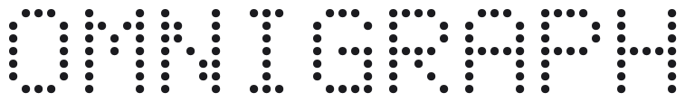

<p align="center">
  <picture>
    <source media="(prefers-color-scheme: dark)" srcset="assets/omnigraph-wordmark-dark.svg">
    
  </picture>
</p>

<p align="center">
  <a href="LICENSE"></a>
  <a href="rust-toolchain.toml"></a>
  <a href="https://crates.io/crates/omnigraph-cli"></a>
</p>

**Lakehouse graph db for context assembly & multi-agent coordination**\
Multimodal retrieval, Git-style branching, object storage-native

Omnigraph is the operational state and coordination layer for fleets of agents.\
Run it as a server, declared as code; hundreds of agents operate and enrich the graph on parallel isolated branches, and every change is reviewed and merged safely.

## Key capabilities

| Capability | What it gives you |
|---|---|
| **Declared as code** | A `cluster.yaml` declares graphs, schemas, stored queries, embedding providers, and policies; `cluster apply` converges it and `omnigraph-server` brings every graph online at `/graphs/{id}/…`. |
| **Built for fleets of agents** | Hundreds of agents enrich the graph on **parallel isolated branches**; changes are reviewed and merged safely, Git-style, across the whole graph. |
| **Multimodal retrieval** | Graph traversal + vector ANN + full-text + Reciprocal Rank Fusion in **one** query runtime, for context assembly. |
| **Security as code** | Cedar policy enforced **server-side on every mutation**, per-graph and server-wide; bearer auth; actor/audit tracking. |
| **Runs on your infrastructure** | Any S3-compatible object store — **on-prem via RustFS / MinIO**, or AWS S3 / R2 / GCS. VPC, on-prem, hybrid; your data never leaves your store. |
| **Open, versioned storage** | [`Lance`](https://github.com/lance-format/lance) columnar format: branchable, time-travelable, with native blob-as-data (docs, images, video). |

## What you can build

| Use case | What it's for |
|---|---|
| **Company brain** | Org knowledge unified into one graph every agent can query |
| **Agentic memory** | Durable, versioned memory — a branch per agent or per task, merged on review |
| **Context graph** | Decision traces and codified tribal knowledge for retrieval |
| **Dev graph** | Issues & dependency model that coding agents read and write |
| **R&D / ML data layer** | Experiments and trials written into branches, versioned for training & eval |

## Install

```bash
curl -fsSL https://raw.githubusercontent.com/ModernRelay/omnigraph/main/scripts/install.sh | bash
```

This installs `omnigraph` (CLI) and `omnigraph-server` into `~/.local/bin` from
published release binaries. Or with Homebrew:

```bash
brew tap ModernRelay/tap
brew install ModernRelay/tap/omnigraph
```

## Drive it with an AI agent

Omnigraph is built to be run by coding agents — two ways in.

**Teach your agent the playbook.** This repo ships the
[**`omnigraph` agent skill**](skills/omnigraph): the operational playbook —
cluster mode, the two config surfaces, schema evolution, query linting, data
writes, branches, Cedar policy, and the common gotchas.

```bash
npx skills add ModernRelay/omnigraph@omnigraph
```

**Or have an agent set it up from scratch.** Paste this into Claude Code,
Cursor, or any agent that can read a URL and run a shell command:

```text
Help me set up Omnigraph

1. Read the docs at https://github.com/ModernRelay/omnigraph — start with
   docs/user/clusters/index.md, then docs/user/deployment.md.
2. Skim the starter graphs and seed data in the cookbooks:
   https://github.com/ModernRelay/omnigraph-cookbooks
3. Ask me what I want to build (company brain, agent memory, dev graph,
   research / R&D layer, …). Then stand up a cluster for it, load a little
   data, and run a query so I can see it working.
```

For ready-to-run graphs with real seed data (company brain, VC operating system,
pharma & industry intel),
[`ModernRelay/omnigraph-cookbooks`](https://github.com/ModernRelay/omnigraph-cookbooks)
is the fastest way to see Omnigraph shaped to a real domain.

## Deploy

A deployment is a **cluster** — a **multigraph** config directory that declares
its graphs, schemas, stored queries, and policies as code. You manage it
**Terraform-style**: `cluster plan` previews the diff, `cluster apply` converges
it. `omnigraph-server` then boots from the cluster and brings every graph online
at `/graphs/{id}/…`, each behind its own policy.

**1. Declare the cluster.**

```
company-brain/
├── cluster.yaml
├── people.pg          # schema for the "knowledge" graph
├── queries/           # stored queries — the .gq files ARE the declaration
│   └── people.gq
└── base.policy.yaml   # a Cedar policy bundle
```

```yaml
# cluster.yaml
version: 1
metadata:
  name: company-brain
storage: s3://company/clusters/company-brain   # ledger, catalog, and graph data live here
graphs:
  knowledge:
    schema: people.pg
    queries: queries/                          # every `query <name>` in queries/*.gq registers
policies:
  base:
    file: base.policy.yaml
    applies_to: [knowledge]                    # graph-bound; use [cluster] for server-level
```

**2. Stand up your object store.** On-prem, run RustFS (or MinIO) — Omnigraph
writes [Lance](https://github.com/lance-format/lance) to it over the standard S3
API. In the cloud, point the same `AWS_*` env at S3 / R2 / GCS instead.

**3. Converge and run.** `apply` creates each graph, applies its schema, and
publishes queries and policies into the content-addressed catalog. It is
idempotent — re-running is always safe.

```bash
omnigraph cluster validate   # parse + typecheck everything
omnigraph cluster plan       # preview what apply would do
omnigraph cluster apply      # converge

# Boot the server from the cluster dir — storage resolves through cluster.yaml
omnigraph-server --cluster company-brain --bind 0.0.0.0:8080
```

See the [cluster guide](docs/user/clusters/index.md) for the day-2 loop
(edit → plan → apply → restart), approval gates for destructive changes, drift
inspection, and recovery; the [deployment guide](docs/user/deployment.md) for
containers, AWS/Railway, auth, and the full `AWS_*` contract.

## Query and mutate

Point the CLI at a running server and a graph. Stored queries and mutations run
**by name** from the catalog; branch and merge run across the whole graph, so a
fleet of agents can write in isolation and have changes reviewed before they
land on `main`.

```bash
# Stored query / mutation, parameters as JSON
omnigraph query  search_docs --server https://graph.internal:8080 --graph knowledge --params '{"q":"AI safety"}'
omnigraph mutate add_person  --server https://graph.internal:8080 --graph knowledge --params '{"name":"Mina","team":"Research"}'

# An agent enriches on its own branch; you review, then merge
omnigraph branch create --from main agent/ingest-42 --server https://graph.internal:8080 --graph knowledge
omnigraph branch merge  agent/ingest-42 --into main --server https://graph.internal:8080 --graph knowledge
```

Name the server (and a default graph) once in `~/.omnigraph/config.yaml` — with
operator identity and credentials — and the `--server`/`--graph` flags drop
away: `omnigraph query search_docs --params '{"q":"…"}'`. See the
[CLI reference](docs/user/cli/reference.md).

## Security & governance

- **Engine-wide enforcement** — every write path goes through the same Cedar gate, so the HTTP server, the CLI, and the embedded SDK obey identical rules.
- **Declared in the cluster** — a policy bundle is bound to graphs (or the whole server) via `policies:` → `applies_to`.
- **Scoped** — rules apply per graph, per branch, or server-wide.
- **No plaintext tokens** — bearer tokens are hashed at startup and compared in constant time.
- **Forge-proof identity** — the actor is resolved server-side from the token; clients can't set it.

See the [policy guide](docs/user/operations/policy.md).

## Clients & SDKs

| Client | Use it for | Where |
|---|---|---|
| **TypeScript SDK** | typed access from Node / TS | [`@modernrelay/omnigraph`](https://www.npmjs.com/package/@modernrelay/omnigraph) · [source](https://github.com/ModernRelay/omnigraph-ts) |
| **MCP server** | bridge Omnigraph to LLM hosts (Claude, Cursor, …) | [`@modernrelay/omnigraph-mcp`](https://www.npmjs.com/package/@modernrelay/omnigraph-mcp) |
| **HTTP / OpenAPI** | any language — the wire contract | the server's OpenAPI spec |
| **Python SDK** | typed access from Python | *coming soon* |

Both npm packages are versioned in lockstep with `omnigraph-server`.

## Local quick test (no server)

1-min setup to try it: an **embedded, local file-backed graph** — no server, no
object store. For dev and experiments; production is the deployed cluster above.

```bash
cat > schema.pg <<'PG'
node Signal  { slug: String @key, title: String }
node Pattern { slug: String @key, name: String }
edge Indicates: Signal -> Pattern
PG
printf '%s\n' \
  '{"type":"Signal","data":{"slug":"s1","title":"OSS model adoption surging"}}' \
  '{"type":"Pattern","data":{"slug":"p1","name":"adoption"}}' \
  '{"edge":"Indicates","from":"s1","to":"p1"}' > data.jsonl

omnigraph init  --schema schema.pg ./graph.omni
omnigraph load  --data data.jsonl --mode overwrite --store ./graph.omni

# "What pattern does signal s1 indicate?"
omnigraph query --store ./graph.omni \
  -e 'query indicates() { match { $s: Signal { slug: "s1" }  $s indicates $p } return { $p.name } }'
# → adoption
```

## Docs

- [Cluster guide](docs/user/clusters/index.md) · [Deployment guide](docs/user/deployment.md) · [CLI reference](docs/user/cli/reference.md)
- [Schema](docs/user/schema/index.md) · [Queries](docs/user/queries/index.md) · [Search](docs/user/search/index.md) · [Policy](docs/user/operations/policy.md)

## Build And Test

```bash
cargo build --workspace
cargo test  --workspace
```

Notes:

- Rust stable toolchain, edition 2024
- CI runs `cargo test --workspace --locked`
- Full CI and some local test flows require `protobuf-compiler`
- S3 integration tests expect an S3-compatible endpoint such as RustFS

## Workspace Crates

- `crates/omnigraph-compiler`: shared schema/query parser, typechecker, catalog, and IR lowering (zero Lance dependency)
- `crates/omnigraph` (package `omnigraph-engine`): storage/runtime, branching, merge, change detection, query execution, and embeddings
- `crates/omnigraph-policy`: Cedar policy compilation and enforcement
- `crates/omnigraph-api-types`: shared HTTP wire DTOs used by both the server and the CLI
- `crates/omnigraph-cluster`: cluster config validation, planning, and apply (the control plane)
- `crates/omnigraph-server`: Axum HTTP server — cluster-first, runs N graphs under `/graphs/{id}/…`
- `crates/omnigraph-cli`: CLI for graph lifecycle, query/mutate, branch/commit/merge, schema/lint, snapshot/export, cluster control, policy/queries, profiles, and maintenance

## Contributing

Please open an issue, spec, or design discussion before sending large code
changes. Design feedback and concrete problem statements are the fastest way to
collaborate on the roadmap.

## Community

Join the [Omnigraph Slack community](https://join.slack.com/t/omnigraphworkspace/shared_invite/zt-3wfpglyxj-lHvJGhuySPfqLtN35uJZNw)
to ask questions, share feedback, and follow development.
