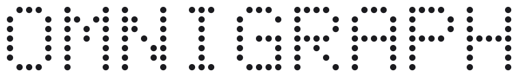

<p align="center">
  <picture>
    <source media="(prefers-color-scheme: dark)" srcset="assets/omnigraph-wordmark-dark.svg">
    
  </picture>
</p>

<p align="center">
  <strong>Lakehouse graph database for context assembly &amp; multi-agent coordination</strong><br>
  <sub>Multimodal retrieval · Git-style branching · object-storage native</sub>
</p>

<p align="center">
  <a href="docs/user/quickstart.md">Quickstart</a> &nbsp;·&nbsp;
  <a href="docs/user/clusters/index.md">Docs</a> &nbsp;·&nbsp;
  <a href="https://github.com/ModernRelay/omnigraph-cookbooks">Cookbooks</a> &nbsp;·&nbsp;
  <a href="docs/user/cli/reference.md">CLI</a> &nbsp;·&nbsp;
  <a href="https://www.omnigraph.dev/llms.txt">llms.txt</a>
</p>

<p align="center">
  <a href="LICENSE"></a>
  <a href="rust-toolchain.toml"></a>
</p>

<hr>

Omnigraph is the operational state and coordination layer for fleets of agents and teams.

Join the [Omnigraph Slack community](https://join.slack.com/t/omnigraphworkspace/shared_invite/zt-3wfpglyxj-lHvJGhuySPfqLtN35uJZNw)
to ask questions, share feedback, and follow development.

## 1. Popular use cases

| Use case | What it's for |
|---|---|
| **Company brain** | Org knowledge unified into one graph every agent can query |
| **Agentic memory** | Durable, versioned memory: a branch per agent or per task, merged on review |
| **Context graph** | Decision traces and codified tribal knowledge for retrieval |
| **Dev graph** | Issues & dependency model that coding agents read and write |
| **R&D / ML data layer** | Experiments and trials written into branches, versioned for training & eval |

## 2. How it works

Omnigraph is a **graph database** that lives on object storage. You describe your domain with a **typed schema**, which includes the types of entities, their properties, and the relationships between them:

```rust
node Person {
  email: String @key
  name: String
}

node Organization {
  slug: String @key
  name: String
}

// A relationship between a Person and an Organization.
edge WorksAt: Person -> Organization
```

This schema gives people and agents a shared contract, with types enforced by the database rather than left to application code or agent prompts.

Hundreds (or even thousands) of agents can then operate on the shared graph simultaneously on their own isolated branches, and every change can be reviewed and merged safely.

### 2.1 — Key capabilities

| Capability | What it gives you |
|---|---|
| **Multimodal data** | Documents, images, audio, video, and structured data in one connected, versioned graph. |
| **Branching & versioning** | Hundreds of agents enrich the graph on **parallel isolated branches**; changes are reviewed and merged safely, Git-style, across the whole graph. |
| **Designed for scale** | Built on object storage, with large multimodal datasets and fast retrieval for parallel agent workloads. |
| **Unified retrieval** | Graph traversal, vector ANN, full-text search, and Reciprocal Rank Fusion in one query runtime. |
| **Runs on your infra** | Local storage or any S3-compatible object store (**RustFS / MinIO**, AWS S3 / R2 / GCS, Azure). VPC, on-prem, hybrid; your data never leaves your store. |
| **Open, versioned storage** | Your entire graph on open-format [Lance](https://github.com/lance-format/lance) storage, with branches and history—not locked inside a proprietary database. |
| **Declarative config** | A `cluster.yaml` declares graphs, schemas, stored queries, embedding providers, and policies; `cluster apply` converges it and `omnigraph-server` brings every graph online at `/graphs/{id}/…`. |
| **Security as code** | Cedar policy enforced **server-side on every mutation**, per-graph and server-wide; bearer auth; actor/audit tracking. |

### 2.2 — Running Omnigraph

Omnigraph runs as a server, with its configuration defined as code. A **cluster** brings the graphs it serves, their schemas, stored queries, and access policies together in one directory:

```text
my-omnigraph/
├── cluster.yaml
├── people.pg
├── queries/
│   └── people.gq
└── base.policy.yaml
```

You preview configuration changes with `omnigraph cluster plan`, apply them with `omnigraph cluster apply`, and serve the graphs through `omnigraph-server`.

Follow the [quickstart](docs/user/quickstart.md) to create and query your first graph, or the [cluster guide](docs/user/clusters/index.md) to configure a deployment.

## 3. Getting started

```bash
curl -fsSL https://raw.githubusercontent.com/ModernRelay/omnigraph/main/scripts/install.sh | bash
```

This installs `omnigraph` (CLI) and `omnigraph-server` into `~/.local/bin` from
published release binaries. Or with Homebrew:

```bash
brew tap ModernRelay/tap
brew install ModernRelay/tap/omnigraph
```

### 3.1 — Set it up with an AI agent

Omnigraph is built to be run by coding agents. Two ways in:

**Teach your agent the playbook.** This repo ships the
[**`omnigraph` agent skill**](skills/omnigraph): the operational playbook
covering cluster mode, the two config surfaces, schema evolution, query linting,
data writes, branches, Cedar policy, and the common gotchas.

```bash
npx skills add ModernRelay/omnigraph@omnigraph
```

**Or have an agent set it up from scratch.** Paste this into Claude Code,
Codex, or any agent that can read a URL and run a shell command:

```text
Help me set up Omnigraph

1. Read the docs at https://github.com/ModernRelay/omnigraph, starting with
   docs/user/clusters/index.md, then docs/user/deployment.md.
2. Skim the starter graphs and seed data in the cookbooks:
   https://github.com/ModernRelay/omnigraph-cookbooks
3. Ask me what I want to build (company brain, agent memory, dev graph,
   research / R&D layer, …). Then stand up a cluster for it, load a little
   data, and run a query so I can see it working.
```

For ready-to-run graphs with real seed data (company brain, VC operating system,
pharma & industry intel),
[`ModernRelay/omnigraph-cookbooks`](https://github.com/ModernRelay/omnigraph-cookbooks)
is the fastest way to see Omnigraph shaped to a real domain.

## 4. Docs

- [Quickstart](docs/user/quickstart.md) · [Cluster guide](docs/user/clusters/index.md) · [Deployment guide](docs/user/deployment.md) · [CLI reference](docs/user/cli/reference.md)
- [Schema](docs/user/schema/index.md) · [Queries](docs/user/queries/index.md) · [Search](docs/user/search/index.md) · [Policy](docs/user/operations/policy.md)
- For agents: [Documentation index (llms.txt)](https://www.omnigraph.dev/llms.txt) · [Full documentation (llms-full.txt)](https://www.omnigraph.dev/llms-full.txt)
- Contributing to the engine: [developer guide](docs/dev/index.md)

## 5. Contributing

Please open an issue before sending large code changes — a maintainer triages it, and the `accepted` label is the green light for a PR (see [GOVERNANCE.md](GOVERNANCE.md)). Build and test setup is in [CONTRIBUTING.md](CONTRIBUTING.md).
