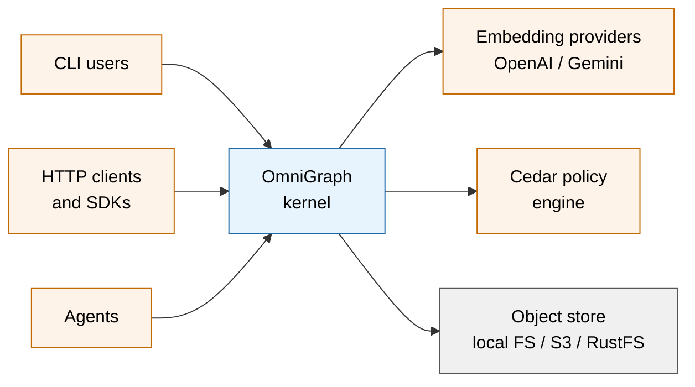
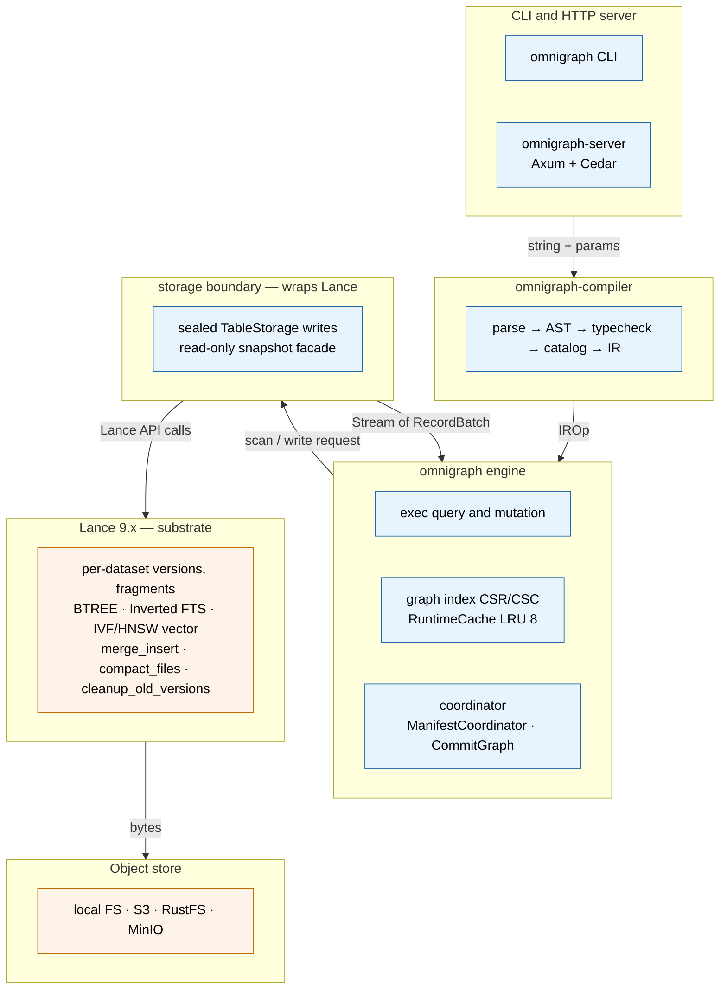
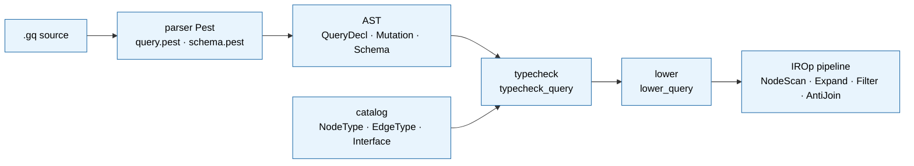
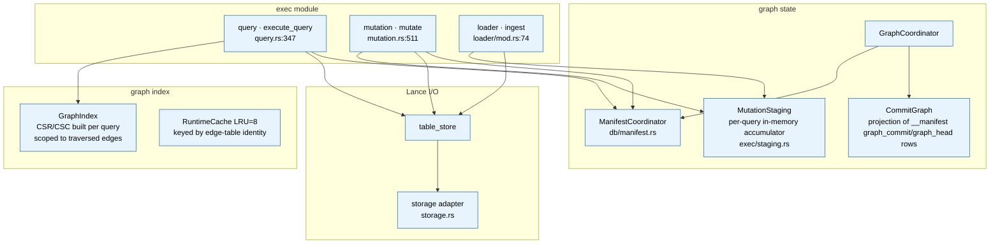
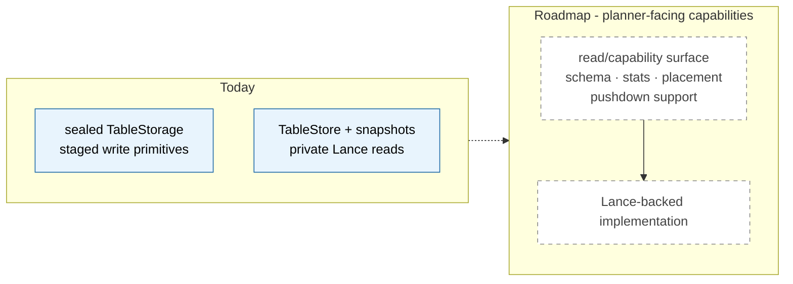
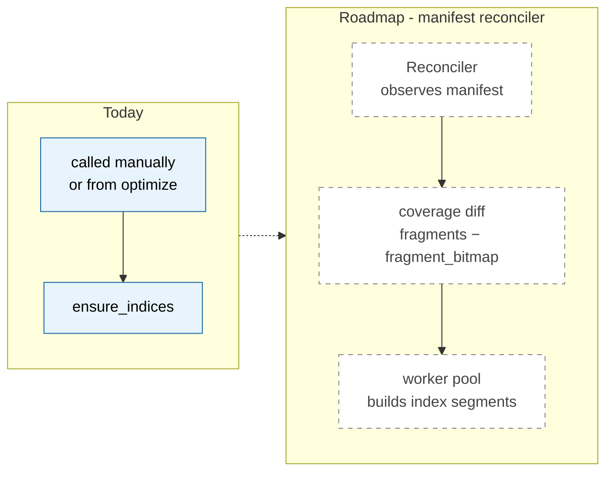
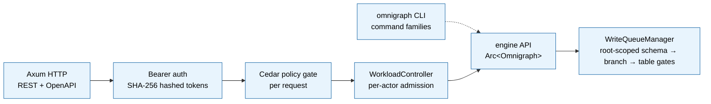

# Architecture

OmniGraph is a typed property-graph engine built as a coordination layer over many Lance datasets, with Git-style branches and commits across the whole graph, multi-modal querying (vector + FTS + BM25 + RRF + graph traversal) in one runtime, an HTTP server with Cedar policy, and a CLI driven by a per-operator `~/.omnigraph/config.yaml` plus team-owned cluster directories.

## Reading guide

Three views, increasing zoom:

1. **System context** — what OmniGraph is and what it touches.
2. **Layer view** — the eight-layer stack inside one OmniGraph process.
3. **Component zoom-ins** — what's inside each layer.

For runtime flows (read query, mutation), see [`docs/dev/execution.md`](execution.md). For the on-disk layout of a graph, see [`docs/user/storage.md`](../user/concepts/storage.md).

L1 (orange in the diagrams) is what we inherit from Lance; L2 (blue) is what OmniGraph adds. The L1/L2 framing is also called out in prose at the bottom of this doc.

## System context



OmniGraph runs as a single process (one binary, multiple crates). External dependencies are the embedding APIs (called during ingest and at query-time normalization), Cedar (called for every privileged action), and an object store (everything OmniGraph persists lands here).

## Layer view

Inside the OmniGraph process, work flows through these layers:



The write-side storage seam is enforced: supported data-table write effects route
through the sealed `TableStorage` staging surface, with Optimize as the documented
bounded maintenance exception. Read, capability, and statistics surfaces are not
yet one complete substrate trait; that planner-facing boundary remains roadmap.

## Component zoom-ins

### Compiler — `omnigraph-compiler`



The compiler crate has zero Lance dependency. It owns the schema language, the query language, and the AST → IR lowering.

Code paths:

- Parser: `crates/omnigraph-compiler/src/query/parser.rs`, `crates/omnigraph-compiler/src/query/query.pest`
- Typecheck: `crates/omnigraph-compiler/src/query/typecheck.rs:83` (`typecheck_query`)
- Lower: `crates/omnigraph-compiler/src/ir/lower.rs:11` (`lower_query`)
- Catalog: `crates/omnigraph-compiler/src/catalog/`

### Engine — `omnigraph` crate



The engine binds the compiler IR to Lance. It owns multi-dataset coordination, the graph topology index, the per-query staging accumulator, and the snapshot/manifest read path.

Code paths:

- Read entry: `Omnigraph::query` at `crates/omnigraph/src/exec/query.rs:7`
- Mutation entry: `Omnigraph::mutate` at `crates/omnigraph/src/exec/mutation.rs:511`
- Manifest publish: `GraphCoordinator::commit_changes_with_intent_and_expected`
  gates the exact writer path and delegates to
  `ManifestCoordinator::commit_changes_with_lineage_and_precondition`
- Graph index: `crates/omnigraph/src/graph_index/`
- Loader: `Omnigraph::load_as` in `crates/omnigraph/src/loader/mod.rs`

### Mutation atomicity — in-memory accumulator + branch-wide OCC (MR-794 / RFC-022)

Mutations inside `mutate_as` and every bulk-load mode go through `MutationStaging`
([`crates/omnigraph/src/exec/staging.rs`](../../crates/omnigraph/src/exec/staging.rs)),
a per-query in-memory accumulator. No Lance HEAD advance happens during
op execution. The attempt captures one native branch identity, exact graph head,
accepted schema identity/catalog, and base snapshot. At end-of-query it stages
one exact Lance transaction per touched table outside the effect gates, then
acquires the root-shared schema → branch → sorted-table gates and revalidates the
complete authority before arming recovery or advancing any table HEAD.

```
op-1 (insert/update) → push RecordBatch → MutationStaging.pending[table]
op-2 (insert/update) → read committed via Lance + pending via DataFusion
                       MemTable (read-your-writes) → push batch
op-N → push batch
─── end of query ────────────────────────────────────────────────
stage_all: concat batches → one exact stage_* transaction per table (no HEAD move)
commit_all: acquire schema → branch → sorted-table gates
            → reject a new recovery intent → revalidate the complete branch token
            → arm identity-bearing v9 recovery → commit_staged per table
publisher: publish pre-minted lineage under the exact native-branch/head + table precondition
```

A failed op leaves Lance HEAD untouched on the staged tables. If authority
changes before effects, insert-only mutations and Append/Merge loads discard the
whole attempt and fully reprepare with a bounded retry; Update/Delete/Overwrite
returns `ReadSetChanged`. After any physical effect, any later error returns
`RecoveryRequired` and leaves the v9 sidecar to converge the fixed outcome.
Concrete contracts:

- `D₂` parse-time rule: a query is either insert/update-only or
  delete-only. Mixed → reject. Deletes now stage like inserts/updates
  (MR-A: `stage_delete` via Lance 7.0 `DeleteBuilder::execute_uncommitted`),
  so they no longer advance HEAD inline; D₂ is a deliberate boundary
  (constructive XOR destructive per query) that keeps in-query read-your-writes
  unambiguous — compose mixed operations via separate mutations or a branch.
- `LoadMode::Overwrite` uses Lance `Operation::Overwrite` through the
  same staged path. Loader validation runs against the replacement
  in-memory batches before any `commit_staged`, and the publish window is
  covered by `SidecarKind::Load` recovery.
- Read sites consume `TableStore::scan_with_pending`, which Lance-scans
  the committed snapshot at the captured `expected_version` and unions
  with a DataFusion `MemTable` over the pending batches.

This pattern realizes read-your-writes within a multi-statement mutation
and keeps failure scope bounded for inserts/updates by construction at
the writer layer. See [docs/dev/invariants.md](invariants.md) and
[docs/dev/writes.md](writes.md) for the publisher CAS contract this builds on.

### Storage trait — today vs. roadmap



The staged-write trait exists today as `TableStorage`, implemented by
`TableStore`. Every staged-capable graph-visible effect routes through its
primitives; Optimize remains the documented exception: its identity-bearing v9
envelope carries a bounded Lance-maintenance payload because the
compaction/index-fold APIs have no stable public
caller-controlled transaction form. The final storage-trait
inline residual was removed when full-table vector index creation moved into
`stage_create_indices`. Capability and statistics surfaces remain roadmap, so
the planner cannot yet reason about all pushdown opportunities through a
documented trait surface.

### Index lifecycle — today vs. roadmap



Today, physical indexes are built explicitly via `ensure_indices`/`optimize`;
schema apply, mutation, and load only record intent or publish their exact data
effects and never build indexes inline. EnsureIndices batches every missing
BTREE, FTS, and full-table vector artifact for one table into one staged Lance
`CreateIndex` transaction. Its identity-bearing v9 recovery intent captures exact
branch/schema authority, fixed original and rollback lineage, the complete
manifest delta, and first-touch ref ownership before publication. Optimize is
separate: its compaction/index-coverage fold uses a bounded payload inside the
same v9 identity envelope within the single-writer-process recovery boundary.
Reads degrade gracefully when index coverage is missing or
partial — Lance's scanner unions indexed and scan paths automatically (vector
search falls back to brute force). A future background reconciler may automate
the same explicit convergence path.

The supported SDK graph-write set is closed first by Rust visibility: raw
`TableStore` / `TableStorage`, handle-cache, and coordinator surfaces are
crate-private. Public snapshot tables expose reads rather than a writable Lance
`Dataset`; their scan facade withholds Lance's raw `Scanner` and physical plan,
which can otherwise reveal the dataset embedded in a scan execution node.
`crates/omnigraph/tests/forbidden_apis.rs` then provides defense in depth by
classifying public async inherent `Omnigraph` methods and loader conveniences,
every crate-visible async coordinator method, and exact per-file occurrences of
registered durable-call shapes, including recovery execution. It rejects known
direct Lance open/mutation shapes outside exact gateway files. Adding a
supported writer therefore changes that registry; the scanner supplements the
visibility boundary rather than pretending to expand arbitrary Rust macros or
prove function-pointer aliases.

### Server / CLI



The server applies Cedar policy at the HTTP boundary today. The roadmap, called out in [docs/dev/invariants.md](invariants.md) as a known gap, is to push policy into the planner as predicates. After Cedar, mutating handlers go through `WorkloadController` (per-actor admission cap + byte budget; PR 2 / MR-686) before reaching the engine. Every handle for one canonical graph root shares an `Arc<WriteQueueManager>` in-process. RFC-022-enrolled mutation/load attempts prepare outside the effect gates, then acquire the exclusive root schema gate, the target branch-effect gate, and sorted `(table, branch)` gates and hold them through publish. The root schema gate means enrolled effect windows on one graph currently serialize even across different branches; readers remain ungated, and pre-effect parsing, validation, and fragment staging can overlap. The branch gate preserves the complete per-branch validation authority, while table gates protect each concrete Lance effect and legacy adapter. These gates prevent same-process races and impose one deadlock-free order; the exact publisher precondition and durable recovery intent remain the correctness authorities, and the gates are not a cross-process lock. See [docs/user/server.md](../user/operations/server.md) "Per-actor admission control" and [docs/dev/writes.md](writes.md). The CLI bypasses the HTTP layer (and admission) and calls the engine API directly.

Code paths:

- Server entry: `crates/omnigraph-server/src/lib.rs`
- Auth: `crates/omnigraph-server/src/auth.rs`
- Policy: `crates/omnigraph-server/src/policy.rs`
- CLI: `crates/omnigraph-cli/src/main.rs`

## L1 / L2 framing

Throughout the docs, capabilities are split into:

- **L1 — Inherited from Lance**: what OmniGraph gets "for free" by sitting on top of the Lance dataset format (columnar Arrow storage, per-dataset versions and branches, index types, `merge_insert`, `compact_files` / `cleanup_old_versions`).
- **L2 — Added by OmniGraph**: typing (schema language), graph semantics, multi-dataset coordination via `__manifest`, graph-level branches and commits, the `.gq` query language and IR, the topology index, the HTTP server, Cedar policy, the CLI.

## Concurrency model

- **MVCC**: every Lance write bumps a per-dataset version; the OmniGraph manifest version coordinates which sub-table versions are visible together.
- **Snapshot isolation**: a query holds one `Snapshot` for its lifetime; concurrent writes don't leak in.
- **Cross-branch isolation**: Lance copy-on-write keeps branch data independent, and readers never acquire write gates. Enrolled writer preparation can overlap across branches, but their effect/publish windows currently share one exclusive root schema gate before the branch/table gates, so those windows serialize in-process even for different branches.
- **Per-query staging**: `mutate_as` and every `load` mode accumulate their work in an in-memory `MutationStaging`; `stage_all` prepares exact per-table transactions without moving HEAD. At commit, the root schema → branch → sorted-table gates protect complete-token revalidation, v9 recovery arming (with the retained `protocol_v3` mutation/load payload), zero-retry table effects, and one atomic manifest publish. A mid-query failure leaves Lance HEAD untouched on staged tables. (MR-794 / RFC-022; pre-v0.4.0 used a `__run__<id>` staging branch + Run state machine, removed in MR-771.)
- **Schema-apply lock**: `__schema_apply_lock__` system branch serializes schema migrations.
- **Fail-points** (`failpoints` cargo feature): `failpoints::maybe_fail("operation.step")?` in `branch_create`, publish, etc., for deterministic failure injection in tests.

## Workspace crates

- `omnigraph-compiler` — schema and query grammars, catalog, IR, lowering, type checker, lint, migration planner, OpenAI-style embedding client.
- `omnigraph` (engine, published as `omnigraph-engine` on crates.io since v0.2.2) — the Lance-backed runtime: manifest, commit graph, snapshot, exec (incl. per-query `MutationStaging` accumulator), merge, loader, Gemini embedding client.
- `omnigraph-cli` — the `omnigraph` binary.
- `omnigraph-server` — the `omnigraph-server` binary (Axum HTTP server).
