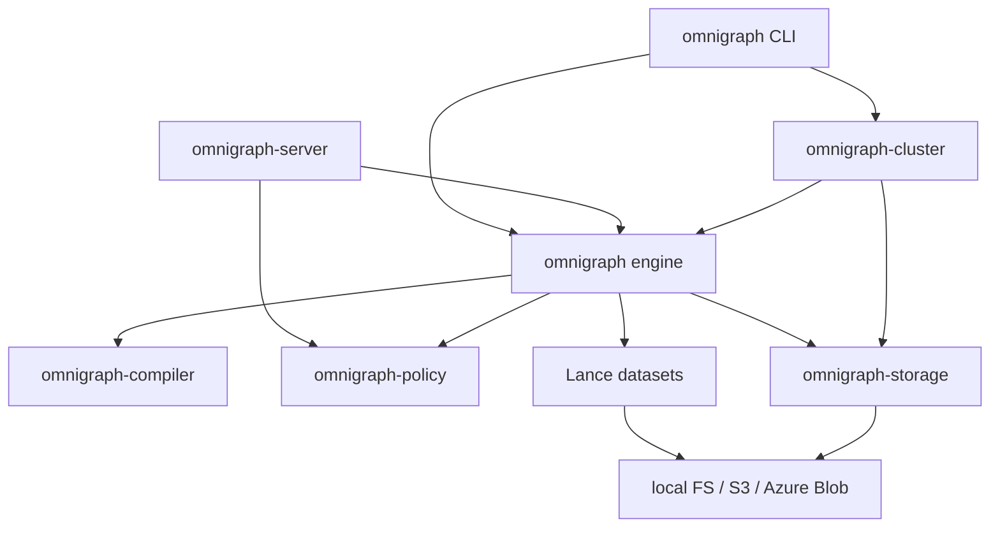

# Architecture

**Audience:** contributors and maintainers
**Authority:** current system boundaries and ownership; detailed protocols live
in the linked area guides

OmniGraph is a typed property-graph engine that coordinates many Lance
datasets. Lance supplies columnar storage, per-dataset versions, branches,
transactions, and indexes. OmniGraph adds one accepted graph schema, one
graph-wide visibility boundary, graph query and mutation semantics, policy,
cluster deployment state, and public CLI/HTTP surfaces.

## System shape

```mermaid
flowchart TB
    CLI[omnigraph CLI]
    HTTP[omnigraph-server]
    CLUSTER[omnigraph-cluster]
    COMPILER[omnigraph-compiler]
    ENGINE[omnigraph engine]
    POLICY[omnigraph-policy]
    STORAGE[omnigraph-storage]
    LANCE[Lance datasets]
    OBJECTS[local FS / S3 / Azure Blob]

    CLI --> CLUSTER
    CLI --> ENGINE
    HTTP --> ENGINE
    HTTP --> POLICY
    CLUSTER --> ENGINE
    ENGINE --> COMPILER
    ENGINE --> POLICY
    ENGINE --> STORAGE
    ENGINE --> LANCE
    CLUSTER --> STORAGE
    LANCE --> OBJECTS
    STORAGE --> OBJECTS
```

These are separate libraries and binaries, not one monolithic process. An
embedded caller may use the engine directly; the CLI may use an embedded store
or the HTTP API; the server hosts multiple graphs from one applied cluster
revision.

## Authority model

Three kinds of state must not be conflated:

1. **Accepted graph state.** Accepted SchemaIR owns rename-stable type,
   property, and table-incarnation identities. `__manifest` owns the graph
   branch heads, visible table versions, and graph lineage. One manifest
   publication makes a graph change visible.
2. **Lance physical state.** Each node and edge table is a Lance dataset with
   its own versions, branches, fragments, and indexes. A table HEAD may move
   before graph publication only when a durable recovery record owns the gap.
3. **Derived runtime state.** Topology indexes, physical index coverage,
   caches, fragment layout, and serving projections may be rebuilt. They never
   become a second authority for graph contents.

Names and paths are diagnostic aliases. A supported rename preserves stable
identity and table history; drop/re-add creates a new lifetime even if the
alias is reused. See [invariants.md](invariants.md) and
[versioning.md](versioning.md).

## Layers and ownership

| Layer | Owns |
|---|---|
| `omnigraph-compiler` | `.pg` and `.gq` parsing, catalog, type checking, lint, migration planning, and typed IR lowering. It has no Lance dependency. |
| `omnigraph` (`omnigraph-engine`) | Snapshots, query and mutation execution, graph topology, graph branches/lineage, validation, multi-dataset publication, and recovery. |
| `omnigraph-storage` | Shared local/S3/Azure control-object access used for manifests' companion objects, cluster state, locks, approvals, and recovery artifacts. |
| Lance | Dataset files, transactions, versions, native refs, secondary indexes, compaction, and version cleanup. |
| `omnigraph-policy` | Cedar compilation and the engine-facing action/scope/actor gate. |
| `omnigraph-cluster` | Desired configuration, state ledger, plan/apply, approvals, cluster recovery, and immutable serving snapshots. |
| `omnigraph-api-types` | Additive HTTP wire DTOs shared by server and CLI. |
| `omnigraph-cli` | Operator commands, target resolution, output, embedded/remote dispatch, and local credential selection. |
| `omnigraph-server` | HTTP authentication, read authorization, admission control, routing, OpenAPI, and multi-graph serving. |
| `omnigraph-azure-admission` | Azure deployment wrapper that admits one mutation-capable server process through the root-derived Blob lease. It is not a storage backend. |

## Principal flows

- A read resolves one branch or snapshot and keeps that immutable view for the
  full query. The compiler produces typed IR; the executor combines Lance
  scans/search with the scoped in-memory topology index. See
  [execution.md](execution.md).
- A content write captures one accepted authority view, stages exact Lance
  transactions, arms recovery, applies table effects, and publishes all table
  pointers plus lineage in one manifest CAS. See [writes.md](writes.md) and
  [recovery.md](recovery.md).
- A merge performs a graph-level three-way comparison, validates the selected
  result, stages its table effects, and uses the same publication boundary. See
  [merge.md](merge.md).
- Blob cells use an engine-owned, snapshot-bound facade; callers never receive
  a raw Lance `BlobFile` or physical placement. See [blob.md](blob.md).
- Cluster apply converges definitions and graph topology into a CAS-protected
  ledger. Servers boot only from an applied serving snapshot and do not mutate
  cluster state at runtime. See [control-plane.md](control-plane.md).

## Trust and policy boundaries

HTTP authentication resolves a bearer token to an actor; the client cannot set
that actor identity. Server handlers enforce read and transport-specific
policy. Mutating engine entry points enforce Cedar again through their `_as`
surface, so embedded and CLI-direct writers cannot bypass the graph write gate.
No-policy embedded development remains an explicit engine configuration.

Admission and authorization are different controls. `WorkloadController`
bounds served work, and the write queue orders in-process effects; neither is a
durable cross-process lock. Azure has the additional deployment admission
wrapper because mutation-capable Azure replicas must not rely on process-local
gates for single-writer ownership.

## Concurrency and support boundary

- Reads are snapshot-isolated and do not take write gates.
- Write preparation may overlap. Durable effects are ordered by the shared
  schema, branch, and sorted-table gates, then fenced again by persisted
  authority and Lance transaction identity.
- The gates prevent same-process races and deadlocks; manifest preconditions,
  Lance transactions, and recovery records provide durable correctness.
- Some maintenance and destructive-recovery classifiers intentionally retain
  a one-mutation-process support boundary. Do not infer distributed writer
  safety from an in-process mutex. [recovery.md](recovery.md) names the modes.
- Missing physical indexes or stale cache entries may change cost, never query
  meaning. Explicit reconciliation restores physical coverage.

## Storage failure boundary

`omnigraph-storage` classifies substrate evidence as `Transient`,
`Configuration`, `NotFound`, `Precondition`, `Permanent`, or `Unknown`.
The engine preserves that evidence in `OmniError::Storage(StorageFailure)`
instead of flattening Lance, `object_store`, or filesystem failures into
strings. `StorageFailure::is_transient()` is true only for positive transient
evidence; it is not permission to replay an operation. The operation that owns
the effect boundary still decides whether a retry is safe, and unknown evidence
stays unknown. [RFC 0038](../rfcs/0038-typed-storage-failures.md) records the
rationale and compatibility change.

## Storage backends

Graph datasets and cluster control objects support local paths, S3-compatible
URIs, and native Azure Blob `az://` roots. Azure remains a qualification
preview while the adversarial live-Azure matrix is pending; the narrower
managed-identity smoke proof is complete. Any mutation-capable
Azure server must run through `omnigraph-azure-admission`; direct server boot is
for read-only qualification and tests, not writer ownership.

Upstream behavior must be checked against the full matching Lance pages in
[lance.md](lance.md) before changing a substrate-facing contract.
