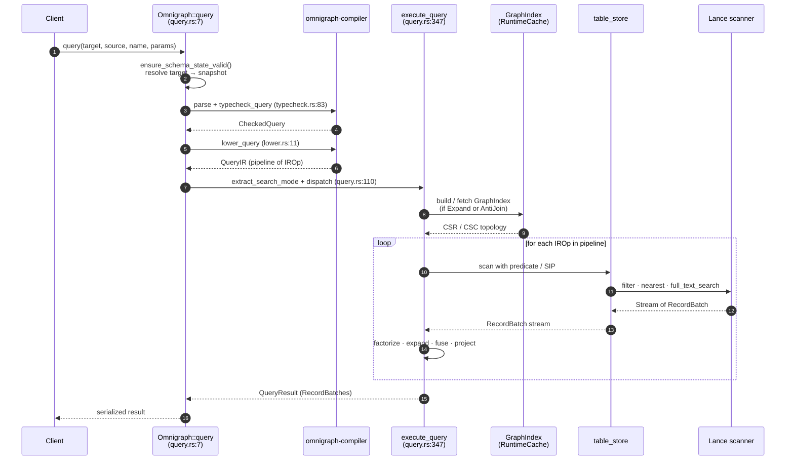

# Query Execution, Mutations, and Loading

## Query execution (`exec/query.rs`)

Pipeline:

1. Parse + typecheck via `omnigraph-compiler`.
2. Lower to IR.
3. If `Expand` or `AntiJoin` is present, build (or fetch from `RuntimeCache`) a `GraphIndex` **scoped to the edge types the query actually traverses** (`referenced_edge_types`, recursing through `AntiJoin` inners) — not every edge type in the catalog. The CSR build full-scans each covered edge dataset, so scoping is what keeps a single-edge join (`$x identifiesPerson $p`) from scanning the whole graph's edge data. The `RuntimeCache` key is each covered edge table's **physical identity** `(table_key, version, table_branch, e_tag)` (not the resolved snapshot id), so a `{Knows}` index and a `{Knows, WorksAt}` index are distinct entries AND a lazy-fork branch whose edge tables physically *are* main's reuses main's built index instead of cold-scanning it.
4. Run `execute_query` against the snapshot.

### Read flow — sequence



**Code paths:**

- Entry: `Omnigraph::query` at `crates/omnigraph/src/exec/query.rs:7`
- Search-mode extraction: `extract_search_mode` at `crates/omnigraph/src/exec/query.rs:110`
- Pipeline runner: `execute_query` at `crates/omnigraph/src/exec/query.rs:347`
- RRF fan-out: `execute_rrf_query` at `crates/omnigraph/src/exec/query.rs:393`
- Per-source-row BFS: `execute_expand` at `crates/omnigraph/src/exec/query.rs:675`
- Lance scan + pushdown: `execute_node_scan` at `crates/omnigraph/src/exec/query.rs:1027`
- Filter → SQL pushdown: `build_lance_filter` at `crates/omnigraph/src/exec/query.rs:1158`

### Multi-modal search modes (`SearchMode`)

The executor recognizes three modes that may be combined in a single query:

- **`nearest`** — vector ANN (uses Lance vector index; `LIMIT` required).
- **`bm25`** — BM25 over an inverted index.
- **`rrf`** — Reciprocal Rank Fusion of two rankings, with k (default 60).

Hybrid example: `order { rrf(nearest($d.embedding, $q), bm25($d.body, $q_text)) desc } limit 20`.

### Joins / set operations

- Joins are implicit: MATCH bindings + traversals are implemented as scans + CSR/CSC lookups.
- `not { … }` lowers to an `AntiJoin` over the inner pipeline.

### Scoped reads

- `query(target, source, name, params)` — at any branch or snapshot.
- `run_query_at(version, …)` — direct historical query at a manifest version.

### Concurrency

- Snapshot isolation per query: all reads inside a query use the same `Snapshot`.
- Readers and writers on different branches don't block each other.

## Mutation execution (`exec/mutation.rs`)

Resolves expression values to literals, converts to typed Arrow arrays (`literal_to_typed_array(lit, DataType, num_rows)`), then writes via Lance's two-phase distributed-write API at end-of-query. Before lowering/execution, one `WriteTxn` captures the target's Lance-native branch identity, exact optional graph head, accepted schema identity/catalog, and base table snapshot; every step in the attempt uses that immutable authority.

- `insert` (no `@key`, edges) → accumulate into `MutationStaging.pending` (Append mode); `stage_all` later calls `stage_append` once per touched table.
- `insert` (`@key` node) → accumulate into `pending` (Merge mode); `stage_all` later calls `stage_merge_insert` once per touched table.
- `update` → scan committed via Lance + pending via DataFusion `MemTable` (read-your-writes), apply assignments, accumulate into `pending` (Merge mode).
- `delete` → records a predicate into `MutationStaging.delete_predicates` (count matching committed rows now for `affected_*`); `stage_all` combines a table's predicates into one `stage_delete` (Lance 7.0 `DeleteBuilder::execute_uncommitted`, a deletion-vector transaction) — no inline HEAD advance (MR-A).

**D₂ parse-time rule.** A single mutation query is either insert/update-only or delete-only. Mixed → reject before any I/O. The check fires in `enforce_no_mixed_destructive_constructive(&ir)` inside `execute_named_mutation`.

Multi-statement mutations are atomic at the publisher commit boundary. Every batch lives in memory until all statements and validation succeed; `stage_all` then prepares one exact transaction per touched table without advancing HEAD. `commit_all` acquires the root-shared schema → branch → sorted-table gates, rechecks for recovery intent, revalidates the complete branch authority, writes the schema-v3 recovery sidecar, and commits the table transactions with zero transparent conflict retries. The guards remain held while `ManifestBatchPublisher` publishes the pre-minted lineage under the same exact native-branch/head and table-version precondition.

### Mutation flow — sequence

```mermaid
sequenceDiagram
    autonumber
    participant client as Client
    participant og as Omnigraph::mutate_as<br/>(mutation.rs)
    participant cmp as omnigraph-compiler
    participant stg as MutationStaging<br/>(exec/staging.rs)
    participant ts as table_store
    participant rec as schema-v3 recovery sidecar
    participant pub as ManifestBatchPublisher

    client->>og: mutate_as(branch, source, name, params, actor_id)
    og->>og: heal/reject recovery intent; open_write_txn
    og->>cmp: parse + typecheck + lower using txn catalog
    cmp-->>og: MutationIR
    og->>og: enforce_no_mixed_destructive_constructive (D₂)
    loop for each mutation op
        og->>og: resolve literals + build batch
        alt insert / update (accumulate)
            og->>ts: open dataset @ pre-write version (first touch)
            og->>stg: ensure_path + append_batch (PendingMode)
            opt update — scan committed + pending
                og->>ts: scan_with_pending (Lance + DataFusion MemTable union)
                ts-->>og: matched batches
            end
        else delete (record predicate; D₂ keeps separate)
            og->>ts: count_rows (committed match → affected_*)
            og->>stg: ensure_path + record_delete (predicate)
        end
    end
    og->>og: validate complete staged change-set against txn base
    og->>stg: stage_all(db, branch)
    loop per touched table
        stg->>ts: stage_append OR stage_merge_insert OR stage_delete (one per table)
        ts-->>stg: exact staged transaction (no HEAD movement)
    end
    stg->>stg: acquire schema → branch → sorted-table gates
    stg->>og: recheck recovery barrier + revalidate complete WriteTxn
    alt authority changed before effects
        stg-->>og: ReadSetChanged
        alt insert-only mutation
            og->>og: discard complete attempt; bounded full reprepare
        else Update/Delete
            og-->>client: ReadSetChanged (409)
        end
    else authority unchanged
        stg->>rec: persist fixed lineage + exact transaction identities
        loop per touched table
            stg->>ts: commit_staged (zero transparent retries)
            ts-->>stg: confirm achieved transaction + table update
        end
        stg-->>og: updates + expected versions + sidecar + held gates
        og->>pub: publish exact graph-head/table precondition
        alt publish succeeds
            pub-->>og: new manifest version
            og->>rec: delete sidecar
            og-->>client: MutationResult
        else any error after an effect
            pub-->>og: error
            og-->>client: RecoveryRequired (sidecar remains authoritative)
        end
    end
```

**Code paths:**

- Entry: `Omnigraph::mutate_as` at `crates/omnigraph/src/exec/mutation.rs`
- Per-mutation orchestration: `mutate_with_current_actor` at `crates/omnigraph/src/exec/mutation.rs`
- D₂ check: `enforce_no_mixed_destructive_constructive` (in the same file)
- Per-op execution: `execute_insert`, `execute_update`, `execute_delete_node`, `execute_delete_edge`
- Pending-aware reads: `TableStore::scan_with_pending` / `count_rows_with_pending` at `crates/omnigraph/src/table_store.rs`
- Edge cardinality with pending: `validate_edge_cardinality_with_pending` at `crates/omnigraph/src/exec/mutation.rs`
- Per-query accumulator and protocol adapter: `crates/omnigraph/src/exec/staging.rs` (`MutationStaging::stage_all`, `StagedMutation::commit_all`)
- End-of-query Lance operations: `TableStore::stage_append`, `stage_merge_insert`, `stage_delete`, `commit_staged` at `crates/omnigraph/src/table_store.rs`
- Manifest commit primitive: `commit_updates_on_branch_with_expected` at `crates/omnigraph/src/db/omnigraph/table_ops.rs` (exact native-branch/head precondition plus expected table versions)

Atomicity guarantee for multi-statement mutations: a mid-query failure leaves Lance HEAD untouched because no effect occurs during statement execution or staging. A pre-effect authority mismatch discards the complete attempt: insert-only mutations fully reprepare with a bounded retry, while Update/Delete returns typed `ReadSetChanged`. Once any `commit_staged` effect is durable, the attempt either makes every update visible together or returns `RecoveryRequired` with the fixed sidecar left for recovery; the engine never treats that post-effect error as an ordinary rebase. See [docs/dev/invariants.md](invariants.md) and [docs/dev/writes.md](writes.md).

## Bulk loader (`loader/mod.rs`)

- **JSONL only** in v1, with two record shapes:
  - Node: `{"type":"NodeType", "data":{…}}`
  - Edge: `{"edge":"EdgeType", "from":"src_id", "to":"dst_id", "data":{…}}`
- Lines starting with `//` are treated as comments.
- Schema validation on every row (typecheck, required props, blob base64 decoding).
- Edge endpoint resolution by node `@key`.

## Load modes (`LoadMode`)

| Mode | Semantics | Path (post-MR-794) |
|---|---|---|
| `Overwrite` | Replace all data in the target tables on the branch | Same accumulator; one staged Lance `Operation::Overwrite` transaction per touched table. A pre-effect authority change is strict `ReadSetChanged`; no automatic replay. |
| `Append` | Strict insert; duplicates error | One `stage_append` transaction per touched table. A pre-effect authority change discards the whole parsed/validated attempt and fully reprepares with a bounded retry. |
| `Merge` | Upsert by `id` (`merge_insert`) | One `stage_merge_insert` transaction per touched table (deduped by `id`, last-write-wins). The same bounded full-reprepare rule as Append applies before effects. |

All three modes then use the same schema → branch → sorted-table gate, v3 recovery, zero-retry table commit, and exact publisher-precondition path as mutation. A parse, RI, cardinality, or validation failure leaves Lance HEAD untouched. After any table effect, any later error is `RecoveryRequired`. Load, mutation, and schema apply build no physical indexes inline; explicit `ensure_indices`/`optimize` reconciliation materializes declared intent later.

## `load` and the deprecated `ingest` shims

- `load_as(branch, base, data, mode, actor)` — the unified entry (single publisher commit per call). `base: Some(b)` forks a missing `branch` from `b` first (via `branch_create_from_as`, which enforces `BranchCreate`); `base: None` requires the branch to exist — staging fails on an unknown branch, so a typo'd name can never create one.
- `load(branch, data, mode)` — convenience wrapper with `base: None` and no actor.
- Returns `LoadResult { branch, base_branch, branch_created, nodes_loaded, edges_loaded }`.
- `ingest{,_as,_file,_file_as}` are `#[deprecated]` shims over `load_as` preserving the historical contract (`from: None` forks from `main`; returns `IngestResult`); they are slated for removal. The CLI `ingest` command is a deprecated alias of `load --from <base>`.

## Embeddings during load

The loader does **not** embed `@embed` properties at load time. `@embed` is a catalog annotation consumed by query typecheck/lint; vectors are supplied directly in the load data, or pre-filled by the offline `omnigraph embed` pipeline. Query-time `nearest($v, "string")` auto-embeds the query string via the provider-independent embedding client. See [embeddings.md](../user/search/embeddings.md). (Ingest-time `@embed` execution is a planned RFC-012 phase.)
