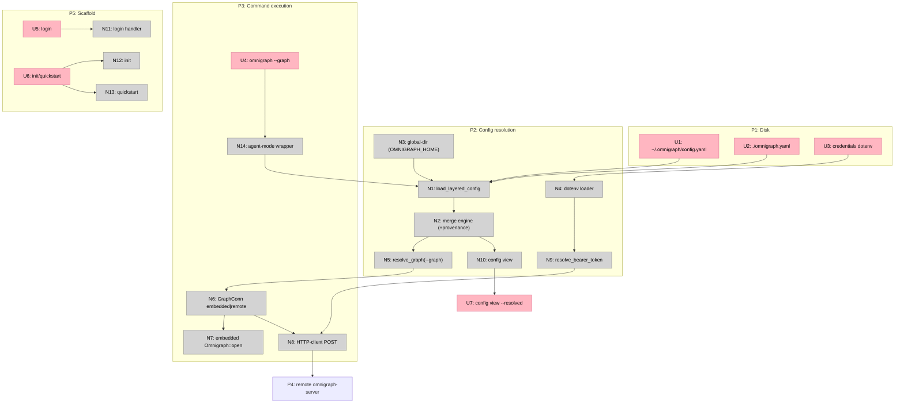

# RFC: Config & CLI Architecture — Layered Config, Client Targeting, File Naming

**Status:** Proposed
**Date:** 2026-05-30
**Tickets:** MR-668 (multi-graph server, shipped — the dependency this builds on), MR-969 (stored queries + MCP — supplies the in-repo agent tool surface), MR-973 (quickstart / onboarding), MR-974 (agent setup surface), MR-981 (agent-friendly CLI hardening)
**Target release:** v0.8.x (tentative; phased — see Rollout)

## Summary

OmniGraph today has a single config file, `omnigraph.yaml`, read both by the CLI (operating the embedded engine) and by `omnigraph-server` (hosting graphs). There is **no client-side configuration that targets a *running server*** — to talk to a deployed `omnigraph-server` you drop to `curl` or the `omnigraph-ts` client. This is the one real gap in an otherwise coherent design (storage-URI addressing, multi-graph routing, per-graph policy).

This RFC defines the config and CLI architecture that closes that gap, derived from first principles — *working backwards from what OmniGraph uniquely enables* rather than copying kubeconfig / `helix.toml`. The result:

1. A **global-first layered config** — user-global (`~/.omnigraph/`) is the **primary, self-sufficient default**; per-project (`./omnigraph.yaml`) is an *optional* override + deployment manifest. One uniform schema, both layers optional; the CLI works from any directory with **no project file** (the `kubectl`/`aws`/`gh` posture), unlike today's project-anchored behavior.
2. A single unifying noun — the **target** — that resolves a name to a concrete `(locus, graph, sub-state, credential)` tuple, where the locus is **embedded (storage URI) XOR remote (server endpoint)**.
3. A **multi-server × multi-graph** client model (OmniGraph hosts N graphs per server and there are M servers — unlike Helix's one-cluster-one-graph).
4. **Credentials by reference, keyed by server name** (the AWS/gh/kube model) — OS keychain `omnigraph:<server>` (preferred) → a `[<server>]` profile in `~/.omnigraph/credentials` → `OMNIGRAPH_TOKEN[_<SERVER>]` env (CI). `servers.<name>` is endpoint-only by default but may carry an explicit, secret-free `auth: { token: { env|file|command|keychain } }` source; no `credentials.yaml`; the shipped `bearer_token_env` + dotenv stay as a legacy compat path. Every committed/GitOps'd surface stays secret-free.
5. A **file-naming** decision: project and server config are **the same artifact, same name** (`omnigraph.yaml`); the only differently-named file is the user-global `config.yaml`, justified by **scope, not role**.

The design optimizes jointly for **DX** (one command surface across embedded and remote; clone-and-go) and **AX** (agent experience: one flat resolved context, secrets structurally unreachable, branch-pinned reproducible reads, and a GitOps'd capability surface).

## Reconciliation with shipped / planned CLI work

Verified **against the code**, not ticket statuses (which are unreliable — e.g. MR-581 is marked done but is stale and unbuilt). Findings and the corrections they force:

- **Noun is `graph`/`graphs`, NOT `target`/`targets`.** The config key is `graphs:` in `config.rs` and the flag is `--graph`. **This RFC uses `graphs:`/`--graph` throughout**; the unifying noun is a **`graphs:` entry** that is *embedded* (`uri:`) XOR *remote* (`server:` + a remote graph name). Read any lingering `targets:`/`--target` below as `graphs:`/`--graph`.
- **`~/.omnigraph/` stands on its own merits** (Helix/aws/kube peer convention), **not** on precedent — there is **no `~/.omnigraph/` usage in the code** today. (MR-581 / MR-531 templates-into-`~/.omnigraph/` are *stale tickets, unbuilt*.)
- **Templates do not exist** in the code (no `template` command). The template mechanism is a *design question for this RFC / the init family*, not an existing foothold.
- **What actually exists in the CLI** (verified): `init, query(read), mutate(change), load, ingest, branch, schema, lint, snapshot, export, commit, policy, optimize, cleanup, graphs`. **Not built:** `serve, quickstart, template, prune, login`. `omnigraph init` exists (with `scaffold_config_if_missing`, `main.rs:1415`); the rest of the "init family" (`quickstart` MR-973, `serve` MR-970, `prune`/`init --force` MR-972/975, `mcp install`/skills MR-974, agent-mode MR-981) are **unbuilt tickets**, some stale.
- **Config still uses `aliases:`** (no `operations:` in code; MR-839 unbuilt). §6's reconciliation talks about `aliases:` as-is, noting `operations:` is a *proposed* rename.
- **`bearer_token_env` exists** (per-graph, `config.rs`); MR-971 flags a CLI-parity / server-side gap. The per-`servers.<name>` extension lands on top of that.
- **A top-level `omnigraph lint` command exists** (verified). A stored-query *registry* validator must pick a verb that doesn't read as a competing lint/check.

## Motivation

Three problems, in priority order:

- **No client→server targeting config.** The moment an operator stands up `omnigraph-server` — for bearer auth + Cedar at a network boundary + admission control + multi-graph routing — the CLI can't address it. `curl` is the fallback. There is no named, switchable, credential-carrying way to say "run this against `prod` on the team server."
- **Multi-server × multi-graph has no first-class expression.** OmniGraph genuinely runs N graphs per server across M servers. The same graph is **multi-homed** — `s3://b/prod` may be `prod` on server A, `production` on server B, and opened directly by the CLI. Today's flat `graphs:` map (name→storage-URI) can't express "graph `production` on server `prod-eu`."
- **Solo-first and embedded-first are unserved by the remote story.** A solo developer with no projects should define everything in `~`. A developer iterating locally (embedded, no server) and then pointing at staging (remote) should change *one word*, not learn a second command surface.

MR-668 shipped the server side (multiple graphs per server). MR-969 ships the in-repo agent tool surface (stored queries / MCP). This RFC supplies the **client and config layer** that lets humans and agents target that surface coherently — the foundation under MR-973 / MR-974 / MR-981.

## Non-Goals

- **A control plane / dashboard for config.** Operators edit files and (for servers) restart. No runtime config-mutation API. Matches the MR-668 / MR-969 operational model.
- **Hot reload.** Restart-only for server-side config, matching MR-668 and MR-969.
- **Embedding secrets in any config file.** Credentials are by-reference; the git-ignored `auth.env_file` dotenv (or, later, the OS keychain) holds tokens. Never a committable `*.yaml`.
- **Renaming the project manifest by role.** No `omnigraph.server.yaml` / `omnigraph.client.yaml`. Role lives in sections, not filenames (see Design §3).
- **Dropping embedded mode.** Embedded-first is load-bearing for the file-naming decision; this RFC assumes it stays.
- **Cross-graph / cross-server tool listing in MCP.** Clients loop over per-graph catalogs (a MR-969 non-goal, restated).

## Background

OmniGraph runs on Lance 6.x: typed nodes/edges in per-type Lance datasets, atomic multi-table commits via a `__manifest` table, branchable and time-travelable. The CLI (`omnigraph`) operates the **embedded engine** directly against a storage URI — no HTTP client in its runtime dependencies. `omnigraph-server` (Axum) is a *separate* HTTP front-end over the same engine, with bearer auth + per-graph Cedar (MR-668). The two read the same `omnigraph.yaml` but never connect to each other.

OmniGraph **already has a credentials-by-reference mechanism**, which this RFC builds on rather than replacing: `TargetConfig.bearer_token_env` names the env var holding a graph's bearer token, and `auth.env_file` points at a git-ignored dotenv (`.env.omni`) that the CLI auto-loads into the process (`load_env_file_into_process`) with real-env-vars-win precedence; `resolve_remote_bearer_token` resolves a token via env var then dotenv named lookup. `.env.omni` is already in `.gitignore`.

The six **irreducible enablers** that drive the design (referenced as E1–E6 below):

| # | Enabler | Consequence |
|---|---|---|
| E1 | A graph is a **self-contained storage URI**; the substrate (object store + manifest CAS) is the source of truth — no server required to read/write. | A graph is addressable **directly (embedded)**, not only via a server. |
| E2 | A server hosts **many graphs**; **many servers** exist. | The remote address space is **`{server} × {graph_id}`**. |
| E3 | The same graph is **multi-homed** under different per-locus names. | **Name ≠ identity.** Resolution is mandatory. |
| E4 | **Branch / commit / snapshot** are first-class addressable sub-state. | An address is *graph @ branch/snapshot*, not just graph. |
| E5 | Enforcement is **two-layered**: engine-layer Cedar (`_as` writers, works embedded) + HTTP-boundary bearer+Cedar (server only). | *How* you reach a graph determines *which* enforcement applies. |
| E6 | **Stored queries / MCP tools are a per-graph registry defined in the project config** (MR-969). | The **agent tool surface is version-controlled in the repo**. |

Competitors collapse dimensions OmniGraph keeps live: **Helix** fuses E2+E3 (one cluster = one graph); **namidb** fuses E1+E3 into the URI (`s3://b?ns=prod`) and serves one namespace per process. OmniGraph has all of E1–E6 at once, so its config resolves a richer space — but the richness is *earned* by capability.

## Design

### 1. The address space and the `target` abstraction

Every OmniGraph address is a tuple:

```
(locus, graph, sub-state, credential)
  locus      = embedded(URI)  XOR  remote(server-endpoint)        # E1, E2
  graph      = a URI (embedded)  |  a graph_id on a server (remote) # E3
  sub-state  = branch | snapshot                                   # E4
  credential = cloud-storage creds (embedded) | bearer token (remote) # E5
```

The config's only job is **name → this tuple**. Define one noun — a **target** — that resolves to either shape:

```yaml
targets:
  dev:                       # embedded — substrate-direct (E1)
    uri: s3://team-bucket/dev.omni
    branch: main             # sub-state (E4)
  staging:                   # remote — resolves a server by reference (E2/E3)
    server: staging          # → looked up in `servers`
    graph: prod              # graph_id on that server
    branch: review
```

`--target staging` resolves: project `targets.staging` → `{server: staging, graph: prod, branch: review}` → `servers.staging` → `{endpoint, token-by-ref}` → final `(remote(https://…), prod, review, $TOKEN)`. Embedded targets skip the server hop and use cloud-storage credentials.

**Two concepts, not kubeconfig's three.** kube splits cluster / user / context; that 3-way split is its most-cursed UX. A target *bundles* server+graph+branch+defaults under one name; the **only** thing split out is `servers`, because endpoints+credentials are shared across many targets and are secret-bearing (different ownership and rate-of-change; see §2). Result: **2 nouns — `servers` and `targets`.** Embedded `targets` (`uri:`) subsume today's `graphs:` entries.

### 2. Layered config — global-first, uniform schema, project-optional

**Posture: global-first, project-optional.** OmniGraph's CLI is primarily a *client* (it operates against graphs and servers, embedded or remote), so it sits on the **global-first** side of the CLI-config axis — like `kubectl` / `aws` / `gh` / `docker`, and unlike *project-first* tools (`git` / `cargo` / `terraform`) whose primary config is per-repo. The **global user config is the primary, self-sufficient default**; the project file is an *optional* repo-scoped override (and, when present, the deployment manifest). `omnigraph query --target prod` must work from **any directory with no project file**, exactly as `kubectl get pods --context prod` works from anywhere. *(This is a deliberate flip from today, where the CLI reads `./omnigraph.yaml` and does not even walk parent dirs — i.e. today it is project-anchored.)*

**Rule: the two layers share ONE schema, and each is fully self-sufficient** (the git-layering mechanism — same schema at both levels; you never need a repo to have a working config). Do **not** specialize the layers. Anything — `servers`, `targets`, `defaults`, `queries`, `aliases`, `policy` — is expressible at either layer.

This makes the **zero-project case the default, not an edge case**: a solo user (or an agent) defines everything in `~/.omnigraph/config.yaml` — servers, embedded + remote targets, defaults, even a personal server's `graphs:`/`queries:` — and **never creates a project file**. A team adds `./omnigraph.yaml` only when it wants repo-scoped overrides or a committed, GitOps'd deployment manifest. Global-first does **not** forbid project files; it stops *requiring* them (the kubectl model: `~/.kube/config` is sufficient and default; per-project kubeconfigs are opt-in via `KUBECONFIG`).

| Layer | Required? | Typical use | Path |
|---|---|---|---|
| Global | no | **the default** — solo/agent's entire config; shared servers+creds for teams; even a personal server's graphs/queries | `~/.omnigraph/config.yaml` |
| Project | no | **opt-in** — repo-scoped overrides + the committed deployment manifest (graphs, queries, policy) | `./omnigraph.yaml` |

**Precedence (low → high):** built-in defaults < global < project < env vars < CLI flags. With no project file it collapses to **built-in < global < env < flags** — the common global-only path.

**Merge semantics — "closest layer wins, at the smallest meaningful unit"** (the field consensus: git / kubeconfig / cargo / Helm / VS Code):
- **Settings objects** (`defaults`, `auth`, `server`) → **deep-merge per field**: a project sets `defaults.target` and *inherits* the global `defaults.output_format`. (VS Code / cargo behavior.)
- **Named-resource maps** (`servers`, `targets`, `queries`, `aliases`) → **union by key; on a collision the higher layer's entry REPLACES the lower wholesale** — *no field-level deep-merge within an entry*. (kubeconfig: union contexts by name.) The footgun this avoids: global `servers.prod = {endpoint, policy}`, project `servers.prod = {endpoint: other}` — deep-merge would silently retain the old fields; replace makes the project's `prod` self-contained and predictable.
- **Lists/arrays** → **replace, never append** (Helm convention; appending is order-sensitive and surprising).
- **Scalars** → higher layer wins.
- **Relative paths carry their origin's base_dir.** A `queries:` entry's `.gq` path, or a `policy.file`, resolves against the directory of the layer it was *defined in* — global entries under `~/.omnigraph/`, project entries under the project dir.
- **Inspectable (non-negotiable):** `omnigraph config view --resolved --show-origin` prints each final value *and which layer set it* (the `git config --show-origin` / `kubectl config view` rule). A layered config without origin-tracing is a debugging trap.

### 3. Roles, and the file-naming decision (same name for project = server)

`omnigraph.yaml` carries two *roles* that diverge in prod and collapse on a laptop:

- **Server role** (read by `omnigraph-server`): `graphs:` (graph_id → URI), per-graph `policy.file`, **`queries:` — the stored-query/MCP registry lives here**, plus serving knobs.
- **Client role** (read by the CLI/agent): `servers:`, `targets:`, `defaults:`, `aliases:`.

**Project config and server config are the same artifact, hence the same name.** The server *serves the project*: the file that says "these graphs exist, with these stored queries and this policy" is simultaneously the project manifest and the server's deploy config. Role is distinguished by which *sections* are populated, never by filename. Readers ignore sections that are not theirs (today's file already does this with `cli:` vs `server:`).

**Why not kube's role-split.** Two coherent models exist: (A) one project file with role-sections (Helix `helix.toml` holds both `[local.dev]` and `[enterprise.production]`; compose; Cargo), and (B) deployment-manifest strictly separate from client config (kubectl — you never put a context in `deployment.yaml`). kube is the sharpest topological analog (multi-server × multi-graph, one client targeting many), so B has a real claim. The tiebreaker is **E1: OmniGraph is embedded-first.** In embedded mode the manifest's `graphs:` *is* the local target list — manifest and local-client-view are the same object, so splitting them (B) fights the grain and forces two files for local work. kube splits because it has **no** embedded mode (client always remote+global). So: take the half kube is right about — *remote* client targeting (`servers:`, endpoints, creds) is a separate concern in a separate **user-global** file (`config.yaml`, like `~/.kube/config`); reject the half it is wrong about for us — do **not** split the *project* layer by role. **The second name (`config.yaml`) is justified by scope (user-global), not role.** *(If OmniGraph ever dropped embedded mode and went pure-remote, model B's strict split would become cleanest.)*

### 4. File naming

Principles from the field: **one global dir** `~/.omnigraph/` (like `~/.aws`/`~/.kube`/`~/.helix`), with config/cache/state as **subdirectories** (separation without XDG's three-root scatter); **secrets keyed by server name in the OS keychain or a separate git-ignored profile file** (AWS/gh model, not a new `credentials.yaml`); **project-root manifest keeps the app-named file** (`Cargo.toml`, `package.json`); **`.yaml`, not `.yml`**; keep OmniGraph's established names. The genuinely *new* decisions are the **global** dir's existence and keyed-by-name resolution with an explicit `auth.token` override (MR-971); the shipped `bearer_token_env` + `auth.env_file` mechanism remains as legacy compat.

| Artifact | Path / name | Why |
|---|---|---|
| Project = server config (one artifact) | `./omnigraph.yaml` | **Keep.** Root manifest like `Cargo.toml` / `compose.yaml` / `helix.toml`. Same name for both roles because it is one file. In prod the server's deploy repo and an app repo each have their own `omnigraph.yaml` — same name, different repos. |
| Global user config | `~/.omnigraph/config.yaml` | **One dir** (`~/.omnigraph/`, like `~/.aws`/`~/.kube`/`~/.helix`). Named `config.yaml` *not* `omnigraph.yaml` — the name signals scope (and `~/.aws/config`, `~/.kube/config`, `~/.helix/config` all do this). Holds the full schema so a solo user needs nothing else. |
| Credentials | OS keychain (`omnigraph:<server>`, preferred) → `~/.omnigraph/credentials` profile file (`[<server>]`, `0600`, git-ignored). **Keyed by server name**, inside the one dir. | **Key by name, AWS/gh model** — `~/.aws/credentials [profile]`, `~/.kube/config users:`, `~/.helix/credentials`. *Not* a `credentials.yaml`, and *not* a per-server hand-named env var; the secret lives under the server name (no indirection). Legacy `bearer_token_env` + `.env.omni` dotenv remain as a compat path. See §5. |
| Cache / state | `~/.omnigraph/cache/`, `~/.omnigraph/state/` | Subdirs of the one dir (like `~/.aws/sso/cache/`, `~/.kube/cache/`) — cache is `rm -rf`-safe and backup-excludable without scattering across XDG roots. |
| Cedar policy | `./policies/<env>.yaml` + `<env>.tests.yaml` | **Keep.** Referenced by `policy.file`. |
| Schema | `./*.pg` (e.g. `schema.pg`) | **Keep.** |
| Stored queries | `./queries/*.gq` | **Keep.** `.gq` sources referenced by the `queries:` registry. |

**Global dir: `~/.omnigraph/` — one place, with subdirectories.** Everything OmniGraph keeps for a user lives under a single `~/.omnigraph/` directory, matching the peer group (`~/.aws`, `~/.kube`, `~/.docker`) and the direct competitor (`~/.helix`). This is what DB/cloud-CLI users expect and the lowest-cognitive-load shape.

*Separation and "one place" are not in conflict* — the decisive realization. The peer tools get config/cache/state separation via **subdirectories inside the one dir**, not via XDG's three scattered roots: `~/.aws/sso/cache/`, `~/.kube/cache/`. So OmniGraph keeps `~/.omnigraph/config.yaml`, `~/.omnigraph/credentials`, `~/.omnigraph/cache/` (catalogs — `rm -rf`-safe, backup-excludable), `~/.omnigraph/state/` (session, logs) — getting cache hygiene **and** a single discoverable location, without the XDG scatter. An earlier draft argued XDG on a false dichotomy (it assumed single-dir ⇒ mixed); subdirs dissolve it. `~/.omnigraph/` is canonical and documented; `$XDG_CONFIG_HOME` may optionally be honored if a user has set it, but XDG is not part of the mental model.

**Env / override precedence (the `KUBECONFIG` analog):**
- `OMNIGRAPH_CONFIG=/path` — explicit config file, highest precedence.
- `OMNIGRAPH_HOME=/path` → the global dir (default `~/.omnigraph/`); `$XDG_CONFIG_HOME` optionally honored if a user has set it, but `~/.omnigraph/` is canonical.
- Cache and state are subdirs of the one dir: `~/.omnigraph/cache/` (cached remote catalogs), `~/.omnigraph/state/` (session, logs).
- Per-server token resolution: an explicit `auth: { token: {...} }` source (env/file/command/keychain) wins if set; otherwise **keyed by the server name** — `OMNIGRAPH_TOKEN_<NAME>` (or `OMNIGRAPH_TOKEN` for the active server) → OS keychain `omnigraph:<name>` → the `[<name>]` profile in `~/.omnigraph/credentials`; legacy `bearer_token_env` still honored. See §5.

### 5. Credentials, connection tiers, and bind portability (12-factor)

**Credentials are by-reference everywhere, never inlined — and keyed by the *server name*, not by a hand-invented env-var name.** This is the one place the design departs from simply reusing the shipped `bearer_token_env` mechanism, because that mechanism is sub-optimal for a multi-server client: it forces the operator to invent and coordinate an env-var name per server (three steps to add a server: pick a var, name it in config, set it in the store). The peer group (AWS profiles, `gh` hosts, kubeconfig users, docker auths) instead keys the secret **by the server's name** — no indirection. OmniGraph should match that.

**Resolution for server `<name>` (no config field required):**
1. **`OMNIGRAPH_TOKEN_<NAME>`** env var (name-derived, upper-snake), else **`OMNIGRAPH_TOKEN`** for the active server — the CI/headless override (12-factor).
2. **OS keychain** entry `omnigraph:<name>` — the preferred interactive store (no plaintext on disk); written by `omnigraph login <name>`.
3. **`~/.omnigraph/credentials`** — an AWS-style profile file keyed by server name (mode `0600`, git-ignored), the fallback when no keychain:
   ```ini
   [prod-us]
   token = …
   [prod-eu]
   token = …
   ```
So a `servers.<name>` with no token field resolves by name — adding a server is one step (`omnigraph login <name>`), and "multiple servers, multiple tokens" falls out for free.

**But implicit must not be the *only* path — explicit sourcing is a first-class option** (the DX/AX lesson). Pure-convention is invisible (you must *know* `OMNIGRAPH_TOKEN_<NAME>`), can't integrate with a secrets-manager's fixed var name, and can't do dynamic/short-lived tokens. So a server may declare an explicit `auth:` block — a **method-agnostic wrapper** (today only `token:` for bearer; `mtls:`/`oidc:` are the future siblings, so the credential model never has to be re-keyed) holding a tagged token *source*. Secrets are *still* never inlined (every source is a reference):

```yaml
servers:
  prod-us:
    endpoint: https://og-us…
    auth: { token: { env: OG_PROD_US_TOKEN } }     # explicit env var — self-documenting (= legacy bearer_token_env)
  prod-eu:
    endpoint: https://og-eu…
    auth: { token: { command: [vault, read, -field=token, secret/og] } }   # dynamic / short-lived
  edge:
    endpoint: https://og-edge…
    auth: { token: { file: /run/secrets/og-token } }   # k8s/docker mounted secret
  staging:
    endpoint: https://og-staging…          # no auth: → implicit chain (below)
```

| `auth.token:` source | when | DX/AX value |
|---|---|---|
| *(auth omitted)* | the common case | zero-config; `omnigraph login` populates keychain `omnigraph:<name>` |
| `{ env: VAR }` | secrets-manager / CI injects a fixed var | **self-documenting** — config states the source; = the legacy `bearer_token_env` |
| `{ file: PATH }` | k8s/docker secret mounted as a file | no env plumbing |
| `{ command: [...] }` | Vault, cloud IAM, `gh auth token` | **dynamic tokens** — first-class exec, the capability pure-env/keychain can't give (kube `exec` / AWS `credential_process`) |
| `{ keychain: ENTRY }` | pin a non-default keychain entry | explicit override of the name-derived default |

**Resolution per server:** if `auth.token:` is set, use that source (no fallthrough). Else the **implicit chain**: `OMNIGRAPH_TOKEN_<NAME>` (or `OMNIGRAPH_TOKEN` for the active server) → keychain `omnigraph:<name>` → `[<name>]` in `~/.omnigraph/credentials` (`0600`, git-ignored). `omnigraph login <server>` writes/rotates only that server's secret; per-server precedence is independent; sharing is opt-in (same env var or source). The `command` source runs locally with the operator's own privileges and is defined only in operator-owned config (never server-supplied), so it adds no remote-execution surface. The `auth:` wrapper is method-agnostic so adding mTLS/OIDC later is a new sibling key, not a breaking re-key (Hyrum's Law: the field name is a contract once shipped). There is **no `credentials.yaml`** and **no inlined secret**. *Convention for the floor, explicit for control — and explicit is legible to agents and never inlines a secret.*

**Back-compat.** The shipped per-graph `bearer_token_env` + `auth.env_file` dotenv (`resolve_remote_bearer_token`, real-env-wins) keeps working unchanged for existing single-server setups; `bearer_token_env` is just the legacy flat alias for `auth: { token: { env } }`. Resolution tries an explicit `auth.token:` (or legacy `bearer_token_env`) first, then the keyed-by-name chain — so nothing breaks, but the zero-config default is the no-boilerplate keyed-by-name path. (MR-971 — the `bearer_token_env` parity gap — is where this resolver work lands.)

**Three connection tiers** (Supabase/Prisma teach the zero-config floor):
1. **Env vars** — `OMNIGRAPH_SERVER=https://…` + `OMNIGRAPH_TOKEN=…`: zero-config remote, no file (the `DATABASE_URL` floor).
2. **Global `config.yaml`** — named `servers:` + `targets:` for multi-server setups (the AWS-profiles convenience).
3. **Project `omnigraph.yaml`** — project-pinned targets/graphs, committed.

**Keep `omnigraph.yaml` a *portable* manifest (12-factor).** Deploy-specific runtime that varies per environment — the **bind host/port**, worker counts — should be supplied by **`--bind` / `OMNIGRAPH_BIND` (flags/env)**, *not* a committed `server.bind:` baked into the manifest. A manifest that hardcodes `0.0.0.0:8080` is not portable across deploys and leaks an environment detail into a version-controlled file. The same-named `omnigraph.yaml` stays portable across deploys precisely because the volatile, per-environment knobs live in env/flags (12-factor config), while the stable, portable definition (graphs, queries, policy) lives in the file. This is the one concrete lesson taken from kube's model-B without adopting its file split: portability via env/flags, not via a second file.

### 6. Where stored queries live: defined locally, invoked remotely

A stored query splits across two axes; do not conflate them:
- **Definition** (`.gq` source + `queries:` entry) lives in the **deployment manifest** (server-role `omnigraph.yaml` + the `.gq` files), GitOps'd. Local to the *deployment/project*, never in a client's connection config.
- **Discovery** ("what tools exist for me?") is fetched from the **server** (Cedar-filtered `GET /queries` / MCP catalog) at connect time.
- **Invocation** is **remote** (client → server, HTTP/MCP) — or **embedded** (the CLI opens the graph directly and reads the same manifest).

So the client carries *pointers to servers*, not query definitions; it **discovers and invokes**, never defines. This is the **capability-as-code guarantee for agents**: an agent can only invoke tools the server's *committed, reviewed* config exposes — it **cannot define a new tool at runtime**. Definition is structurally outside the agent's reach.

`queries:` (manifest, server/remote, Cedar-gated, MCP) and `aliases:` (manifest, embedded CLI only) overlap — both are "named `.gq` queries in the manifest." This RFC keeps them siblings (the MR-969 decision); the clean long-term is **one registry, two invocation surfaces** (embedded + remote), with `aliases:` subsumed. Out of scope here.

#### Reconciling `aliases:` with the role model

`aliases:` is the pre-MR-969, **client-role, embedded-only, ungated** ancestor of `queries:`. An alias bundles `command` (read/change), `query` (`.gq` path), `name` (symbol), `args` (positional param names), and `graph`/`branch`/`format` defaults; the CLI runs it embedded. The server never reads it. So:

- **Role:** `aliases:` is **client-role** (CLI behavior) → it may live in **both** the user-global `config.yaml` and the project manifest, layered. `queries:` is **server-role** → it lives **only** in the deployment manifest (the server reads the manifest, not `~`). *Who reads it determines where it can live.*
- **Difference:** `aliases:` = embedded invocation, no gating, explicit `command`, bundles client defaults + positional args. `queries:` = remote (+future embedded), Cedar + `mcp.expose`, **infers** read/mutate, bundles only MCP settings.
- **Convergence:** decompose an alias — *definition* (name→.gq+symbol) → `queries:` (the superset: typed, validated, gated, multi-surface, no redundant `command`); *target/branch/format* → client invocation context (`--target`/`--branch`/`--format` or `defaults:`), not baked per-query; *positional `args`* → thin CLI sugar or dropped (agents/services use named JSON params). End-state: one `queries:` registry + the client config model subsumes `aliases:`.
- **v1:** keep `aliases:` unchanged. Footgun worth a load-time warn: an alias and a query with the same name in one manifest are different namespaces invoked differently (`--alias X` vs `POST /queries/X`).

### 7. CLI surface

- `omnigraph login <server>` — interactive auth; stores the token keyed by server name in the OS keychain (`omnigraph:<server>`) or the `[<server>]` profile of `~/.omnigraph/credentials` (0600). The `gh auth login` analog.
- `omnigraph use <graph>` — set the active graph (writes the appropriate layer). The `kubectl config use-context` analog.
- `omnigraph config view [--resolved] [--show-origin] [<graph>]` — print the merged config and, with `--resolved`, the final tuple **plus the origin layer of every field** (the `git config --show-origin` / `kubectl config view` analog). Resolution is never a mystery.
- All existing verbs (`query`, `mutate`, `load`, `schema`, `branch`, …) gain `--graph <name>`; resolution decides embedded vs remote transparently.

### 7.5 Init, login, and bootstrap — three tiers (folds in the Q2 design)

Scaffolding splits into three tiers by *scope* and *fatness*, mirroring the field (supabase `init` vs `login`; HelixDB thin `init` vs fat `chef`). Most of this lives in sibling tickets; this RFC owns only the **user route**.

| Tier | Command | Scope | What it does | Model | Status |
|---|---|---|---|---|---|
| **User route** | `omnigraph login [<server>]` | user (`~/.omnigraph/`) | auth + write `~/.omnigraph/config.yaml` / `credentials`; first-run global setup | gh / supabase `login` | **this RFC** (unbuilt) |
| **Thin project init** | `omnigraph init` | project, in-place | create graph + `scaffold_config_if_missing` (`omnigraph.yaml` + minimal `.pg`/`.gq`); refuse-if-exists or `--force` | `cargo init`, `prisma init` | exists; `--force` purge = MR-975 |
| **Fat bootstrap** | `omnigraph quickstart [--template <t>] [--auto]` | project, possibly new-dir | scaffold + seed data + `serve start` + agent prompt file | HelixDB `chef`, `create-next-app` | MR-973 (unbuilt) |

**Design positions** (first-principles, since none of the fat tier is built):
- **Split `init` (project) from `login` (user)** — never one command writing to both `$HOME` and the project (the supabase line, not the dbt line). `init`=project scaffold; `login`=user credential + global config.
- **`init` is in-place + refuse-if-exists** (cargo/prisma/terraform default): don't clobber; adopt existing files; require `--force` to overwrite (and `--force` purges Lance state per MR-975).
- **Interactive for humans, `--auto`/agent-mode for automation** (npm `-y`, create-* `--CI`, MR-981 `--machine`). In `OMNIGRAPH_AGENT_MODE` any prompt → fail with a repair hint.
- **Templates are a `--template <name>` flag on the fat tier** (create-vite model), with the *content* (schema + queries + seed) coming from a template source. Mechanism is a design question (bundled-in vs `og template pull` from a repo vs `npm create-*`-style delegation) — **not** an existing foothold (MR-581 stale). Lean: a small set of bundled templates first (generic `Person→Knows`, plus promote `omnigraph-intel-bootstrap`), `--template <github>` later.
- **`init`/`quickstart` can scaffold the `graphs:` map with one or more entries**; "init with specific graphs" = the scaffolded `graphs:` block (embedded `uri:` locally; the agent/operator adds remote `server:` entries via `login` + editing).
- **Secrets-on-scaffold rule** (prisma/dbt/supabase all do this): anything that writes a token also keeps it out of VCS. `login` prefers the OS keychain (no file); the `~/.omnigraph/credentials` profile fallback is `0600` and git-ignored, and any project-local `.env`-shaped file gets a `.gitignore` entry.

### 8. Concrete shape

**Global** `~/.omnigraph/config.yaml` (per-user, secret-free):
```yaml
servers:                               # endpoint only — token is keyed by the server name
  prod-us:  { endpoint: https://og-us.internal:8080 }
  prod-eu:  { endpoint: https://og-eu.internal:8080 }
  staging:  { endpoint: https://og-staging.internal:8080 }
defaults:
  graph: dev
```

**Project** `./omnigraph.yaml` (committed, secret-free, portable — no `server.bind`). Note the shipped noun is `graphs:` (MR-603); an entry is embedded (`uri`) XOR remote (`server` + remote graph name):
```yaml
graphs:
  dev:      { uri: s3://team-bucket/dev.omni, branch: main }    # embedded
  staging:  { server: staging, graph: prod, branch: review }    # remote → graph `prod` on server `staging`
  prod-us:  { server: prod-us, graph: production }
  prod-eu:  { server: prod-eu, graph: production }              # multi-server, same remote graph name
defaults: { graph: dev, output_format: table }
queries:  { find_user: { file: ./queries/find_user.gq, mcp: { expose: true } } }
operations: { ... }   # the soon-to-be-renamed `aliases:` (MR-839)
```
Select with `--graph <name>` (shipped flag, MR-603).

**Credentials** are keyed by server name — `omnigraph login prod-us` writes the OS keychain entry `omnigraph:prod-us` (or a `[prod-us]` profile in `~/.omnigraph/credentials`, 0600, git-ignored); `OMNIGRAPH_TOKEN_PROD_US` overrides for CI. No token fields in any config file; no committable secrets.

## DX

1. **One command surface, two loci.** `query --target dev` (embedded) and `--target staging` (remote) are the same command; only resolution differs. Change one word, not a mental model.
2. **Clone-and-go.** Project config names servers+graphs; teammate runs `omnigraph login staging` once and every target resolves. The git + `gh auth login` model.
3. **Multi-server × multi-graph is the default.** Targets reference `server` by name; `servers` is a global named map; graphs are per-server. `prod-us` and `prod-eu` both serving `production` is two target entries — Helix cannot express this.
4. **Solo-first.** Everything in `~`, no project required.
5. **Laptop-to-fleet on one schema.** Local = one `omnigraph.yaml` (both roles); prod = role-split across repos. No second format to learn.

## AX (agent experience)

1. **One flat resolved context, never a config to navigate.** target→server→endpoint→token resolves *before* the agent sees anything. The agent reasons about tools, not topology (the LLM-safe-surface principle extended to config).
2. **Secrets are structurally outside the agent's reach.** The repo it operates in has no tokens; they are in the global layer / keychain, outside its view. An agent *cannot* exfiltrate a prod token from project config because it is not there.
3. **Branch/snapshot-pinned contexts** (E4) — hand an agent a `branch: review` / `--snapshot v42` target and its reads are reproducible and cannot see uncommitted main-line state. No kubeconfig analog.
4. **The agent's capabilities are a GitOps'd artifact** (E6) — which graphs exist, which stored-query tools it may call, and which Cedar rules gate them are all in the version-controlled server config. Powers change only via a reviewed PR, deployed by restart. Infrastructure-as-code for what the AI can do.
5. **Config + policy compose.** Config = "where am I pointed + which token"; Cedar = "what may I do there." Orthogonal; no enforcement logic leaks into config.

## GitOps — three surfaces, secrets in none

| Surface | Repo | Contents | Deploy | Secrets |
|---|---|---|---|---|
| Server deployment config | infra/deploy repo | `graphs:`, policy, **`queries:` + `.gq` files** | commit → CI → **server restart** (no hot reload) | none — by-reference |
| Project client config | app repo | `targets:` → servers/graphs | committed, read by CLI/agent | none |
| Global user config | **not GitOps'd** — machine-local `~` | `servers:` + creds-by-ref | `omnigraph login` writes it | refs only (like `~/.kube/config`) |

## Comparison

| Property | kubeconfig | Helix | git | compose | **OmniGraph (this RFC)** |
|---|---|---|---|---|---|
| Named remote endpoints + creds-by-ref | ✅ | ✅ | partial | partial | ✅ (global `servers`) |
| Global + project layering, uniform schema | ✗ | ✗ | ✅ | ✗ | ✅ |
| Embedded OR remote under one name | ✗ | ✗ | n/a | ✗ | ✅ (E1) |
| Multi-server × multi-graph | ✅ | ✗ | n/a | n/a | ✅ (E2) |
| Branch/snapshot in the address | ✗ | ✗ | partial | ✗ | ✅ (E4) |
| Agent tool surface in the repo | ✗ | ✗ (separate bundle) | n/a | n/a | ✅ (E6) |
| Project manifest renamed by role | — | no | — | no | **no** |
| Concept count | 3 | 1 | 2 | 1 | **2 (servers/targets)** |

## Migration / backwards compatibility

- **Additive.** Today's `omnigraph.yaml` (`graphs:`, `cli:`, `server:`, `aliases:`, `policy:`) keeps working unchanged. `graphs:` entries are equivalent to embedded `targets:` with a `uri:`; both resolve.
- **`targets:` is new** and optional. `servers:` is new and optional. Absent → today's behavior.
- **Global `~/.omnigraph/config.yaml` is new.** Absent → only project + env + flags, exactly as now. Its addition is the **global-first posture flip**: today the CLI is project-anchored (reads `./omnigraph.yaml`, no parent walk); the global config becomes the new primary discovery path so the CLI works with no project file. Existing project-only workflows are unchanged (project still overrides global); the flip is additive — it adds a fallback layer below the project file, it does not remove the project file.
- **`graphs:` → `targets:` is an evolution, not a break.** Both can coexist; `targets:` is the superset (adds remote + branch pinning). A future cleanup may alias `graphs:` to embedded `targets:`.
- **`server.bind` stays supported** but documentation steers operators to `--bind` / `OMNIGRAPH_BIND` for portability; no removal.
- **Credentials: keyed-by-name is new; `bearer_token_env` is the compat path.** The primary design (keychain / `[<server>]` profile / `OMNIGRAPH_TOKEN_<SERVER>`) is new resolver work (lands on MR-971). The shipped `bearer_token_env` + `auth.env_file` dotenv (`resolve_remote_bearer_token`) is **unchanged and still honored** — existing single-server dotenv setups keep working, and the resolver honors an explicit `auth: { token: {...} }` source (env/file/command/keychain) with `bearer_token_env` as its flat legacy alias. No `credentials.yaml`.

## Open questions

- **`graphs:` vs `targets:` naming churn.** Do we rename `graphs:` → `targets:` (with a deprecation alias) or keep `graphs:` for embedded and add `targets:` for remote? Leaning: keep both, document `targets:` as the superset.
- **Keychain integration scope.** Keychain is now the *primary* credential store (§5), so this is on the critical path, not optional: macOS Keychain first (matches operator practice) with the `0600` `[<server>]` profile file as fallback; Linux Secret Service / `pass` later. Open: which keyring crate, and the exact `OMNIGRAPH_TOKEN_<SERVER>` name-derivation (upper-snake, non-alnum → `_`).
- **Project-local `servers:`.** Allowed (e.g. a localhost dev server), merged with global. Confirm creds stay by-reference even for project-local servers (yes).
- **`aliases:` ⇄ `queries:` convergence.** Out of scope here; tracked separately. One registry with embedded + remote invocation surfaces is the target end state.
- **Single-file `KUBECONFIG`-style list.** Do we support `OMNIGRAPH_CONFIG` pointing at multiple files (colon-joined), or a single file only? Start single; revisit if demand appears.

## Implementation — breadboard + slices (Shape A)

Shaped via requirements + a fit check (Shape A — global-first layered config + unified `graphs:` entry + three-tier init — selected over a project-first minimal option and a Helix-clone). This section breadboards A and slices it. **Bold** = NEW.

### Places

| # | Place | What |
|---|---|---|
| P1 | Disk | `~/.omnigraph/{config.yaml, credentials, cache/, state/}` + project `omnigraph.yaml` + `.env.omni` |
| P2 | Config resolution | runs on every command: load layers → merge → resolve `--graph` |
| P3 | Command execution | embedded engine OR remote HTTP client |
| P4 | Remote `omnigraph-server` | existing HTTP surface (`/query`, `/mutate`, `/queries/{name}`) |
| P5 | Scaffold | `login` / `init` / `quickstart` |

### Affordances

| # | Place | Affordance | NEW? | Wires |
|---|---|---|---|---|
| U1 | P1 | `~/.omnigraph/config.yaml` (operator edits) | **N** | → N1 |
| U2 | P1 | project `./omnigraph.yaml` | — | → N1 |
| U3 | P1 | `~/.omnigraph/credentials` / `.env.omni` dotenv (secrets, git-ignored) | — | → N4 |
| U4 | P3 | `omnigraph <verb> --graph <name>` (any command) | — | → N14 |
| U5 | P5 | `omnigraph login [<server>]` | **N** | → N11 |
| U6 | P5 | `omnigraph init` / `quickstart [--template]` | partly | → N12 / N13 |
| U7 | P2 | `omnigraph config view --resolved --show-origin` | **N** | → N10 |
| N1 | P2 | `load_layered_config()` — global (N3) + project (cwd), serde each | **N** | → N2 |
| N2 | P2 | **merge engine** — deep-merge settings; replace named-resource entries; replace lists; **retain provenance** | **N⚠️** | → N5, → S_merged |
| N3 | P2 | global-dir resolver — `OMNIGRAPH_HOME` else `~/.omnigraph/` | **N** | → N1 |
| N4 | P2 | `load_env_file_into_process` — dotenv, real-env-wins (existing) | — | → N9 |
| N5 | P2 | `resolve_graph(name, merged)` → `(locus, graph, sub-state, credential)` | **N⚠️** | → N6 |
| N6 | P3 | `GraphConn` — `Embedded(engine)` \| `Remote(http)` dispatch | **N⚠️** | → N7, → N8 |
| N7 | P3 | embedded path — `Omnigraph::open(uri)` (existing) | — | → engine |
| N8 | P3 | **HTTP-client path** — POST `/query`/`/mutate`/`/queries/{name}` | **N⚠️** | → P4, → N9 |
| N9 | P2 | `resolve_bearer_token(server)` — explicit `auth.token` source if set, else **keyed by name**: `OMNIGRAPH_TOKEN_<NAME>`/`OMNIGRAPH_TOKEN` → keychain `omnigraph:<name>` → `[<name>]` profile; legacy `bearer_token_env`/dotenv (MR-971) | **N⚠️** | → N8 |
| N10 | P2 | `config view` handler — merged + per-field origin (needs N2 provenance) | **N** | → U7 |
| N11 | P5 | `login` handler — interactive auth → write `config.yaml` + `credentials` (0600) + `.gitignore` | **N⚠️** | → S_global |
| N12 | P5 | `init` handler — `scaffold_config_if_missing` + create graph; refuse-if-exists/`--force` purge (MR-975) | partly | → S_project |
| N13 | P5 | `quickstart` handler — scaffold + `--template` + seed + `serve start` + agent prompt (MR-973; needs serve MR-970) | **N⚠️** | → S_project |
| N14 | P3 | agent-mode wrapper — `--machine`/`OMNIGRAPH_AGENT_MODE`: JSON, structured errors, never-prompt, typed exit codes (MR-981) | **N⚠️** | → N1 |
| S_global | P1 | `~/.omnigraph/config.yaml` + `credentials` | **N** | read by N1/N9 |
| S_project | P1 | `./omnigraph.yaml` + `.env.omni` | — | read by N1/N4 |
| S_merged | P2 | in-memory resolved config (per command, with provenance) | **N** | read by N5/N10 |
| S_cache | P1 | `~/.omnigraph/cache/` (remote catalogs) | **N** | read by N8 |



### Slices (vertical, each demo-able)

| # | Slice | Parts/affordances | Demo |
|---|---|---|---|
| **V1** | **Global layer + merge + `config view`** | A1–A4 · N1,N2,N3,N10 · U1,U7,S_global,S_merged | Put config in `~/.omnigraph/`, run `omnigraph config view --resolved --show-origin` from any dir → merged result with per-field origin; existing embedded commands work global-first with no project file |
| **V2** | **Remote graphs + HTTP client + creds** | A5–A7 · N5,N6,N8,N9 · S_cache | Define a `server:` graph entry; `omnigraph query --graph prod` hits the remote server (`curl`-free); embedded `--graph dev` still local |
| **V3** | **`omnigraph login`** | A8 · N11,U5 | `omnigraph login prod` writes `~/.omnigraph/credentials` (0600) + `.gitignore`; V2 remote query now works with no manual env |
| **V4** | **Thin-init hardening + quickstart + templates** | A9 · N12,N13,U6 (needs serve MR-970) | `omnigraph quickstart --template person-knows` scaffolds + seeds + serves; `init --force` purges (MR-975) |
| **V5** | **Agent-mode** | A10 · N14,U4 (MR-981) | `OMNIGRAPH_AGENT_MODE=1 omnigraph query …` → JSON + structured errors + typed exit codes; never-prompt |

V1 is the foundation (global-first + merge + view). V2 closes the substantive client→server gap. V3 is credential ergonomics. V4/V5 ride sibling tickets (MR-970/973/981). MR-969 (stored queries) ships independently and is reached by N8's `/queries/{name}` once V2 lands.

## Rollout

The slices above are the rollout order: **V1 (global layer + merge) → V2 (remote graphs + HTTP client) → V3 (login) → V4 (quickstart/templates, on MR-970) → V5 (agent-mode, MR-981).** V1–V2 close the substantive gap (global-first config + `curl`-free server access); V3–V5 are ergonomics that ride sibling tickets. Evaluate after V2 against early-adopter and agent-onboarding (MR-973 / MR-974) signal. The spikes (X1 HTTP-client, X2 merge engine, X3 resolver+provenance, X4 login) resolve before their owning slice.

## Prior art

- kubeconfig (clusters / users / contexts; `KUBECONFIG`; `kubectl config view`)
- Helix CLI v2 (`helix.toml` local+enterprise instance blocks; `~/.helix/config`; `~/.helix/credentials`)
- AWS CLI (`~/.aws/config` + `~/.aws/credentials` split; named profiles; `credential_process`)
- git (`~/.gitconfig` + `.git/config`; `--show-origin`)
- Cargo (`Cargo.toml` manifest + `~/.cargo/config.toml`)
- Supabase / Prisma (one project manifest; connection via `DATABASE_URL` env)
- 12-factor app (config that varies by deploy lives in the environment)
