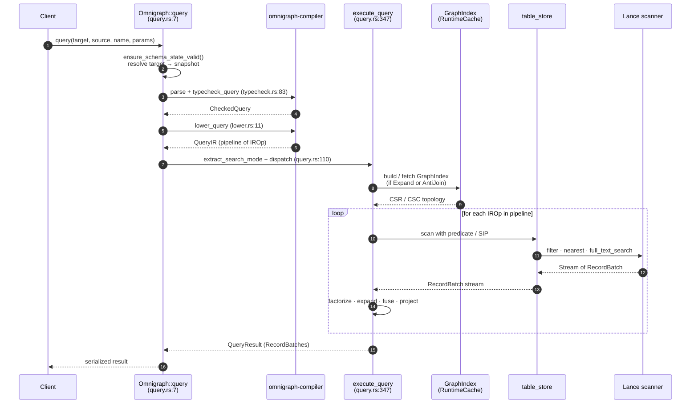
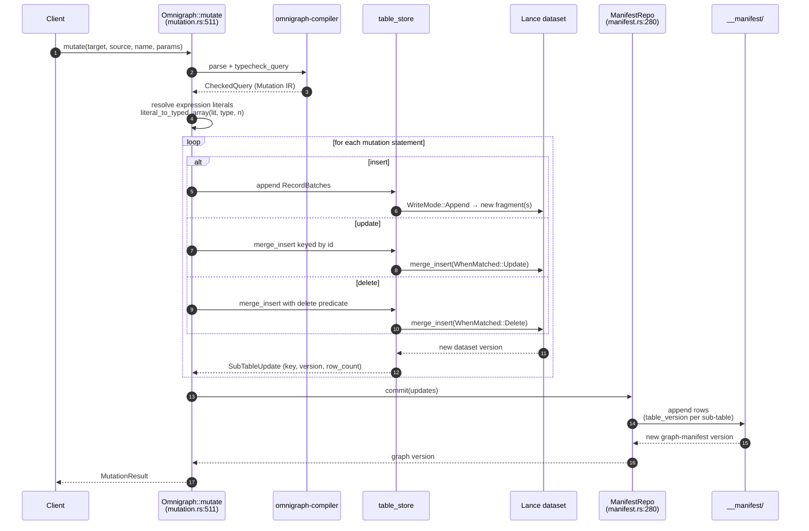

# Query Execution, Mutations, and Loading

## Query execution (`exec/query.rs`)

Pipeline:

1. Parse + typecheck via `omnigraph-compiler`.
2. Lower to IR.
3. If `Expand` or `AntiJoin` is present, build (or fetch from `RuntimeCache`) a `GraphIndex`.
4. Run `execute_query` against the snapshot.

### Read flow — sequence

**Code paths:**

- Entry: `Omnigraph::query` at `crates/omnigraph/src/exec/query.rs:7`
- Search-mode extraction: `extract_search_mode` at `crates/omnigraph/src/exec/query.rs:110`
- Pipeline runner: `execute_query` at `crates/omnigraph/src/exec/query.rs:347`
- RRF fan-out: `execute_rrf_query` at `crates/omnigraph/src/exec/query.rs:393`
- Per-source-row BFS: `execute_expand` at `crates/omnigraph/src/exec/query.rs:675`
- Lance scan + pushdown: `execute_node_scan` at `crates/omnigraph/src/exec/query.rs:1027`
- Filter → SQL pushdown: `build_lance_filter` at `crates/omnigraph/src/exec/query.rs:1158`

### Multi-modal search modes (`SearchMode`)

The executor recognizes three modes that may be combined in a single query:

- **`nearest`** — vector ANN (uses Lance vector index; `LIMIT` required).
- **`bm25`** — BM25 over an inverted index.
- **`rrf`** — Reciprocal Rank Fusion of two rankings, with k (default 60).

Hybrid example: `order { rrf(nearest($d.embedding, $q), bm25($d.body, $q_text)) desc } limit 20`.

### Joins / set operations

- Joins are implicit: MATCH bindings + traversals are implemented as scans + CSR/CSC lookups.
- `not { … }` lowers to an `AntiJoin` over the inner pipeline.

### Scoped reads

- `query(target, source, name, params)` — at any branch or snapshot.
- `run_query_at(version, …)` — direct historical query at a manifest version.

### Concurrency

- Snapshot isolation per query: all reads inside a query use the same `Snapshot`.
- Readers and writers on different branches don't block each other.

## Mutation execution (`exec/mutation.rs`)

Resolves expression values to literals, converts to typed Arrow arrays (`literal_to_typed_array(lit, DataType, num_rows)`), then writes:

- `insert` → Lance `WriteMode::Append`
- `update` → Lance `merge_insert(WhenMatched::Update)`
- `delete` → Lance `merge_insert(WhenMatched::Delete)` (logical) or filtered overwrite.

Multi-statement mutations are atomic at the manifest commit boundary.

### Mutation flow — sequence

**Code paths:**

- Entry: `Omnigraph::mutate` at `crates/omnigraph/src/exec/mutation.rs:511`
- Actor-attributed variant: `Omnigraph::mutate_as` at `crates/omnigraph/src/exec/mutation.rs:522`
- Manifest commit: `ManifestRepo::commit` at `crates/omnigraph/src/db/manifest.rs:280`

The whole mutation — every statement, every affected sub-table — publishes through one call to `ManifestRepo::commit`. That single append to `__manifest` is what gives multi-statement mutations their atomicity guarantee (per [`docs/invariants.md`](invariants.md) §VI.26).

## Bulk loader (`loader/mod.rs`)

- **JSONL only** in v1, with two record shapes:
  - Node: `{"type":"NodeType", "data":{…}}`
  - Edge: `{"edge":"EdgeType", "from":"src_id", "to":"dst_id", "data":{…}}`
- Lines starting with `//` are treated as comments.
- Schema validation on every row (typecheck, required props, blob base64 decoding).
- Edge endpoint resolution by node `@key`.

## Load modes (`LoadMode`)

| Mode | Semantics |
|---|---|
| `Overwrite` | Replace all data in the target tables on the branch |
| `Append` | Strict insert; duplicates error |
| `Merge` | Upsert by id (`merge_insert`) |

## `load` vs `ingest`

- `load(branch, data, mode)` — direct load to a branch.
- `ingest(branch, from, data, mode)` — branch-creating, transactional load:
  1. If target advanced since the run started, fork a fresh run branch from `from`.
  2. Load into the run branch (Append).
  3. If target hasn't moved, fast-publish; otherwise abort.
- Returns `IngestResult { branch, base_branch, branch_created, mode, tables[] }`.
- `ingest_as(actor_id)` records the actor on the resulting commit.

## Embeddings during load

If a node type has `@embed` properties, the loader calls the engine embedding client (Gemini, RETRIEVAL_DOCUMENT) per row to populate the vector column. See [embeddings.md](embeddings.md).
