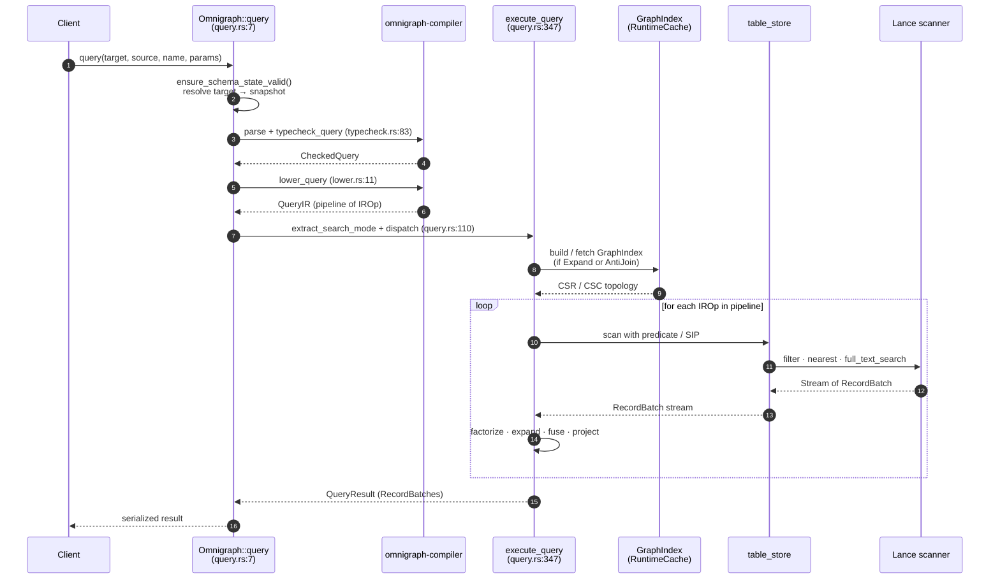
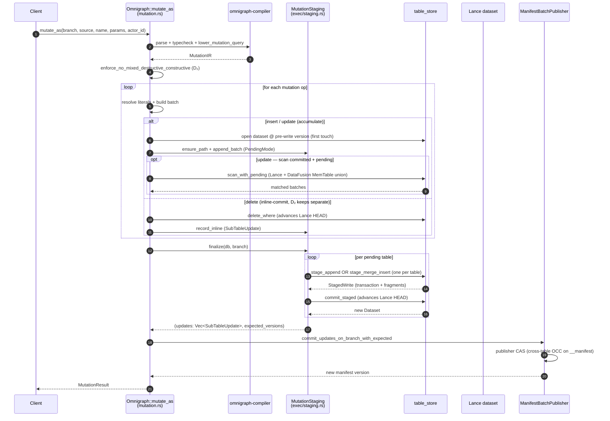

# Query Execution, Mutations, and Loading

## Query execution (`exec/query.rs`)

Pipeline:

1. Parse + typecheck via `omnigraph-compiler`.
2. Lower to IR.
3. If `Expand` or `AntiJoin` is present, build (or fetch from `RuntimeCache`) a `GraphIndex`.
4. Run `execute_query` against the snapshot.

### Read flow — sequence

**Code paths:**

- Entry: `Omnigraph::query` at `crates/omnigraph/src/exec/query.rs:7`
- Search-mode extraction: `extract_search_mode` at `crates/omnigraph/src/exec/query.rs:110`
- Pipeline runner: `execute_query` at `crates/omnigraph/src/exec/query.rs:347`
- RRF fan-out: `execute_rrf_query` at `crates/omnigraph/src/exec/query.rs:393`
- Per-source-row BFS: `execute_expand` at `crates/omnigraph/src/exec/query.rs:675`
- Lance scan + pushdown: `execute_node_scan` at `crates/omnigraph/src/exec/query.rs:1027`
- Filter → SQL pushdown: `build_lance_filter` at `crates/omnigraph/src/exec/query.rs:1158`

### Multi-modal search modes (`SearchMode`)

The executor recognizes three modes that may be combined in a single query:

- **`nearest`** — vector ANN (uses Lance vector index; `LIMIT` required).
- **`bm25`** — BM25 over an inverted index.
- **`rrf`** — Reciprocal Rank Fusion of two rankings, with k (default 60).

Hybrid example: `order { rrf(nearest($d.embedding, $q), bm25($d.body, $q_text)) desc } limit 20`.

### Joins / set operations

- Joins are implicit: MATCH bindings + traversals are implemented as scans + CSR/CSC lookups.
- `not { … }` lowers to an `AntiJoin` over the inner pipeline.

### Scoped reads

- `query(target, source, name, params)` — at any branch or snapshot.
- `run_query_at(version, …)` — direct historical query at a manifest version.

### Concurrency

- Snapshot isolation per query: all reads inside a query use the same `Snapshot`.
- Readers and writers on different branches don't block each other.

## Mutation execution (`exec/mutation.rs`)

Resolves expression values to literals, converts to typed Arrow arrays (`literal_to_typed_array(lit, DataType, num_rows)`), then writes via Lance's two-phase distributed-write API at end-of-query:

- `insert` (no `@key`, edges) → accumulate into `MutationStaging.pending` (Append mode); finalize calls `stage_append` once per touched table.
- `insert` (`@key` node) → accumulate into `pending` (Merge mode); finalize calls `stage_merge_insert` once per touched table.
- `update` → scan committed via Lance + pending via DataFusion `MemTable` (read-your-writes), apply assignments, accumulate into `pending` (Merge mode).
- `delete` → still inline-commits via `delete_where` (Lance 4.0.0 has no public two-phase delete); recorded into `MutationStaging.inline_committed`.

**D₂ parse-time rule.** A single mutation query is either insert/update-only or delete-only. Mixed → reject before any I/O. The check fires in `enforce_no_mixed_destructive_constructive(&ir)` inside `execute_named_mutation`.

Multi-statement mutations are atomic at the publisher commit boundary: every insert/update batch lives in memory until end-of-query, then exactly one `stage_*` + `commit_staged` runs per touched table, then `ManifestBatchPublisher::publish` commits the manifest atomically with per-table `expected_table_versions` CAS.

### Mutation flow — sequence

**Code paths:**

- Entry: `Omnigraph::mutate_as` at `crates/omnigraph/src/exec/mutation.rs`
- Per-mutation orchestration: `mutate_with_current_actor` at `crates/omnigraph/src/exec/mutation.rs`
- D₂ check: `enforce_no_mixed_destructive_constructive` (in the same file)
- Per-op execution: `execute_insert`, `execute_update`, `execute_delete_node`, `execute_delete_edge`
- Pending-aware reads: `TableStore::scan_with_pending` / `count_rows_with_pending` at `crates/omnigraph/src/table_store.rs`
- Edge cardinality with pending: `validate_edge_cardinality_with_pending` at `crates/omnigraph/src/exec/mutation.rs`
- Per-query accumulator: `crates/omnigraph/src/exec/staging.rs` (`MutationStaging`, `PendingTable`, `PendingMode`, `finalize`)
- End-of-query Lance commit: `TableStore::stage_append`, `stage_merge_insert`, `commit_staged` at `crates/omnigraph/src/table_store.rs`
- Manifest commit primitive: `commit_updates_on_branch_with_expected` at `crates/omnigraph/src/db/omnigraph/table_ops.rs`

Atomicity guarantee for multi-statement mutations: a mid-query failure leaves Lance HEAD untouched on staged tables (no inline commit happened during op execution), so the next mutation proceeds normally with no `ExpectedVersionMismatch`. The publisher CAS at the very end either succeeds (manifest advances atomically across all touched sub-tables) or fails with a typed `ManifestConflictDetails::ExpectedVersionMismatch` (no partial publish). See [docs/invariants.md §VI.25 / §VI.32](invariants.md) and [docs/runs.md](runs.md).

## Bulk loader (`loader/mod.rs`)

- **JSONL only** in v1, with two record shapes:
  - Node: `{"type":"NodeType", "data":{…}}`
  - Edge: `{"edge":"EdgeType", "from":"src_id", "to":"dst_id", "data":{…}}`
- Lines starting with `//` are treated as comments.
- Schema validation on every row (typecheck, required props, blob base64 decoding).
- Edge endpoint resolution by node `@key`.

## Load modes (`LoadMode`)

| Mode | Semantics | Path (post-MR-794) |
|---|---|---|
| `Overwrite` | Replace all data in the target tables on the branch | Inline-commit per type, then publisher CAS at end-of-load. Truncate-then-append doesn't fit the staged shape; documented residual. |
| `Append` | Strict insert; duplicates error | In-memory `MutationStaging` accumulator; one `stage_append` + `commit_staged` per touched table at end-of-load; publisher CAS. |
| `Merge` | Upsert by `id` (`merge_insert`) | Same accumulator; one `stage_merge_insert` per touched table at end-of-load (Merge mode dedupes by `id`, last-write-wins); publisher CAS. |

For Append/Merge, a mid-load failure (RI / cardinality violation, validation error) leaves Lance HEAD untouched on the staged tables — the next load on the same tables proceeds normally with no `ExpectedVersionMismatch`. For Overwrite, a mid-load failure can still leave Lance HEAD on a partially-truncated table; the next overwrite replaces it.

## `load` vs `ingest`

- `load(branch, data, mode)` — direct load to a branch (single publisher commit per call).
- `ingest(branch, from, data, mode)` — branch-creating wrapper: if `branch` doesn't exist, fork it from `from` (default `main`) via `branch_create_from`, then call `load(branch, data, mode)`.
- Returns `IngestResult { branch, base_branch, branch_created, mode, tables[] }`.
- `ingest_as(actor_id)` records the actor on the resulting commit.

## Embeddings during load

If a node type has `@embed` properties and a row omits the target vector, the loader calls the engine embedding client (RETRIEVAL_DOCUMENT) using the schema-declared model for that property. The generated vector is inserted before Arrow batch construction, so required embedded vector fields may be satisfied by providing only their source text. See [embeddings.md](embeddings.md).
