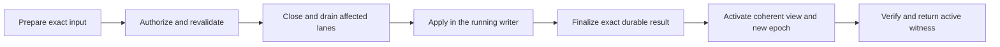

# RFC 0066: Server lifecycle and online deployment

## Summary

Schema and serving-configuration changes must become active without
restarting the server. The running server owns admitted writes, maintenance
and deployment execution; the engine remains responsible for atomic graph
publication and recovery. Deployment prepares and authorizes one exact
change, drains affected operations, applies through the existing writer,
finalizes its exact durable result, activates a coherent serving view and
verifies that activation. The process and listener remain alive. Unaffected
graphs continue serving.

This RFC defines the server upgrade as independently deliverable changes:
operation ownership, failure finalization, bounded resources, graph
availability and online deployment. It also defines the requirements for
recoverable request outcomes. Online deployment does not reset or recreate
a graph as a migration mechanism, hide multiple graph commits inside one
mutation, or silently fall back to a process restart. Affected graphs may
pause while their operations drain and their migration completes; this is
not a zero-downtime migration promise.

## Motivation

The server currently captures its stored-query registry and other serving
configuration at boot. Engine reads can capture newer accepted schema while
stored queries retain their earlier source. A schema/query update can
therefore leave a long-lived server with incompatible components even when
the engine can use the updated graph without reopening. Restart reconstructs
the components, but it is an unnecessarily broad normal deployment action.

Request lifetime is a separate reliability problem. HTTP handlers directly
await effectful engine operations. Dropping a handler may abandon work after
durable table effects but before graph publication. Keeping that work alive
addresses transport cancellation, but not ordinary engine failures:
[#694](https://github.com/ModernRelay/omnigraph/issues/694) reports a branch
merge returning a resource error and blocking subsequent writes until
restart. At the original audit, the post-arm merge error path retained
recovery ownership and live recovery deferred some BranchMerge states.
Current-owner cleanup has since advanced; the remaining requirement is
same-process progress for every supported recoverable outcome, with explicit
refusal where the ownership proof is insufficient.

The same missing lifecycle boundaries affect maintenance, recovery after
transient startup failures, status and resource accounting. A collection of
reload hooks, retry loops and longer HTTP timeouts would leave those
boundaries implicit. The server needs one operation owner and one coherent
activation path around the existing storage protocol.

Current code already provides important parts of the contract: staged
multi-table graph publication, recovery intents, graph-commit preconditions,
mutation/load receipts, boot readiness and bounded shutdown. This proposal
extends those owners. It does not assume every historical incident still
has its original mechanism on current source.

## User and operational behavior

### Online changes

A successful supported schema/configuration deployment leaves the same
server process and listening socket running. Subsequent admissions use the
new accepted schema and matching query/configuration bindings. No stale
stored query executes against a newly activated incompatible schema.
Unchanged graphs remain available throughout a scoped deployment.

The target includes schema, stored queries and runtime policy/provider/trust
configuration. Delivery begins with a fixed graph inventory and fixed
roots, policy, credentials, signed trust, provider and Blob-policy bindings.
Schema and stored-query changes are the first supported class. Later classes
use the same lifecycle after their authorization, secret resolution and
compatibility proofs pass. Initial scope restrictions are validated before
effects and reported explicitly, rather than silently restarting the process.

Existing schema migration rules still apply, including branch restrictions,
supported backfills, identity-preserving renames and destructive-change
authorization. Deployment does not make an unsupported migration valid.
Binary replacement, physical-root relocation and storage-format upgrades
are separate compatibility operations.

### Request outcomes

- An admitted write executes once to an engine-terminal result, contained
  panic or process shutdown cutoff. Client disconnect and caller wait
  timeout change delivery, not execution ownership.
- Reads cancel cooperatively. Their resource and admission permits remain
  held until response bodies and scoped producers actually settle.
- When an operation publishes, success identifies its own publication. A
  no-op explicitly has no new graph commit. A committed merge followed by
  failed optional source deletion reports that compound outcome accurately.
- An uncertain result preserves available operation identity and recovery
  disposition. Transport loss may leave the caller with neither until
  recoverable submission and lookup ship. It is never presented as proof
  that the write failed or as permission to submit it again.
- Temporarily unavailable graphs remain known and have distinct read/write
  availability. Protected diagnostics are available through authorized
  status, with finite retry guidance where progress is possible.

The first operation-ownership increment does not make an interrupted client
able to retrieve a result after process loss. Durable submission identity
and lookup have additional requirements below; they are necessary to close
[#513](https://github.com/ModernRelay/omnigraph/issues/513).

### Administrative access

Deployment uses an explicit authenticated operator interface to the running
server. A local transport is not authorization. The request binds an exact
configuration input, expected base and initiating principal; policy checks
cover every required effect before execution. Ordinary data credentials do
not acquire deployment privileges merely because a new endpoint exists.
The schema/admin exclusions of the existing
[signed-data credential profile](0053-offline-data-token-verification.md)
remain enforced; deployment requires its own explicit authorization.

Existing ownership of cluster-managed schemas remains enforced. A generic
schema mutation route must not become a second writer of the configuration
ledger. The online path invokes the same configuration validation, planning,
apply and graph publication implementation as existing supported tools.

## Design

### Ownership and relationship to existing RFCs

| Responsibility | Owner |
|---|---|
| Graph visibility, accepted schema and recovery evidence | Engine and existing storage protocol |
| Request admission, operation lifetime and shutdown | Server, following [RFC 0035](0035-served-operation-ownership.md) |
| Recovery classification and authority | Engine, following [RFC 0034](0034-durable-recovery-authority.md) |
| Coherent serving generations and graph supervision | Server, extending [RFC 0036](0036-atomic-runtime-activation.md) |
| Configuration validation, planning and durable applied state | Existing `omnigraph-cluster` implementation |
| Online deployment sequencing and its server-visible contract | This RFC |
| Exact data submission identity and recoverable outcomes | The separately gated outcome contract below |

RFCs 0034–0036 are drafts, not available implementation APIs. Their proposed
guards and effect-free constructors must be implemented and qualified
before a consumer relies on them. The ownership core can ship independently
of full supervision.

This RFC proposes two bounded extensions to RFC 0036: configuration
deployment becomes in scope, and a fully drained engine may be reused for
the initial schema/query class under the proof below. RFC 0036's existing
fresh-engine rule still applies elsewhere. This is not its existing
unchanged-schema reuse exception. Acceptance must reconcile the owning
draft's affected rules; it does not supersede that whole RFC or relax
recovery authority.

[RFC 0065](0065-isolated-branch-merge-publication.md) separately proposes
isolated merge preparation to keep failed preparation off accepted target
tables. It remains a draft with storage and compatibility gates. Server
operation ownership and exact outcome handling apply under either merge
representation; narrow failure-finalization fixes can ship independently
of that proposal.

### One serving view per admission

The published serving view contains graph identities and engine handles,
accepted schema/catalog bindings, stored-query registries, policy and
authentication bindings, providers, Blob policy, derived authentication
requirements and active revision evidence. Immutable unchanged components
may be shared, but their association belongs to one view.

A request captures this view before authentication-dependent routing,
authorization and query selection. Reads retain their admission permit and
generation through body and scoped-producer settlement. Writes retain them
through engine-terminal settlement; result delivery does not prolong the
write lane, and retains its own bounded buffer accounting. A request cannot
authorize against one policy, select a query from another registry and then
reload a third engine generation. Authoritative engine write-policy and
attempt revalidation remain required; admission does not replace them.

Current authentication requirements depend partly on graph policies while
other authentication fields live separately in `AppState`. A future
configuration update must publish those fields and derived requirements
together. The fixed-binding first slice verifies their effective values,
not just unchanged filenames.

### Operation admission and lifetime

Each graph generation has independently closeable read and write lanes.
Acquire, task registration and ownership transfer form one synchronous
handoff with no cancellation gap. An owned operation retains its inputs,
principal, exact serving view, workload reservation and permits until actual
settlement. The result receiver owns none of its execution lifetime.

Cover every effectful route: mutations, stored mutations, loads, branch
create/delete/merge, GQ branch statements, deployment and maintenance.
Deployment/recovery tasks have their own tracked lifetime and must not hold
a data-lane permit that they then wait to drain.

Closing an admission epoch is irreversible. Successful reactivation receives
a new token even if it reuses the same engine. A drain timeout returns
remaining work and leaves the selected lanes closed; it does not prove
quiescence, cancel a mutator, start recovery or permit replacement.

All tasks, connections, streams and transitions participate in one absolute
shutdown deadline. No participant restarts the clock. Cutoff reports
unfinished/unknown work and exits without claiming graceful completion.

### Online deployment sequence

1. Capture one immutable, bounded configuration input. Validate schemas,
   queries, references, supported change class and expected identities before
   graph effects. Capture semantic and exact-input identity; never reread a
   changing source midway through the operation.
2. Use the existing full-plan semantics and cluster serialization. Revalidate
   the expected applied state, configuration and graph/schema authority.
   Authorize the complete effect set using current effective policy. A
   candidate policy cannot authorize its own installation.
3. Derive affected graphs and lane requirements from that full plan. There
   is no caller-supplied target list that bypasses validation of the rest of
   the configuration. The initial schema-changing path drains all observers,
   writes and producers of each affected graph before schema effects.
4. Verify the permitted recovery state under authority. Existing apply may
   sweep recovery before diffing; the desired diff alone therefore does not
   bound its effects. The first healthy path refuses pending recovery rather
   than touching undrained graphs. A later path must include every recovery
   participant in its verified scope.
5. Execute the existing apply in the running designated writer. Preserve its
   graph recovery intents, schema gates, exact identity checks and durable
   applied-state publication. Do not launch another writable process beside
   the serving process.
6. Obtain the exact durable result from that publication path. It binds the
   input and base, applied-state revision/digest, complete per-resource
   outcomes, accepted schema identities and the operation's own graph
   publications. Finalization must not sample a later current ledger or HEAD.
7. Validate the replacement serving view against that exact achieved state.
   Hold serialization through activation, or use an equivalent exact
   authority guard that excludes a superseding deployment. Publish the new
   view and fresh admission cells atomically with respect to shutdown.
8. Return an active witness for this deployment. It distinguishes requested,
   durably applied and active state. Applying data successfully and failing
   activation are different outcomes.

One atomic runtime publication does not turn a multi-graph deployment into a
cross-graph transaction. Existing partial-convergence semantics remain.
An execution failure may leave different resources at different durable
boundaries. A coherent achieved projection may activate under its own
identity after verification; it must not claim the requested revision fully
active. Unresolved affected graphs remain closed. Unaffected graphs continue
using their verified bindings.

### Minimum deployment interface

The first online release includes submission, authorized lookup of the
original operation, observation of current active state and capability
discovery. The following are semantic requirements; endpoint spellings,
wire encoding and storage compatibility remain acceptance work.

| Surface | Required contract |
|---|---|
| Capabilities | Advertise supported change classes, protocol versions, input/wait limits and result-retention semantics |
| Submission | The caller fixes a key before sending, immutable bounded input and an expected base revision/digest; the server binds the authenticated principal and exact resource incarnations |
| Identity | Bind the key to deployment scope, principal, operation kind, input identity and original base; concurrent identical duplicates share execution; changed input or base conflicts |
| Acceptance | Acknowledge durable submission acceptance only after identity and sufficient reconciliation evidence survive process loss, before any deployment effects; process-local registration is insufficient |
| Original-operation lookup | Under current authorization, return original identity, execution/effect disposition and bounded phase/progress; include exact result and proved activation evidence when available, with pending/unknown explicit |
| Current-state lookup | Report current active identity separately from historical deployment results |
| Result | Distinguish refusal, applied-but-not-active, partial convergence, unresolved effects and verified activation; bind exact per-resource publications and explicit no-ops, never a later HEAD |
| Retention | Publish terminal-result retention and expiry behavior; unresolved recovery authority must not expire; absent or expired results never prove non-execution or silently permit key reuse |

After current authorization, resolve an existing key before evaluating a new
apply precondition. A duplicate of a completed deployment legitimately
carries its original, now-stale base. After a newer deployment, lookup still
returns the earlier operation's result and proved activation evidence; it
must not replay or reactivate the superseded configuration. If crash timing
prevents proving historical activation, report that uncertainty rather than
inferring it from a newer ledger or a reconstructed current view.

Durable acceptance acknowledges recoverable submission identity, not graph
publication or active success, and does not promise request replay after
restart. Serialize same-key reconciliation with first submission so a lost
acceptance response cannot create two executions. Unresolvable identity
refuses execution. Bound duplicate waiters as well as retained results.
The expiry/key-reuse rules must be enforceable without unbounded history.

A caller wait deadline or disconnect detaches observation only. The initial
interface offers no general cancellation or undo after acceptance. These
deployment-specific requirements belong to increment E; general data-write
idempotency remains increment F. Extend existing applied-state/recovery
authority rather than introducing a parallel job log.

### Engine reuse and candidate construction

The initial schema/query deployment may reuse the current engine only when:

- Every affected read, write, maintenance operation, response body and scoped
  producer has settled; no old admission can reach the engine again.
- Graph identity/root and policy, provider, credential/trust and Blob-policy
  bindings are unchanged and verified.
- Accepted schema/catalog and complete publication authority have been
  verified after apply, including rename and drop/re-add lifetimes.
- Every retained state-dependent cache is keyed by exact accepted identity
  or has a proved invalidation/refresh path. No late producer can populate a
  cache using earlier authority.
- The new runtime bindings and admission epoch are fresh even though the
  engine allocation is retained.

Otherwise candidate construction requires a fresh effect-free factory under
the engine's verified authority. Current ordinary writable open can perform
full recovery, and `refresh()` can perform roll-forward/schema promotion.
Neither is an effect-free candidate-construction API. A pointer swap or
retained `Arc` alone does not preserve an old schema view.

### Failure, finalization and restart safety

The engine classifies effects and recovery; server lifecycle consumes that
classification. Separate substrate condition, whole-operation outcome,
recovery disposition and caller action. A transient storage error says
nothing by itself about whether an earlier effect occurred.

The phase is diagnostic, not proof of publication or permission to retry.
Each transition preserves the original identity and distinguishes execution
settlement from knowledge of its effects.

| Phase | Serving behavior | Transition and failure contract |
|---|---|---|
| Prepare and authorize | Existing verified view serves | Validate input and reserve candidate capacity before closing lanes; refusal has no deployment effects; persist accepted identity before effectful execution |
| Close and drain | Unaffected graphs serve; admitted affected work finishes; new affected admissions refuse | Keep tracked ownership and closed epochs; timeout does not prove quiescence; reopen only after qualified settlement, with proof of no deployment effects and unchanged authority, using a fresh epoch |
| Apply | Affected lanes stay closed | Graph recovery intents own effects and each migration publishes once; ambiguity retains recovery authority and forbids blind replay |
| Finalize | Affected lanes stay closed even if graph publication succeeded | Bind the exact per-resource and applied-state result; finalization failure does not turn a known publication into an abort |
| Activate | Publish one verified view of the exact achieved state | Exclude superseding deployments and shutdown; failed activation preserves the applied result; registry rollback does not undo data |
| Verify and deliver | Verified bindings serve in fresh admission epochs | Return the exact witness; lost delivery remains retrievable under the retention contract; restart requires a freshly verified serving view |

Once effects may exist, returning to the old view requires engine proof that
it is still valid. Reversal after publication is a newly validated
deployment. Partial convergence does not become cross-graph atomicity.
Startup reconciles accepted and ambiguous transitions before effectful open
or active readiness, including an accepted operation that never began apply.

An online deployment needs durable identity and enough publication evidence
to distinguish an unresolved transition from a completed result after a
process crash. Startup must not boot an incompatible registry, run unauthorized
recovery or report the requested deployment active merely because it sees a
newer ledger. An in-memory drain flag is insufficient.

This RFC requires that startup gate but does not pretend an existing durable
deployment-result encoding supplies it. Its representation must extend the
existing applied-state/recovery authority with exact operation binding and
retention rules. It must not become a second source of graph truth, custom
WAL or replay queue. Encoding, publication ordering, finalization and
downgrade refusal are acceptance gates for online deployment.

### Failed writes and recovery progress

[#694](https://github.com/ModernRelay/omnigraph/issues/694) is an explicit
failure-finalization requirement. Keeping a merge alive after disconnect
does not fix a merge that returns a resource error. The original writer must
classify and finalize its attempt under the same exact ownership proof used
by recovery. Proved effect-free intent may retire; complete exactly
confirmed effects may roll forward. First-touch refs are physical effects
even without data-HEAD movement. Unchanged graph-visible rows do not prove
absence of unpublished effects.

Current-owner finalization does not create general exclusive-compensation
authority. Partial effects requiring stronger authority remain explicitly
blocked until the engine's supported recovery procedure proves exclusion
and quiescence. No background loop may obtain that authority merely by
reopening the graph or waiting out a timeout. The routine failed-attempt
cases must recover write progress without a process restart.

For [#601](https://github.com/ModernRelay/omnigraph/issues/601), carry the
discovered artifact URI and object version through fresh reread,
classification and any authorized retirement. Detect path/body disagreement;
do not reconstruct a different deletion target or delete surprising names
automatically.

For [#602](https://github.com/ModernRelay/omnigraph/issues/602), retain the
immutable original manifest outcome and all intended/confirmed participant
witnesses. Reconstruct confirmation only when exact transaction and
incarnation evidence establish the complete result. A matching commit ID or
numeric HEAD is insufficient. Diagnostics alone do not close either
availability defect; supported resolution and subsequent write progress are
required.

### Maintenance and graph availability

Optimize, rebuild and cleanup use the same designated writer, admission and
operation ownership. A maintenance batch publishes one complete graph result
under the existing protocol. An independent optimizer process, even in the
same container, is another writer and cannot rely on server-local locks.

Cleanup additionally needs reader lifetime and retention proofs covering
snapshots, native refs and recovery pins, including retained serving and
candidate views. Open handles, object age and zero in-process I/O counters
alone do not prove that reclamation is safe. Missing index coverage is derived
performance state and must not make ordinary graph results incomplete.
Index status is read-only and must not trigger maintenance.

Keep every configured graph represented while opening, serving, draining,
recovering or blocked. Reads and writes can have different availability when
the engine proves an accepted read snapshot remains safe. Supervision is
bounded and singleflight per graph; notifications coalesce as hints without
resetting deadlines or retry budgets. A transient failure is retried only
when its effect/authority disposition permits another recovery attempt.
Unverifiable state remains blocked with an actionable diagnostic.

Reduce failure scope only when durable evidence proves independence. A
branch-local condition may permit other branches to proceed; a global schema
or unattributable recovery condition must not be ignored for availability.

### Exact outcomes and CLI retry guidance

Thread the engine's own publication result through every merge surface.
Reading latest target history after a merge can return another writer's
commit and is not a receipt. Configuration/query-only activation may produce
a new active revision without a new graph commit; no-op results preserve
that distinction.

Execution settlement and effect knowledge are independent:

| Execution evidence | Effect knowledge | Permitted continuation |
|---|---|---|
| Not admitted, or settled with no possible later effects | Proved no effects | A fresh attempt only when the typed caller action and preconditions permit it |
| Still running | Any currently known result | Observe the original owner; do not duplicate execution |
| Settled with no possible later effects | Exact committed, no-op or compound result | Return the original result and any remaining recovery disposition; do not replay input |
| Settled with no possible later effects | Unknown | Reconcile exact evidence; settlement alone does not authorize non-idempotent replay |
| Settlement or external I/O quiescence unproved | Incomplete, including timeout or process loss | Preserve unresolved identity and recovery authority; delayed effects may still arrive |

Joining or dropping a task does not itself prove that an already submitted
object-store request cannot finish later. The stronger settlement claim
requires engine-qualified evidence, including child producers and external
I/O. Process ownership is distinct from durable acceptance. A known graph
publication stays known when cleanup, finalization or response delivery fails.

For [#466](https://github.com/ModernRelay/omnigraph/issues/466), preserve
structured error details through ordinary and streamed HTTP/CLI paths and
centralize data-command outcome classification:

| Evidence | Caller action |
|---|---|
| Proved pre-effect transient refusal of the entire command | A bounded fresh attempt may be allowed |
| Failed caller precondition | Re-read and decide; do not discard the condition |
| Fixed resource or logical conflict | Correct the request or limiting condition |
| Recovery making bounded progress | Observe/back off according to the typed disposition |
| Recovery blocked | Follow the stated supported recovery action |
| Unknown earlier outcome | Reconcile the original operation; do not blindly resubmit |

A low-level retryable failure does not make a compound command replayable.
Direct reopen may complete earlier work. HTTP 409/503, topology and generic
`RecoveryRequired` are not retry authorization. Preserve existing CLI exit
contracts, including explicit precondition failures; new data-command exits
must be documented and qualified without globally remapping other command
families. The first increment adds classification, not an automatic retry
loop.

Durable data submission and lookup require a separately reviewable protocol:
the caller knows its key before sending; its scope includes the stable
authenticated principal and operation kind; key lookup binds the original
graph/branch incarnations before selecting current names; semantic input and
preconditions are fingerprinted; concurrent duplicates attach to one
execution; changed input under the same key conflicts. Current authorization
protects lookup. Committed, no-op, refused and compound outcomes have explicit
crash and finite-retention semantics. An expired/missing record is not proof
of no effects. No independent result database may become graph commit truth.
In-memory task registration alone cannot acknowledge durable acceptance.

### Resource bounds and feed progress

Bound aggregate ingress before collecting or parsing request bodies. Include
process-wide and per-actor concurrency, retained inputs, queue capacity and
actor-record cardinality. Account for decoded Arrow/vector/Blob buffers,
staging, merge validation, hydration and output until their actual lifetime
ends. Existing body/chunk limits and estimated request bytes do not measure
total engine work.

Reserve bounded execution, memory and local I/O admission/concurrency
capacity within the aggregate process budget for finalization of admitted
work, authorized recovery, shutdown and status. Ordinary admission must not
consume this reserve. Keep a small diagnostic allowance separate from the
qualified budget for larger recovery work. These paths must not wait for a data-lane permit
held by work they must settle. Reserves prevent starvation by new traffic;
they neither guarantee storage progress nor extend deadlines, retry budgets
or recovery authority. If qualified recovery cannot fit, preserve its
authority and report the limiting condition.

Bound concurrent candidate preparation and retained generations. Account
for the overlap of active, candidate and retained views, caches, decode/I/O
buffers and staged inputs until their actual release; shared allocations
count once. Reserve qualified preparation/activation headroom before closing
otherwise healthy lanes. Insufficient capacity refuses or defers within a
bounded queue. Exhaustion after effects follows the existing outcome and
recovery contract. Failed preparation cannot accumulate generations, and
resources are released only after their users and producers settle.

Separate input deadlines, caller response-wait deadlines, read-execution
budgets and the shared shutdown deadline. Refuse excessive work before
effects where the engine can prove that boundary. Budget exhaustion after
effects must preserve an exact recovery outcome. Never split one requested
atomic mutation into unannounced incremental commits.

Measure merge work against target size/history, delta size, selected columns
and row width. Small upload size does not bound merge scan memory. The
reported `ordered_scan_input_batch_bytes` failure in #694 needs its own
fixture and cost evidence; a feed failure using the same limit name does not
establish the merge's mechanism. Raising the cap is not a recovery fix.

For changes/feed and ordered export, use bounded key/address-first ordering
where applicable and hydrate payloads from exact pinned datasets. Preserve
order, cardinality and fragment/version identity. A supported wide row must
not permanently block the cursor. Keep the solo-oversized-change rule and
test Blob/encoding expansion and oversized identifiers. Do not skip a bad
commit or lower ingress limits to hide already accepted history.

### Status and embedding diagnostics

Preserve `/healthz` as process liveness and the `/readyz` fields
`booted_serving_digest`, `state_revision` and `state_cas` as boot facts. Add
active-deployment evidence and dynamic read/write availability without
relabeling those fields. Readiness, current status and active graph counts
derive from the graph lifecycle. A successful active witness binds
the exact achieved state, accepted schemas and fresh generation; it is not
manufactured from current HEAD.

The aggregate readiness contract is:

| Current serving state | `/readyz` |
|---|---|
| At least one graph can serve a supported read or write operation | 200, with explicit partial/read/write counts if other graphs are unavailable |
| Valid applied empty graph inventory | 200, with zero active graphs |
| Nonempty inventory with no available graph, including initial loading | 503 |
| Process shutdown has begun | 503 regardless of remaining graph availability |

Thus one graph's drain does not make healthy peers globally unready. HTTP
200 alone never proves a deployment completed; callers compare its exact
active witness. The changed readiness behavior requires versioned
compatibility qualification alongside its new fields.

Keep graph identifiers and protected recovery detail out of unauthenticated
readiness. Authorized inventory/status must preserve existing credential
scope and disclosure rules. A broader identity/discovery change requires
its own explicit compatibility contract.

Authorized operation status exposes original operation identity, observed
phase and elapsed time, outstanding read/write/producer drain counts,
last failure, retry-budget disposition and supported next action.
Deployments also expose requested, applied and active
identities when available. Mark observations with their freshness; elapsed
time does not imply progress or completion. Use monotonic timing within a
process epoch, and identify reconstructed or unavailable timing after restart.

Status reads bounded snapshots without entering the affected data lane or
waiting for its drain or deployment serialization. It does not trigger
recovery. Bound polling, payloads, retained history and metric cardinality;
operation IDs belong in protected diagnostics, not unbounded metric labels.
Derived progress can be discarded or rebuilt; it must not become a second
source of operation ownership or durable result truth.

Ordinary `@embed` currently declares metadata; the server does not populate
vectors automatically. Add useful missing/supplied embedding diagnostics
for the touched input. Automatic embedding population remains the separate
value-semantics proposal in [RFC 0015](0015-ingest-embeddings.md), including
provider provenance, stale values, supplied-vector precedence and update
races. Operation ownership alone does not deliver it.

## Invariants

The [architectural invariants](../dev/invariants.md) remain binding:

- Invariants 1–5: Lance retains per-table storage ownership; one graph
  publication contains all participants; attempts use coherent authority;
  independently durable effects remain recoverable.
- Invariants 6–9: schema/incarnation identity survives supported renames;
  caches and indexes remain derived; failures stay typed and loud; query
  semantics remain in typed compiler structures.
- Invariant 10: authentication establishes the principal, and authoritative
  engine checks still enforce permission for every mutating entry.
- Invariants 11–13: lifetime, memory, retries and queues are bounded;
  runtime/status are derived from authoritative state; tests qualify the
  boundary whose promise changes.

No custom WAL, transaction manager, manifest-derived job queue, synchronous
vector/FTS rebuild on content writes, public raw Lance writer, string-built
query semantics or second commit authority is introduced. Admission locks
are explicitly process-local, not distributed fencing. The existing
one-mutation-process support boundary remains; this RFC adds neither writer
takeover nor read-only replica enforcement.

## Compatibility and reversibility

Normal data requests retain their APIs and graph publication semantics.
Existing graph-commit preconditions are not idempotency keys. New deployment
requests, exact results and active witnesses need versioned capability
negotiation and unknown-field/error compatibility tests. A server that cannot
perform a requested online change refuses before effects; it must not
silently execute a restart-based path.

The ownership/resource increments need no new graph format. Durable
deployment/outcome evidence may require versioned extensions to existing
authority; their encoding and migration are unresolved acceptance work.
Older binaries must refuse incompatible evidence before effectful recovery.
Never remove schema fields, graph rows or recovery artifacts to make a
downgrade appear compatible.

Configuration rollback is a newly validated deployment against current
accepted state. It is not reuse of a stale registry or an assumption that
data effects were undone. Runtime activation cannot conceal a partial apply.
Local and object-store deployments use the same protocol; Azure retains its
existing admission-wrapper and qualification boundary.

## Alternatives

| Alternative | Why it does not meet the target |
|---|---|
| Restart after every schema/configuration change | Disrupts unrelated graphs and makes process replacement the normal deployment mechanism |
| Refresh engines on request or after errors | Leaves startup query/policy bindings stale and can perform recovery effects |
| Watch applied state and swap a registry | Notices schema effects too late and does not own drain, authority or crash recovery |
| Always reopen engines | Current open is effectful and discards reusable state without proving coherent activation |
| Pause serving and run an independent writable apply process | Introduces a writer-transfer and restart race that process-local admission cannot fence |
| Detach writes without accounting or durable evidence | Avoids one cancellation path but permits unbounded work and does not resolve lost outcomes |
| Replay transient errors or every `RecoveryRequired` | May repeat already committed or partially completed work |
| Require a complete supervisor/job system first | Delays independently useful ownership, receipt, recovery and feed fixes |

## Evidence and tests

### Investigation evidence

The source audit covered `5c4ca700d9dc5470bac4fd8d6a7f534699a2b137` and checked
the relevant paths through `fe8ae062765745060b8212d0f9bf550cbaedf665`.
At that audit, the dependency was Lance 11.0.0, internal manifest schema v7
and recovery v9; these are historical evidence, not a claim about the current
manifest format. The lifecycle design uses the pinned Lance 11.0.0 contract,
not newer upstream APIs or older draft references to Lance 10/v6.

The focused server baseline passed 362 parent tests. The engine selection
reported 351 passes, of which three environment-gated cases returned early;
348 engine cases actually executed. Four selected DST scenarios passed, but
two preserve known stale/misnamed-sidecar limitations rather than proving
healthy recovery. Those exceptions must become progress assertions when
their fixes land.

Local schema characterization showed an existing engine using new accepted
schema while its startup stored-query registry stayed stale. A replacement
registry could reuse that engine after completed apply. This demonstrates
feasibility, not unchanged-listener, concurrent activation or restart safety.
The backend-specific traversal report
[#494](https://github.com/ModernRelay/omnigraph/issues/494) retains separate
shared-memory and configured object-store qualification.

A local diagnostic accepted a 40 MiB payload and a later small-row update.
Unpaged diff succeeded while paged changes and repeated polls from the same
cursor failed with `ordered_scan_input_batch_bytes`, actual 41,943,850 bytes
against a 39,321,600-byte limit. The diagnostic exposed the remaining feed
gap; it did not reproduce #694's merge failure. The exact merge fixture,
real transport cancellation and online activation remain required evidence.

The investigation read the complete relevant Lance storage, transactions,
schema evolution, branches/cleanup, scanner/Blob, index and observability
pages and inspected pinned Lance 11 source. Relevant constraints include
[transaction ownership](https://lance.org/format/table/transaction/),
[schema evolution](https://lance.org/guide/data_evolution/),
[versioned reads and maintenance](https://lance.org/guide/read_and_write/),
[object-store behavior](https://lance.org/guide/object_store/) and
[Blob access](https://lance.org/guide/blob/). They support exact version-pinned
reads and explicit coordination; they do not make caller cancellation an
abort or require a process restart for every schema change.

### Design precedents

These references inform the requirements above, without importing their
storage protocols or promising their availability model.

| Reference | Applicable lesson | Boundary in this proposal |
|---|---|---|
| [CockroachDB schema changer](https://github.com/cockroachdb/cockroach/blob/master/pkg/sql/schemachanger/doc.go) and [Google long-running operations](https://google.aip.dev/151) | Explicit transition stages and separately observable operation results | Keep OmniGraph's existing publication authority; no generic job system or full online schema backfill promise |
| [FoundationDB error handling](https://apple.github.io/foundationdb/developer-guide.html#error-handling) | A commit error can leave its outcome unknown; retry safety needs operation identity and outcome semantics | Task completion, outcome knowledge and possible later effects remain separate; no imported transaction retry loop |
| [Envoy listener updates](https://www.envoyproxy.io/docs/envoy/latest/configuration/listeners/lds) and [overload manager](https://www.envoyproxy.io/docs/envoy/latest/configuration/operations/overload_manager/overload_manager) | Prepare replacement state, drain old work and preserve bounded essential capacity under overload | Schema publication is an additional durable boundary; activation cannot undo it |
| [Tokio TaskTracker](https://docs.rs/tokio-util/latest/tokio_util/task/task_tracker/struct.TaskTracker.html) | Tracking and closing a tracker do not by themselves prevent new task creation | Admission closure must exclude late registration and account for child producers |
| [SlateDB garbage collection](https://slatedb.io/docs/design/gc/#boundary-files) | Delayed writes must be considered when deciding which storage objects can be reclaimed | Use exact engine retention/recovery proof; do not copy boundary-file formats or infer quiescence from time |
| [TigerBeetle deterministic simulation](https://github.com/tigerbeetle/tigerbeetle/blob/main/docs/internals/vopr.md) | Reproducible interacting faults expose lifecycle races | Extend existing DST owners, plus real transport and configured backend qualification |

### Acceptance matrix

Extend the owners in [the testing map](../dev/testing.md). Logical row/error
behavior belongs in GQT; mechanism, concurrency, scale and process lifetime
use their existing Rust owners.

| Contract | Required evidence | Existing owners |
|---|---|---|
| Owned writes and reads | Actual HTTP/1 disconnect, HTTP/2 reset, wait timeout, dropped receiver and body abandonment at each durable boundary; acquire/close/spawn and late-child races; permits survive until settlement | Server `data_routes`, `stored_queries`, unit/process fixtures |
| Online schema/query changes | Same PID/listener; new query/schema together; unaffected graph remains usable; invalid query refuses before effects | Server `multi_graph`, `schema_routes`, `stored_queries`; cluster apply tests |
| Engine reuse | Warm-cache rename, drop/re-add, new fields/types, no late producers, fresh admission token; shared-memory and configured backend coverage | Engine `schema_apply`, `failpoints`, `warm_read_cost`; DST |
| Deployment interface | Concurrent same-key submissions during drain/apply, changed input or base, lost first response with original base, authorization changes, retention/expiry and key-reuse refusal; deploy D1 then D2 and retrieve D1 without replay/reactivation | Cluster apply/failpoint tests; server admin/process owners |
| Deployment crash safety | Crash before/after durable acceptance, each graph effect, applied-state publication, finalization, activation and delivery; pending transition cannot boot ready incorrectly; unproved historical activation stays unknown | Cluster failpoints; server boot/process fixtures |
| Shutdown and activation | Race shutdown against view publication and fresh admission; no new admission opens after shutdown wins; all participants share one deadline | Server lifetime/process fixtures; DST |
| Failed merge progress (#694) | Resource failure and disconnect separately; exact physical/ref census; after verified resolution a no-op write, ordinary load and branch creation succeed in the same process | Merge/GQT owners, engine `failpoints`/`recovery`, server route/process owners |
| Multi-table maintenance | Observers see one coherent published snapshot; exact participant recovery after each effect; delayed storage completion racing cleanup cannot orphan accepted data or cross an incarnation; live readers/refs remain protected | Engine `maintenance`, `recovery`, `failpoints`; DST |
| Recovery artifacts (#601/#602) | Misnamed/stale artifacts resolve under exact proof; subsequent writes progress; foreign/ambiguous artifacts are not destroyed | Recovery unit/integration owners; DST sidecar scenarios |
| Exact receipts and retry (#466) | Competing later commit cannot change receipt; merge/delete partial outcome; structured and streamed errors; no extra submissions on unknown results | Server `data_routes`; CLI `cli_data`, `parity_matrix` |
| Graph and operation status | Loading, empty configuration, partial read/write availability, peer failure, retry exhaustion, shutdown; phase/counts remain obtainable during blocked drain; bounded history, boot/active distinction and disclosure | Server `boot_settings`, `multi_graph`, `auth_policy`, `openapi` |
| Bounds and feed | Saturated admission/queues, actor cardinality, retained buffers, wide payload/key/Blob, encoding expansion and repeated cursor progress | Engine `changes`, `changes_cost`; server route/resource tests |
| Reserved completion capacity | Saturate ordinary work while finalization, qualified recovery, shutdown and status progress within their budgets; persistent storage failure produces bounded refusal, not fictitious progress | Server resource/lifetime owners; engine failpoints; DST |
| Replacement capacity | Concurrent proposals and repeated failed preparations stay bounded; insufficient headroom leaves healthy lanes open; active/candidate/retained overlap remains charged until release | Server activation/resource owners; cluster apply tests |
| Durable data outcomes | Same-key concurrency, changed payload, lost first response, process crash, graph/branch recreation, no-op, expiry and authorization changes | Outcome protocol tests plus server/CLI integration owners when that slice is designed |

The online deployment release gate requires zero implicit restarts in every
supported-change case and zero mixed schema/query activations. Every failure
case must end with an exact result or explicit unresolved ownership; no
false success, blind replay or silent partial result is allowed. Record
measured drain/migration/memory costs before setting availability promises.

Exercise interacting failures, not only isolated failpoints: overload during
finalization, shutdown during activation, late producers during drain and
delayed I/O during cleanup. For a server that remains serving, removing the
injected transient fault must restore same-process write progress when the
engine proves recovery and resumption are authorized. When that proof is
unavailable, assert bounded, explicit refusal. Shutdown cases must settle or
report unresolved work by the shared deadline without reopening admission.
Run these interleavings through existing deterministic simulation where
representable and retain transport/backend tests for behavior the simulator
cannot prove.

Before implementation merges, run the canonical workspace feature graph,
both Clippy graphs, formatting, OpenAPI and repository checks, plus configured
backend suites for the changed authority. Local green tests are not live
object-store, transport or deployment qualification.

## Rollout

| Increment | Deliverable | Exit gate |
|---|---|---|
| A | Exact merge receipts and conservative typed CLI outcomes, separating settlement from effect knowledge | Own-publication race and whole-command retry tests |
| B | Server-owned writes, read/stream accounting, close/drain, shared shutdown and minimum bounded completion capacity | Real transport cancellation, late-producer and overload/lifetime matrix |
| C | #694 failure finalization, #601/#602 resolution, owned maintenance | Recovery proof and same-process write progress; maintenance-specific authority |
| D | Aggregate resource bounds and wide-row feed progress; embedding diagnostics | Accepted history remains readable; limits preserve recovery |
| E | Online schema/query deployment interface, original-result lookup, phase diagnostics, replacement budgets, active witness and startup gate | Same-process activation, duplicate/retention and full crash/restart matrix; no implicit restart |
| F | Durable data-operation submission identity and lookup | Accepted encoding/retention contract and duplicate/crash proof |
| G | Broader recovery supervision and runtime policy/provider/trust changes | Coherent authorization/bindings, bounded recovery and safe secret resolution |

A, focused C repairs and D can proceed alongside B. B cannot defer the
admission bounds and completion reserve needed to make owned execution safe
until D. E depends on B, the relevant D resource accounting and the
healthy-state/publication/activation proofs, not a complete supervisor or F's
general data-operation identity. Later runtime configuration classes reuse
the same deployment lifecycle. Independent bug fixes may ship under their
accepted issues; this proposal must not become a reason to defer them.

Update implementation status as these contracts land, with user/developer
documentation and release notes describing only qualified behavior.

## Unresolved questions

Before accepting the online deployment slice, settle:

1. The wire representation and compatibility rules for the minimum operator
   interface above, including exact input identity, authorization, bounded
   progress and active-witness fields.
2. The durable deployment identity, publication/finalization encoding and
   startup reconciliation proof, including safe partial convergence and
   retention/expiry enforcement, original-key lookup after later deployments
   and acknowledgment ordering. Choose the smallest extension to existing
   authority.
3. The exact effect-free factory and settled-engine reuse interfaces, and
   the corresponding bounded amendments to RFCs 0034/0036.
4. Measured budget values and admission/reservation rules that bound
   replacement overlap and preserve qualified completion/recovery capacity
   within the total process budget.

General data-operation idempotency has its own acceptance gate and must not
be inferred from deployment identity or process-owned tasks. Automatic
embedding semantics, distributed writer fencing and replicas remain owned
by their separate proposals.

## Decision log

- 2026-09-16: Added minimum deployment and historical-result semantics,
  explicit phase transitions, separate execution/effect evidence, reserved
  completion capacity, replacement accounting, bounded progress diagnostics
  and interacting-failure qualification. Kept durable data idempotency
  separately gated and the proposal draft pending encoding and authority
  proofs.
- 2026-09-10: Proposed server-owned execution and online schema/configuration
  deployment as the target. Routine configuration changes must keep the
  server process alive. Added explicit failed-merge finalization, typed
  caller actions, bounded resources and startup/activation evidence gates;
  separated them from durable data submission and broader runtime changes.
