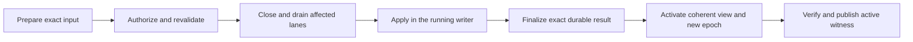

# RFC: Server lifecycle and online deployment

## Summary

Schema and serving-configuration changes must become active without
restarting the server. The running server owns admitted writes, maintenance
and deployment execution; the engine remains responsible for atomic graph
publication and recovery. A deployment is declared through `cluster apply`,
which records a validated revision in the configuration ledger; the running
server observes that revision, revalidates one exact change, drains affected
operations, applies through the existing writer implementation, finalizes its exact durable
result, activates a coherent serving view and verifies that activation. The
process and listener remain alive. Unaffected graphs continue serving.

This RFC defines the server upgrade as independently deliverable changes:
operation ownership, failure finalization, bounded resources, graph
availability and online deployment. It also defines the requirements for
recoverable request outcomes. Online deployment does not reset or recreate
a graph as a migration mechanism, hide multiple graph commits inside one
mutation, or silently fall back to a process restart. Selected live admissions are refused with 503 during drain and migration; already admitted work settles. Existing and
new reads of retained historical versions remain available under the
independent historical-read contract below. This does not promise uninterrupted
live reads or writes during schema migration.

## Motivation

The server currently captures its stored-query registry and other serving
configuration at boot. Engine reads can capture newer accepted schema while
stored queries retain their earlier source. A schema/query update can
therefore leave a long-lived server with incompatible components even when
the engine can use the updated graph without reopening. Restart reconstructs
the components, but it is an unnecessarily broad normal deployment action.

Request lifetime is a separate reliability problem. HTTP handlers directly
await effectful engine operations. Dropping a handler can leave its outcome
unknown and interrupt schema-control completion. Current content writers stage
detached table versions and publish their pins through one graph publication;
unpublished detached content does not become accepted graph data. First-touch
dataset/ref creation, schema staging and the schema-apply sentinel still have
separate completion and reclamation requirements.

[#694](https://github.com/ModernRelay/omnigraph/issues/694) originally reported a
failed merge blocking subsequent writes until restart. Its sidecar-based
mechanism is historical. The current requirement is same-process progress after
supported transient failures, exact publication outcomes and explicit refusal
where completion or reclamation cannot be proved.

The same missing lifecycle boundaries affect maintenance, recovery after
transient startup failures, status and resource accounting. A collection of
reload hooks, retry loops and longer HTTP timeouts would leave those
boundaries implicit. The server needs one operation owner and one coherent
activation path around the existing storage protocol.

Current code already provides important parts of the contract: staged
multi-table graph publication, detached table versions and pending pins,
staged-schema completion, cluster recovery records, graph-commit preconditions,
mutation/load receipts, boot readiness and bounded shutdown. This proposal
extends those owners. It does not assume every historical incident still
has its original mechanism on current source.

## User and operational behavior

### Online changes

A successful supported schema/configuration deployment leaves the same
server process and listening socket running. Subsequent admissions use the
new accepted schema and matching query/configuration bindings. No stale
stored query executes against a newly activated incompatible schema.
Unchanged graphs remain available throughout a scoped deployment.

The target includes schema, stored queries and runtime policy/provider/trust
configuration. Delivery begins with a fixed graph inventory and fixed
roots, policy, credentials, signed trust, provider and Blob-policy bindings.
Schema and stored-query changes are the first supported class. Later classes
use the same lifecycle after their authorization, secret resolution and
compatibility proofs pass. Initial scope restrictions are validated before
effects and reported explicitly, rather than silently restarting the process.

Existing schema migration rules still apply, including branch restrictions,
supported backfills, identity-preserving renames and destructive-change
authorization. Deployment does not make an unsupported migration valid.
Binary replacement, physical-root relocation and storage-format upgrades
are separate compatibility operations.

### Request outcomes

- An admitted write is invoked once and remains counted through settlement
  of its scoped work, or the shared shutdown cutoff. A terminal task result
  or contained panic does not by itself settle external storage I/O. Client
  disconnect and caller wait timeout change delivery, not execution ownership.
- Reads cancel cooperatively. Their resource and admission permits remain
  held until response bodies and scoped producers actually settle.
- When an operation publishes, success identifies its own publication. A
  no-op explicitly has no new graph commit. A committed merge followed by
  failed optional source deletion reports that compound outcome accurately.
- An uncertain result preserves available operation identity and recovery
  disposition. Transport loss may leave the caller with neither until
  recoverable submission and lookup ship. It is never presented as proof
  that the write failed or as permission to submit it again.
- Temporarily unavailable graphs remain known and have distinct read/write
  availability. Protected diagnostics are available through authorized
  status, with finite retry guidance where progress is possible.

The first operation-ownership increment does not make an interrupted client
able to retrieve a result after process loss. Durable submission identity
and lookup have additional requirements below; they are necessary to close
[#513](https://github.com/ModernRelay/omnigraph/issues/513).

### Administrative access

Deployment is declared, not requested. The configuration ledger under
`__cluster/` is the only thing the serving process reads, and each of its
revisions is one of two entry kinds. The rules below are referenced by the deployment
sequence, the interface and the evidence as "the ledger rules".

1. `cluster apply` validates and plans the configuration and records a
   **validated revision**: the content-addressed input under
   `__cluster/resources/`, its intended per-resource digests, the ledger
   revision it was validated against (its base) and, under the `blocked_on`
   ledger-fields gate, the initiating principal, approval and affected graph
   set. Its graph effects are pending. This entry kind is new: today
   `cluster apply` performs graph effects in its own process and records only
   the applied result. It never calls the serving process.
2. Exactly one mutation-capable serving process per cluster root observes the
   ledger, which is the existing one-writer operating rule of the cluster
   guide; read-only replicas rebuild on a manifest/schema probe as RFC 0036
   §10 specifies, and this RFC adds no replica enforcement. Observation is a read
   of `__cluster/state.json` (`state_revision`, `state_cas`) at boot and on a
   configured interval that is part of the compatibility contract; the
   server never reads a desired bundle.
3. The server acts on validated revisions in ledger order. A validated
   revision whose intended per-resource digests equal the digests the server
   activated is already converged and is skipped. A revision that changes
   only observations (`cluster refresh`, `import`) is not a deployment. A
   validated revision superseded by a later validated revision before the
   server acted on it is skipped, never executed; its successor proceeds once
   every revision before it is active or skipped. A validated revision whose
   base is neither active, skipped nor refused is refused before effects, as
   is an entry whose digest or provenance fails verification; a refused
   revision has no effects, so its successors are validated against the
   state that is still active.
4. The serving process runs the existing apply implementation from the
   validated entry, holding the writable engine, and records the **applied
   result** in `__cluster/state.json` under the cluster lock and state CAS
   exactly as `cluster apply` does today: per-resource outcomes and digests,
   with `config_digest` set only on full convergence. A revision the serving
   process wrote is its own result and is never observed as new. Partial
   convergence leaves some intended digests unmet; the server reports it as
   partial convergence against the validated revision rather than hiding
   behind an unchanged `config_digest`.
5. There is no deployment route on the server. Ordinary data credentials
   therefore never acquire deployment privileges, and the schema/admin
   exclusions of the existing
   [signed-data credential profile](0053-offline-data-token-verification.md)
   remain enforced.

Existing ownership of cluster-managed schemas remains enforced. A generic
schema mutation route must not become a second writer of the configuration
ledger. The online path invokes the same configuration validation, planning,
apply and graph publication implementation as existing supported tools.
While a graph has one writer, that apply runs in the serving process; the
validated entry is its authorization and the server verifies the entry's
digest and provenance before any effect.

## Design

### Ownership and relationship to existing RFCs

| Responsibility | Owner |
|---|---|
| Graph visibility, accepted schema and recovery evidence | Engine and existing storage protocol |
| Request admission, operation lifetime and shutdown | Server, following [RFC 0035](0035-served-operation-ownership.md) |
| Recovery classification and authority | Engine, following [RFC 0034](0034-durable-recovery-authority.md) |
| Coherent serving generations and graph supervision | Server, extending [RFC 0036](0036-atomic-runtime-activation.md) |
| Configuration validation, planning and durable applied state | Existing `omnigraph-cluster` implementation |
| Online deployment sequencing and its server-visible contract | This RFC |
| Exact data submission identity and recoverable outcomes | The separately gated outcome contract below |

RFCs 0034–0036 are drafts, not available implementation APIs. Their proposed
guards and effect-free constructors must be implemented and qualified
before a consumer relies on them. The ownership core can ship independently
of full supervision. Their earlier content-write recovery representation must
be reconciled with the current detached-publication protocol before use; their
authority requirements do not reinstate retired engine sidecars.

This RFC extends RFC 0036 for configuration deployment, qualified reuse of
settled mutable engine state and independent historical reads under the proofs
below. RFC 0036's existing
fresh-engine rule still applies elsewhere. This is not its existing
unchanged-schema reuse exception. Acceptance must reconcile the owning
draft's affected rules; it does not supersede that whole RFC or relax
recovery authority.

The current publication baseline is the implemented
[detached-table protocol](https://github.com/ModernRelay/omnigraph/blob/24da4f545ad5349aaa335e960ee9231eae0ea136/docs/rfcs/0067-detached-table-commits.md).
[RFC 0065](0065-isolated-branch-merge-publication.md) is earlier design context
for isolated merge preparation. This RFC uses current publication and promotion
semantics rather than restoring content-write intents or compensation.

### One serving view per admission

The published serving view contains graph identities and engine handles,
accepted schema/catalog bindings, stored-query registries, policy and
authentication bindings, providers, Blob policy, derived authentication
requirements and active revision evidence. Immutable unchanged components
may be shared, but their association belongs to one view.

A live request captures this view before authentication-dependent routing,
authorization and query selection. Reads retain their admission permit and
generation through body and scoped-producer settlement. Writes retain them
through scoped-work settlement, including submitted storage I/O. Result
delivery does not prolong the write lane; delivery buffers carry their own
bounded accounting. A request cannot
authorize against one policy, select a query from another registry and then
reload a third engine generation. Authoritative engine write-policy and
attempt revalidation remain required; admission does not replace them.

Current authentication requirements depend partly on graph policies while
other authentication fields live separately in `AppState`. A future
configuration update must publish those fields and derived requirements
together. The fixed-binding first slice verifies their effective values,
not just unchanged filenames.

### Independent historical reads

> A term set in bold italics is defined at that point.

A ***historical read view*** is immutable execution state binding exact graph,
branch and table incarnations and published data versions to version-appropriate
schema/catalog. Stored-query execution additionally binds a compatible query
revision; query-only deployment need not create a graph commit. Newly supplied
queries compile against the selected historical catalog.

Historical admission follows this contract:

1. Capture current authentication and authorization with the selected historical
   execution view. Historical selection never restores old policy or credentials.
   A denied or unverifiable binding refuses before target execution.
2. Resolve retained data, schema and query identities without depending on the
   mutable live catalog or waiting for the full live schema-apply critical
   section. Reconstruction is effect-free and must work after cache eviction
   and process restart. Existing authoritative graph/schema/configuration state
   retains the required content and references; derived serving metadata cannot
   independently declare graph publication or become a second graph ledger.
3. Acquire retention protection before reclamation can become authorized for
   the selected objects, or return an explicit expired/unavailable result.
   Never substitute current state for unavailable history. Declared retention
   bounds new acquisition; admitted readers keep protection through body and
   producer settlement, even after that acquisition window expires.
4. Keep both existing historical reads and new requests for retained versions
   independent of the live deployment drain. They remain subject to current
   authorization, bounded admission and resource budgets. Historical admission
   does not reopen a closed live cell or retarget an existing permit.
5. Register historical capture, reconstruction and producers with process
   shutdown. The same shutdown latch closes all new admission and the same
   absolute deadline governs settlement. Account for retained authority,
   resident views, reconstruction and old/new overlap; reserve deployment
   headroom before effects rather than evicting state held by admitted readers.

The engine must prove that historical execution and cache fills cannot reach
state changed by live apply or engine reuse. A retained engine `Arc` or the
current snapshot API alone does not establish this property. The capture,
retention and reconstruction interfaces remain acceptance work. This contract
does not make historical snapshots writable or promise unlimited retention.

### Operation admission and lifetime

Each live graph generation has independently closeable read and write lanes;
qualified historical admission follows the separate contract above.
Acquire, task registration and ownership transfer form one synchronous
handoff with no cancellation gap. An owned operation retains its inputs,
principal, exact serving view, workload reservation and permits until actual
settlement. The result receiver owns none of its execution lifetime. A terminal
error or contained panic preserves the counted owner of pending storage work,
or transfers it atomically to a registered successor that remains in the
original drain. Unproved settlement cannot release the permit or produce
`DrainedProof`; cutoff reports unresolved work rather than successful drain.

Cover every effectful route: mutations, stored mutations, loads, branch
create/delete/merge, GQ branch statements, deployment and maintenance.
Read capture and streaming preparation must be effect-free; any required schema
completion belongs to a separately owned operation before cancellable delivery.
Deployment/recovery tasks have their own tracked lifetime and must not hold
a data-lane permit that they then wait to drain.

Closing an admission epoch is irreversible. Successful reactivation receives
a new token even if it reuses the same engine. A drain timeout returns
remaining work and leaves the selected lanes closed; it does not prove
quiescence, cancel a mutator, start recovery or permit replacement.

All tasks, connections, streams and transitions participate in one absolute
shutdown deadline. No participant restarts the clock. Cutoff reports
unfinished/unknown work and exits without claiming graceful completion.

### Online deployment sequence

1. Observe a validated revision in the configuration ledger whose intended
   per-resource digests differ from the ones the server activated, taking
   revisions in ledger order under the ledger rules. Read its immutable, bounded input once: the
   content-addressed resources under `__cluster/resources/` the entry names,
   verified against its digests; never a desired bundle directory. Validate schemas, queries, references, supported change class
   and expected identities before graph effects. Capture semantic and
   exact-input identity from the ledger entry; never reread a changing source
   midway through the operation.
2. Use the existing full-plan semantics and cluster serialization. Revalidate
   the expected applied state, configuration and graph/schema authority.
   Verify the ledger entry's digest and, once the ledger records them, its
   principal and approval; they are the deployment's authorization. Check the complete effect set against
   current effective policy. A candidate policy cannot authorize its own
   installation.
3. Derive affected graphs and lane requirements from that full plan. There
   is no caller-supplied target list that bypasses validation of the rest of
   the configuration. Close and drain writes, maintenance and observers that
   can reach changing live state, including their producers and storage work.
   Independently admitted historical reads remain available under the contract
   above. Verify their isolation and retention proof before schema effects.
4. Verify permitted completion and recovery state under authority. Existing
   cluster apply may sweep cluster recovery records before diffing; the desired
   diff alone does not bound its effects. The first healthy path refuses pending
   cluster recovery and staged schema work rather than touching undrained graphs.
   Legacy graph `__recovery/` artifacts also refuse. A later path must include
   every completion or recovery participant in its verified scope.
5. Execute the existing apply implementation in the running designated
   writer, from the validated entry; the pending-effects entry is the new
   part, the apply is not. Preserve cluster
   recovery records, engine detached publication and pending-pin semantics,
   schema staging and sentinel rules, exact identity checks and durable
   applied-state publication. Do not launch another writable process beside
   the serving process.
6. Obtain the exact durable result from that publication path. It binds the
   input and base, applied-state revision/digest, complete per-resource
   outcomes, accepted schema identities and the operation's own graph
   publications. Finalization must not sample a later current ledger or HEAD.
7. Validate the replacement serving view against that exact achieved state.
   Hold serialization through activation, or use an equivalent exact
   authority guard that excludes a superseding deployment. Publish the new
   view and fresh admission cells atomically with respect to shutdown.
8. Publish an active witness for this deployment through current-state
   lookup. It distinguishes validated, durably applied and active state. Applying data successfully and failing
   activation are different outcomes.

One atomic runtime publication does not turn a multi-graph deployment into a
cross-graph transaction. Existing partial-convergence semantics remain.
An execution failure may leave different resources at different durable
boundaries. A coherent achieved projection may activate under its own
identity after verification; it must not claim the validated revision fully
active. Unresolved affected live lanes remain closed. Historical reads follow
the independent-view contract; unaffected graphs retain their verified bindings.

### Minimum deployment interface

The first online release includes ledger observation, authorized lookup of
the original operation, observation of current active state and capability
discovery. Submission is `cluster apply`'s existing surface, not a server
route. The following are semantic requirements; endpoint spellings, wire
encoding and storage compatibility remain acceptance work.

| Surface | Required contract |
|---|---|
| Capabilities | Advertise supported change classes, protocol versions and result-retention semantics |
| Ledger observation | The server binds a deployment's identity from the validated ledger entry: its revision, intended per-resource digests, affected graph set, operation kind, input identity, its base and, once the ledger records them, principal and approval; it never derives any of these from a caller |
| Identity | One validated revision is one deployment; observing the same revision twice shares one execution; a revision superseded before the server acted on it is skipped and its successor proceeds; a revision whose base is neither active, skipped nor refused, or whose digest or provenance fails verification, is refused before effects (the ledger rules) |
| Original-operation lookup | Under current authorization, return the original revision, execution/effect disposition and bounded phase/progress; include exact result and proved activation evidence when available, with pending/unknown/skipped/refused explicit |
| Current-state lookup | Report current active identity, and the newest observed validated revision with its disposition (pending, skipped, refused with reason, partially converged, converged), separately from historical deployment results |
| Result | Distinguish refusal, applied-but-not-active, partial convergence, unresolved effects and verified activation; bind exact per-resource publications and explicit no-ops, never a later HEAD |
| Retention | Terminal results are retained with the ledger entry that produced them; unresolved recovery authority must not expire; an absent or expired result never proves non-execution |

Ordering, skipping and refusal follow the ledger rules. An operator deciding
whether to record a new revision compares the ledger's newest validated
revision with the active identity from current-state lookup; after partial
convergence the active identity is the achieved projection's. After a newer
deployment, lookup still returns the earlier revision's result and proved
activation evidence; it must not replay or reactivate the superseded
configuration. If crash timing prevents proving historical activation, report
that uncertainty rather than inferring it from a newer ledger or a
reconstructed current view. A refused revision is a deployment result:
original-operation lookup returns it as refused with the reason, current-state
lookup shows it as the newest observed revision's disposition, and the status
values are unchanged; the server keeps serving its active revision and
re-evaluates only when the ledger changes.

Observation acknowledges nothing to a caller: the ledger entry is durable
before the server sees it, so a lost observation is repeated on the next
interval read or restart without creating a second execution. The initial interface
offers no general cancellation or undo after observation; withdrawing a
change is a new ledger revision. Convergence is reported through current-state
lookup as the newest validated revision's intended per-resource digests
against the active ones; the `/readyz` field `booted_serving_digest` remains
the boot-time witness of [RFC 0049](0049-control-plane-seams.md) and is not
that comparison. These
deployment-specific requirements belong to increment E; general data-write idempotency remains
increment F. Extend existing applied-state/recovery authority rather than
introducing a parallel job log.

### Engine reuse and candidate construction

The initial schema/query deployment may reuse the current engine only when:

- Every operation that can reach mutable state being reused has settled,
  including bodies, producers and submitted storage work. Historical readers
  are exempt only with the independent execution/cache proof above.
- Graph identity/root and policy, provider, credential/trust and Blob-policy
  bindings are unchanged and verified.
- Accepted schema/catalog and complete publication authority have been
  verified after apply, including rename and drop/re-add lifetimes.
- Every retained state-dependent cache is keyed by exact accepted identity
  or has a proved invalidation/refresh path. Historical cache fills remain
  isolated by their exact view identities and cannot populate live caches.
- The new runtime bindings and admission epoch are fresh even though the
  engine allocation is retained.

Otherwise candidate construction requires a fresh effect-free factory under
the engine's verified authority. Current writable open refuses legacy graph
recovery sidecars, may promote or discard staged schema files and may reclaim
the schema-apply sentinel. `refresh()` may promote a published schema contract
and release its sentinel. Neither is an effect-free candidate-construction API. A pointer swap or
retained `Arc` alone does not preserve an old schema view.

### Failure, finalization and restart safety

The engine classifies effects and recovery; server lifecycle consumes that
classification. Separate substrate condition, whole-operation outcome,
recovery disposition and caller action. A transient storage error says
nothing by itself about whether an earlier effect occurred.

The phase is diagnostic, not proof of publication or permission to retry.
Each transition preserves the original identity and distinguishes execution
settlement from knowledge of its effects.

| Phase | Serving behavior | Transition and failure contract |
|---|---|---|
| Prepare and authorize | Existing verified view serves | Validate input and reserve candidate capacity before closing lanes; refusal has no deployment effects; bind the observed ledger identity before effectful execution |
| Close and drain | Unaffected graphs and qualified historical reads serve; selected live admissions refuse and admitted live work settles | Keep tracked ownership and closed epochs; timeout does not prove quiescence; reopen only after qualified settlement, with proof of no deployment effects and unchanged authority, using a fresh epoch |
| Apply | Selected live lanes stay closed; qualified historical reads serve | Each migration publishes through the engine protocol; cluster recovery records retain unfinished configuration work. Pending pins and staged-schema completion preserve published outcomes; ambiguity forbids blind replay |
| Finalize | Selected live lanes stay closed even if graph publication succeeded; qualified historical reads serve | Bind the exact per-resource and applied-state result; finalization failure does not turn a known publication into an abort |
| Activate | Publish one verified view of the exact achieved state | Exclude superseding deployments and shutdown; failed activation preserves the applied result; registry rollback does not undo data |
| Verify and publish | Verified bindings serve in fresh admission epochs | Publish the exact witness; a crash before publication leaves it retrievable under the retention contract; restart requires a freshly verified serving view |

Once effects may exist, returning to the old view requires engine proof that
it is still valid. Reversal after publication is a newly validated
deployment. Partial convergence does not become cross-graph atomicity.
Startup reconciles observed and ambiguous transitions before effectful open
or active readiness, including an observed revision that never began apply.

An online deployment needs durable identity and enough publication evidence
to distinguish an unresolved transition from a completed result after a
process crash. Startup must not boot an incompatible registry, run unauthorized
recovery or report the validated deployment active merely because it sees a
newer ledger. An in-memory drain flag is insufficient.

This RFC requires that startup gate but does not pretend an existing durable
deployment-result encoding supplies it. Its representation must extend the
existing applied-state/recovery authority with exact operation binding and
retention rules. It must not become a second source of graph truth, custom
WAL or replay queue. Encoding, publication ordering, finalization and
downgrade refusal are `blocked_on` gates for online deployment, not decisions
this document settles.

### Failed writes and recovery progress

[#694](https://github.com/ModernRelay/omnigraph/issues/694) supplies a progress
requirement, not a requirement to recreate its former sidecar classifier. Failed
content preparation leaves unpublished detached content outside the accepted
snapshot. A published pin remains authoritative when promotion fails; supported
readers resolve its exact detached version until promotion completes. A missing
response or ambiguous publication acknowledgment does not authorize replay.

Keep separate completion rules for schema staging, the schema-apply sentinel,
first-touch datasets/native refs and graph-branch controls. Schema publication
followed by failed contract installation remains a published result requiring
completion. Blocked promotion or missing reclamation proof retains its evidence
and reports the affected capability; task termination does not resolve either.

Legacy graph `__recovery/` artifacts belong to builds predating detached table
commits. Current writable open and storage upgrade refuse them and direct the
operator to the build that wrote them for supported recovery. The current binary
must not reinterpret or delete those artifacts.
[#601](https://github.com/ModernRelay/omnigraph/issues/601) and
[#602](https://github.com/ModernRelay/omnigraph/issues/602) remain historical
compatibility cases, not current engine sidecar-repair implementation targets.

Cluster recovery records remain a separate authority for interrupted
configuration operations. Completion, cleanup and any future recovery procedure
require exact ownership and quiescence proofs. Supported transient failures must
restore same-process progress; unverifiable or unsupported cases remain blocked.

### Maintenance and graph availability

Optimize, rebuild and cleanup use the same designated writer, admission and
operation ownership. Productive user-table maintenance stages detached versions
and publishes their pins in one graph commit; promotion preserves that result.
Physical compaction of main's `__manifest` preserves content outside that publication, and
cleanup does not manufacture a graph-content commit. An independent optimizer process, even in the
same container, is another writer and cannot rely on server-local locks.

Cleanup additionally needs reader lifetime and retention proofs covering
snapshots, native refs, published pending pins and staged content, including
retained serving and candidate views. Historical acquisition and cleanup obey
the ordering in the independent historical-read contract. Open handles, object age and zero in-process I/O counters
alone do not prove that reclamation is safe. Missing index coverage is derived
performance state and must not make ordinary graph results incomplete.
Index status is read-only and must not trigger maintenance.

Keep every configured graph represented while opening, serving, draining,
recovering or blocked. Reads and writes can have different availability when
the engine proves an accepted read snapshot remains safe. Supervision is
bounded and singleflight per graph; notifications coalesce as hints without
resetting deadlines or retry budgets. A transient failure is retried only
when its effect/authority disposition permits another recovery attempt.
Unverifiable state remains blocked with an actionable diagnostic.

Reduce failure scope only when durable evidence proves independence. A
branch-local condition may permit other branches to proceed; a global schema
or unattributable recovery condition must not be ignored for availability.

### Exact outcomes and CLI retry guidance

Thread the engine's own publication result through every merge surface.
Reading latest target history after a merge can return another writer's
commit and is not a receipt. Configuration/query-only activation may produce
a new active revision without a new graph commit; no-op results preserve
that distinction.

Increment A requires the following merge receipt contract on the branch HTTP
route, a GQ merge statement on `POST /mutate`, and CLI JSON output. For
`fast_forward` and `merged`, `commit` is the exact `CommitOutput` produced by
that merge: `graph_commit_id`, `graph_manifest_version`, optional `graph_branch`,
`parent_commit_id`, `merged_parent_commit_id` and `actor_id`, and `created_at`
in Unix microseconds. Optional values come from that publication, never a later
history lookup or invented attribution. A fast-forward also publishes a new
target commit; its `merged_parent_commit_id` is the source head. An `already_up_to_date` result has
`commit: null`; it must not manufacture a publication. An older server's missing
receipt remains missing evidence, not proof of a no-op. A present `commit` is a
receipt only from a server whose `/healthz` `version` is at or above the
release that ships increment A; earlier servers may return a later target head
in `commit`.

Optional source deletion is a separate effect after successful merge. Deletion
failure retains the exact merge receipt, `branch_deleted: false`, the legacy
`branch_delete_error` and structured `branch_delete_error_details` (an
`ErrorOutput`). The compound
CLI command retains its successful exit 0 and reports the deletion failure;
retrying cleanup must not replay the completed merge. These are increment A
requirements, not claims that every inspected server already implements them.

Execution settlement and effect knowledge are independent:

| Execution evidence | Effect knowledge | Permitted continuation |
|---|---|---|
| Not admitted, or settled with no possible later effects | Proved no effects | A fresh attempt only when the typed caller action and preconditions permit it |
| Still running | Any currently known result | Observe the original owner; do not duplicate execution |
| Settled with no possible later effects | Exact committed, no-op or compound result | Return the original result and any remaining recovery disposition; do not replay input |
| Settled with no possible later effects | Unknown | Reconcile exact evidence; settlement alone does not authorize non-idempotent replay |
| Settlement or external I/O quiescence unproved | Incomplete, including timeout or process loss | Preserve unresolved identity and recovery authority; delayed effects may still arrive |

Joining or dropping a task does not itself prove that an already submitted
object-store request cannot finish later. The stronger settlement claim
requires engine-qualified evidence, including child producers and external
I/O. Process ownership is distinct from durable acceptance. A known graph
publication stays known when cleanup, finalization or response delivery fails.

For [#466](https://github.com/ModernRelay/omnigraph/issues/466), preserve
structured error details through ordinary and streamed HTTP/CLI paths and
centralize data-command outcome classification:

| Evidence | Caller action |
|---|---|
| Proved pre-effect transient refusal of the entire command | A bounded fresh attempt may be allowed |
| Failed caller precondition | Re-read and decide; do not discard the condition |
| Fixed resource or logical conflict | Correct the request or limiting condition |
| Recovery making bounded progress | Observe/back off according to the typed disposition |
| Recovery blocked | Follow the stated supported recovery action |
| Unknown earlier outcome | Reconcile the original operation; do not blindly resubmit |

Data-write failures other than typed precondition failures carry
`command_outcome { execution, effects, action }`; `action` is one of `retry`,
`refresh`, `recover` or `reconcile` and selects the caller action.

A low-level retryable failure does not make a compound command replayable.
Direct reopen may complete earlier work. HTTP 409/503, topology and generic
`RecoveryRequired` are not retry authorization. Preserve existing CLI exit
contracts, including explicit precondition failures; new data-command exits
must be documented and qualified without globally remapping other command
families. The first increment adds classification, not an automatic retry
loop.

For increment A's data-write commands, exit 75 means the evidence permits a
bounded caller retry of the complete requested command with unchanged
preconditions and no original work still able to produce its logical effects.
The initial supported cases are a verified single-request admission refusal
(HTTP 429 with typed `too_many_requests`) and an effect-free preparation conflict
from direct standalone append/merge load without `--from`. The CLI forwards the
response's `Retry-After` value in its structured output; the caller owns the
attempt bound. Mutating read-set
conflicts require caller reconsideration, not exit 75. Compound loads, branch
operations, generic 409/503, resource failure, recovery-required responses and
unknown or malformed results do not qualify merely because their last failure
looks transient. Conditional mutation mismatches retain exit 4 and prove the
write had no effect; re-read and resubmit under a new precondition is
permitted. Other failures retain exit 1. A malformed or truncated write
response after dispatch is an unknown outcome with exit 1 even when the HTTP
status was 2xx. Successful merge with failed optional deletion follows the exit 0
rule above. Ordinary read/validation and managed-lifecycle command families keep
their existing contracts. Publish and qualify these new data-write semantics
before advertising the receipt/outcome increment.

Durable data submission and lookup require a separately reviewable protocol:
the caller knows its key before sending; its scope includes the stable
authenticated principal and operation kind; key lookup binds the original
graph/branch incarnations before selecting current names; semantic input and
preconditions are fingerprinted; concurrent duplicates attach to one
execution; changed input under the same key conflicts. Current authorization
protects lookup. Committed, no-op, refused and compound outcomes have explicit
crash and finite-retention semantics. An expired/missing record is not proof
of no effects. No independent result database may become graph commit truth.
In-memory task registration alone cannot acknowledge durable acceptance.

### Resource bounds and feed progress

Bound aggregate ingress before collecting or parsing request bodies. Include
process-wide and per-actor concurrency, retained inputs, queue capacity and
actor-record cardinality. Account for decoded Arrow/vector/Blob buffers,
staging, merge validation, hydration and output until their actual lifetime
ends. Existing body/chunk limits and estimated request bytes do not measure
total engine work. Each configured cap declares whether it counts admitted
lifetime, executing work or queued work, and its process-wide or per-actor
domain. Define immediate refusal or a finite queue with bounded retained inputs
and wait. An unconfigured cap defaults to immediate refusal with
`too_many_requests`. A pre-admission queue entry is not write admission and cannot perform graph effects;
its transition into owned execution uses the synchronous handoff above.

Reserve bounded execution, memory and local I/O admission/concurrency
capacity within the aggregate process budget for finalization of admitted
work, authorized recovery, shutdown and status. Ordinary admission must not
consume this reserve. Keep a small diagnostic allowance separate from the
qualified budget for larger recovery work. These paths must not wait for a data-lane permit
held by work they must settle. Reserves prevent starvation by new traffic;
they neither guarantee storage progress nor extend deadlines, retry budgets
or recovery authority. If qualified recovery cannot fit, preserve its
authority and report the limiting condition.

Bound concurrent candidate preparation and retained generations. Account
for the overlap of active, candidate and retained views, caches, decode/I/O
buffers and staged inputs until their actual release; shared allocations
count once. Reserve qualified preparation/activation headroom before closing
otherwise healthy lanes; preserve admitted historical readers and declared
retention rather than evicting their required state. Insufficient capacity
refuses or defers within a
bounded queue. Exhaustion after effects follows the existing outcome and
recovery contract. Failed preparation cannot accumulate generations, and
resources are released only after their users and producers settle.

Candidate expiry follows [RFC 0036's cancellation and settlement rule](0036-atomic-runtime-activation.md#113-global-bounds-and-fairness).
A deadline invalidates activation and requests cancellation; it does not return
build or byte capacity while construction work remains unsettled.

Separate input deadlines, caller response-wait deadlines, read-execution
budgets and the shared shutdown deadline. Refuse excessive work before
effects where the engine can prove that boundary. Budget exhaustion after
effects must preserve an exact recovery outcome. Never split one requested
atomic mutation into unannounced incremental commits.

Measure merge work against target size/history, delta size, selected columns
and row width. Small upload size does not bound merge scan memory. The
reported `ordered_scan_input_batch_bytes` failure in #694 needs its own
fixture and cost evidence; a feed failure using the same limit name does not
establish the merge's mechanism. Raising the cap is not a recovery fix.

For changes/feed and ordered export, use bounded key/address-first ordering
where applicable and hydrate payloads from exact pinned datasets. Preserve
order, cardinality and fragment/version identity. A supported wide row must
not permanently block the cursor. Keep [RFC 0030's solo-oversized forward-progress exception](0030-cdc-time-travel.md) and
test Blob/encoding expansion and oversized identifiers. Do not skip a bad
commit or lower ingress limits to hide already accepted history.

### Status and embedding diagnostics

Preserve `/healthz` as process liveness and the `/readyz` fields
`booted_serving_digest`, `state_revision` and `state_cas` as boot facts. Add
the `deploying` status value, an active-deployment flag and dynamic read/write
availability without relabeling those fields; deployment identity stays on the
authenticated current-state lookup. `served_graph_count` keeps counting registry
entries and `quarantined_graph_count` the applied graphs with no entry; a
draining, blocked or historical-only graph has a registry entry and is counted
as served, not quarantined. `ready`
is true iff the response is 200; `status` keeps `serving` and `draining` and
gains `loading` and `deploying`. Readiness,
current status and active graph counts derive from the graph lifecycle. A successful active witness binds
the exact achieved state, accepted schemas and fresh generation; it is not
manufactured from current HEAD.

The aggregate readiness contract is:

| Current serving state | `/readyz` |
|---|---|
| At least one graph has live-read, write or qualified historical-read availability | 200, with separate live-read, write and historical-read graph counts |
| Valid applied empty graph inventory | 200, with zero active graphs |
| Nonempty inventory with no available graph, including initial loading | 503 |
| Process shutdown has begun | 503 regardless of remaining graph availability |

The counts are `live_read_graph_count`, `write_graph_count` and
`historical_read_graph_count`; a balancer routing live traffic keys on
`live_read_graph_count > 0`, not on the status code. `status` reports
`loading`, `serving`, `deploying` or `draining`; no deployment identity
appears in unauthenticated readiness.

Thus one graph's drain does not make healthy peers globally unready. HTTP
200 alone never proves a deployment completed; callers compare the witness's
applied revision and digest; its activation component changes on every
activation, including restart. The changed readiness behavior requires versioned
compatibility qualification alongside its new fields.

[RFC 0036's readiness projection](0036-atomic-runtime-activation.md#6-registry-state-and-generation-state-machine)
owns per-graph live and historical availability. RFC 0036's proposed `read_ready` and the
existing default `GET /graphs` list mean live-read readiness. Authorized
`include=all` status also exposes independent historical readiness, with absence
on an older server meaning unknown. Historical routes never use live readiness
as their admission gate. Historical-only service therefore yields aggregate
200 and a historical count without implying live availability or adding the
graph to the legacy list. If all historical targets become unavailable and no
other capability serves, a nonempty inventory yields 503. Finishing admitted
readers alone do not establish readiness for new requests. These observations
neither authorize a caller nor guarantee any particular retained target;
exact admission still applies, and status must not reconstruct historical views.

Keep graph identifiers and protected recovery detail out of unauthenticated
readiness. Authorized inventory/status must preserve existing credential
scope and disclosure rules. A broader identity/discovery change requires
its own explicit compatibility contract.

Authorized operation status exposes original operation identity, observed
phase and elapsed time, outstanding read/write/producer drain counts,
last failure, retry-budget disposition and supported next action.
Deployments also expose validated, applied and active
identities when available. Mark observations with their freshness; elapsed
time does not imply progress or completion. Use monotonic timing within a
process epoch, and identify reconstructed or unavailable timing after restart.

Status reads bounded snapshots without entering the affected data lane or
waiting for its drain or deployment serialization. It does not trigger
recovery. Bound polling, payloads, retained history and metric cardinality;
operation IDs belong in protected diagnostics, not unbounded metric labels.
Derived progress can be discarded or rebuilt; it must not become a second
source of operation ownership or durable result truth.

Ordinary `@embed` currently declares metadata; the server does not populate
vectors automatically. Add useful missing/supplied embedding diagnostics
for the touched input. Automatic embedding population remains the separate
value-semantics proposal in [RFC 0015](0015-ingest-embeddings.md), including
provider provenance, stale values, supplied-vector precedence and update
races. Operation ownership alone does not deliver it.

## Invariants

The [architectural invariants](../dev/invariants.md) remain binding:

- Invariants 1–5: Lance retains per-table storage ownership; one graph
  publication contains all participants; attempts use coherent authority;
  detached effects stay outside graph visibility until publication, and
  published pins plus schema evidence govern completion.
- Invariants 6–9: schema/incarnation identity survives supported renames;
  caches and indexes remain derived; failures stay typed and loud; query
  semantics remain in typed compiler structures.
- Invariant 10: authentication establishes the principal, and authoritative
  engine checks still enforce permission for every mutating entry.
- Invariants 11–13: lifetime, memory, retries and queues are bounded;
  runtime/status are derived from authoritative state; tests qualify the
  boundary whose promise changes.

No custom WAL, transaction manager, manifest-derived job queue, synchronous
vector/FTS rebuild on content writes, public raw Lance writer, string-built
query semantics or second commit authority is introduced. Admission locks
are explicitly process-local, not distributed fencing. The existing
one-mutation-process support boundary remains; this RFC adds neither writer
takeover nor read-only replica enforcement.

## Compatibility and reversibility

Normal data requests retain their APIs and graph publication semantics.
Existing graph-commit preconditions are not idempotency keys. Ledger entries
the server binds, exact results and active witnesses need versioned capability
negotiation and unknown-field/error compatibility tests. A server that cannot
perform a validated online change refuses before effects; it must not
silently execute a restart-based path.

The ownership/resource increments need no new graph format. Durable
deployment/outcome evidence may require versioned extensions to existing
authority; their encoding and migration are `blocked_on` gates.
Older binaries must refuse incompatible evidence before effectful recovery.
Never remove schema fields, graph rows or recovery artifacts to make a
downgrade appear compatible.

Configuration rollback is a newly validated deployment against current
accepted state. It is not reuse of a stale registry or an assumption that
data effects were undone. Runtime activation cannot conceal a partial apply.
Local and object-store deployments use the same protocol; Azure retains its
existing admission-wrapper and qualification boundary.

## Alternatives

| Alternative | Why it does not meet the target |
|---|---|
| Restart after every schema/configuration change | Disrupts unrelated graphs and makes process replacement the normal deployment mechanism |
| Refresh engines on request or after errors | Leaves startup query/policy bindings stale and can perform recovery effects |
| Watch applied state and swap a registry without draining | The naive form notices schema effects too late and owns no drain, authority or crash recovery; the drained, verified, reconciled form is this design |
| Accept deployments through an operator route on the serving server | Adds a second entry point for configuration changes beside the ledger, the only thing the server reads ([RFC 0005](0005-server-cluster-boot.md), [RFC 0049](0049-control-plane-seams.md)); the ledger entry carries the input identity today and, under this RFC, principal and approval, and a route would need its own credentials, lifecycle and blast radius |
| Drain historical reads with live traffic | Blocks independent old-version queries and lets long historical streams delay live deployment |
| Retain only the old engine `Arc` | Does not freeze its mutable catalog/cache state or reconstruct an evicted view |
| Add a separate historical graph ledger | Duplicates publication authority; retained references to existing graph/schema/query authority must suffice |
| Always reopen engines | Current open is effectful and discards reusable state without proving coherent activation |
| Pause serving and run an independent writable apply process | Introduces a writer-transfer and restart race that process-local admission cannot fence. Revisited once a durable writer epoch fences writers across processes: apply then returns to the control plane and the serving process keeps only observation, drain, activation and the witness |
| Detach writes without accounting or durable evidence | Avoids one cancellation path but permits unbounded work and does not resolve lost outcomes |
| Replay transient errors or every `RecoveryRequired` | May repeat already committed or partially completed work |
| Require a complete supervisor/job system first | Delays independently useful ownership, receipt, recovery and feed fixes |

## Evidence and tests

### Investigation evidence

Source audit at `5c4ca700` through `fe8ae062`, revalidated at `24da4f54`; the
PR description holds the run counts.

The investigation read the complete relevant Lance storage, transactions,
schema evolution, branches/cleanup, scanner/Blob, index and observability
pages and inspected pinned Lance 11 source. Relevant constraints include
[transaction ownership](https://lance.org/format/table/transaction/),
[schema evolution](https://lance.org/guide/data_evolution/),
[versioned reads and maintenance](https://lance.org/guide/read_and_write/),
[object-store behavior](https://lance.org/guide/object_store/) and
[Blob access](https://lance.org/guide/blob/). They support exact version-pinned
reads and explicit coordination; they do not make caller cancellation an
abort or require a process restart for every schema change.

### Design precedents

These references inform the requirements above, without importing their
storage protocols or promising their availability model.

| Reference | Applicable lesson | Boundary in this proposal |
|---|---|---|
| [CockroachDB schema changer](https://github.com/cockroachdb/cockroach/blob/master/pkg/sql/schemachanger/doc.go) and [Google long-running operations](https://google.aip.dev/151) | Explicit transition stages and separately observable operation results | Keep OmniGraph's existing publication authority; no generic job system or full online schema backfill promise |
| [FoundationDB error handling](https://apple.github.io/foundationdb/developer-guide.html#error-handling) | A commit error can leave its outcome unknown; retry safety needs operation identity and outcome semantics | Task completion, outcome knowledge and possible later effects remain separate; no imported transaction retry loop |
| [Envoy listener updates](https://www.envoyproxy.io/docs/envoy/latest/configuration/listeners/lds) and [overload manager](https://www.envoyproxy.io/docs/envoy/latest/configuration/operations/overload_manager/overload_manager) | Prepare replacement state, drain old work and preserve bounded essential capacity under overload | Schema publication is an additional durable boundary; activation cannot undo it |
| [Tokio TaskTracker](https://docs.rs/tokio-util/latest/tokio_util/task/task_tracker/struct.TaskTracker.html) | Tracking and closing a tracker do not by themselves prevent new task creation | Admission closure must exclude late registration and account for child producers |
| [SlateDB garbage collection](https://slatedb.io/docs/design/gc/#boundary-files) | Delayed writes must be considered when deciding which storage objects can be reclaimed | Use exact engine retention/recovery proof; do not copy boundary-file formats or infer quiescence from time |
| [TigerBeetle deterministic simulation](https://github.com/tigerbeetle/tigerbeetle/blob/main/docs/internals/vopr.md) | Reproducible interacting faults expose lifecycle races | Extend existing DST owners, plus real transport and configured backend qualification |

### Acceptance matrix

Extend the owners in [the testing map](../dev/testing.md). Logical row/error
behavior belongs in GQT; mechanism, concurrency, scale and process lifetime
use their existing Rust owners.

| Contract | Required evidence | Existing owners |
|---|---|---|
| Owned writes and reads | Actual HTTP/1 disconnect, HTTP/2 reset, wait timeout, dropped receiver and body abandonment at each durable boundary; acquire/close/spawn and late-child races; permits survive until settlement | Server `data_routes`, `stored_queries`, unit/process fixtures |
| Online schema/query changes | Same PID/listener; new query/schema together; unaffected graph remains usable; invalid query refuses before effects | Server `multi_graph`, `schema_routes`, `stored_queries`; cluster apply tests |
| Engine reuse | Warm-cache rename, drop/re-add, new fields/types, historical cache isolation, no unaccounted producers, fresh admission token; shared-memory and configured backend coverage | Engine `schema_apply`, `failpoints`, `warm_read_cost`; DST |
| Ledger observation | The same validated revision observed twice during drain/apply; a revision superseded between observation and activation; a revision whose base is neither active, skipped nor refused; an entry failing digest or provenance verification; restart between observation and activation; deploy D1 then D2 and retrieve D1 without replay/reactivation | Cluster apply/failpoint tests; server process owners |
| Deployment crash safety | Crash before/after ledger observation, each graph effect, applied-state publication, finalization, activation and witness publication; pending transition cannot boot ready incorrectly; unproved historical activation stays unknown | Cluster failpoints; server boot/process fixtures |
| Shutdown and activation | Race shutdown against view publication and fresh admission; no new admission opens after shutdown wins; all participants share one deadline | Server lifetime/process fixtures; DST |
| Failed merge progress (#694) | Resource failure and disconnect separately; distinguish unpublished content, first-touch effects and published pins; supported completion restores same-process writes; unsupported blocked promotion stays explicit | Merge/GQT owners, engine `failpoints`, server route/process owners |
| Multi-table maintenance | One coherent published snapshot; publication/promotion failures preserve exact pins; delayed completion racing cleanup cannot reclaim accepted data or cross an incarnation; readers, refs and unproved detached copies stay protected | Engine `maintenance`, `failpoints`; DST |
| Legacy artifacts and schema completion | Legacy sidecars refuse without mutation and name the originating-build procedure; schema-install/sentinel faults preserve completion authority; cluster recovery retains its separate rules | Engine compatibility/schema/failpoint owners; cluster apply tests |
| Exact receipts and retry (#466) | Competing later commit cannot change receipt; merge/delete partial outcome; structured and streamed errors; no extra submissions on unknown results | Server `data_routes`; CLI `cli_data`, `parity_matrix` |
| Graph and operation status | Loading, empty configuration, partial read/write availability, peer failure, retry exhaustion, shutdown; phase/counts remain obtainable during blocked drain; bounded history, boot/active distinction and disclosure | Server `boot_settings`, `multi_graph`, `auth_policy`, `openapi` |
| Bounds and feed | Saturated admission/queues, actor cardinality, retained buffers, wide payload/key/Blob, encoding expansion and repeated cursor progress | Engine `changes`, `changes_cost`; server route/resource tests |
| Reserved completion capacity | Saturate ordinary work while finalization, qualified recovery, shutdown and status progress within their budgets; persistent storage failure produces bounded refusal, not fictitious progress | Server resource/lifetime owners; engine failpoints; DST |
| Replacement capacity | Concurrent proposals and repeated failed preparations stay bounded; insufficient headroom leaves healthy lanes open; active/candidate/retained overlap remains charged until release; candidate expiry follows RFC 0036 settlement and late-activation checks | Server activation/resource owners; cluster apply tests |
| Durable data outcomes | Same-key concurrency, changed payload, lost first response, process crash, graph/branch recreation, no-op, expiry and authorization changes | Outcome protocol tests plus server/CLI integration owners when that slice is designed |

The online deployment release gate requires zero implicit restarts in every
supported-change case and zero mixed schema/query activations. Every failure
case must end with an exact result or explicit unresolved ownership; no
false success, blind replay or silent partial result is allowed. Record
measured drain/migration/memory costs before setting availability promises.

Exercise interacting failures, not only isolated failpoints: overload during
finalization, shutdown during activation, late producers during drain and
delayed I/O during cleanup. For a server that remains serving, removing the
injected transient fault must restore same-process write progress when the
engine proves recovery and resumption are authorized. When that proof is
unavailable, assert bounded, explicit refusal. Shutdown cases must settle or
report unresolved work by the shared deadline without reopening admission.
Run these interleavings through existing deterministic simulation where
representable and retain transport/backend tests for behavior the simulator
cannot prove.

Before implementation merges, run the canonical workspace feature graph,
both Clippy graphs, formatting, OpenAPI and repository checks, plus configured
backend suites for the changed authority. Local green tests are not live
object-store, transport or deployment qualification.

### Server validation

These are draft acceptance requirements, not claims of implemented coverage.
Case IDs T1–T11 and benchmark IDs B1–B6 are the stable identifiers the delivery gates cite.
Each delivery slice supplies evidence before advertising its guarantee.

#### Ownership

| Layer | Owns | Extend |
|---|---|---|
| GQT + DST | Rows, types, errors, publication and subsequent progress | `omnigraph-gqt/cases/`; reduce expressible failure cases |
| Rust DST | Generated workloads, interleavings, receipts, lifecycle and resource assertions | `omnigraph-dst` scenarios, environment and storage decorators |
| Server/process tests | HTTP delivery, disconnects, signals, process death, readiness and restart | Server route suites and CLI `tests/support`, `system_remote`, `cli_data` |
| Deterministic cost tests | Reviewed bounds on calls, scans and resource accounting | Engine `write_cost`, `merge_cost`, `warm_read_cost`, `changes_cost`; DST `CostLedger` |
| `omnigraph-bench` | Latency, throughput, memory and tenant interference | Existing scenario, supervisor, fixture and archive interfaces |

Extend [existing owners](../dev/testing.md). GQT and Rust share the DST runtime
and fault implementation. Reduce discovered failures into GQT when expressible;
retain Rust coverage when the mechanism or interleaving is essential.

#### Fixtures and common assertions

Adapt existing fixtures to these minimum shapes; do not create parallel setup
helpers. Every case records its initial head, expected rows and touched tables.

| Fixture | Shape and purpose |
|---|---|
| Atomic batch | Two accounts with balances 100 and 0; one transfer changes them to 90 and 10 and inserts a transfer record in another table. Include an edge participant and an untouched marker. Detect torn statements, tables and edges, not just conserved totals. |
| Merge | Source and named target diverge from one base; include both inherited and independently changed tables. Parameterize no-op, fast-forward and three-way merge. A second writer can advance the target. |
| Online schema | Warm a traversal and stored query over two node types and an edge; retain an old snapshot with compatible schema and query revisions. Exercise optional-field addition, supported rename and drop/re-add. Use a single-graph variant for historical-only readiness and an A/B affected plus C unaffected variant for partial convergence. |
| Wide feed | Narrow rows, wide strings with JSON escaping, wide keys and Blob descriptors; follow each wide change with a small sentinel commit. |

Judge exact rows, types, manifest table pins and lineage together. Known committed
work must survive; proven pre-effect refusal must leave the old state. An unknown
outcome for one graph publication may resolve to a complete old or new state,
never a visible prefix. Multi-graph deployments retain the explicit partial-
convergence contract above; do not assert cross-graph atomicity.
Preserve ambiguous/foreign recovery evidence and refuse when authority is unproved.
After recoverable faults clear, require another write on the same process and two
reopens without duplicate graph publication. Permanent faults must instead
produce bounded, explicit refusal. Test deadlines are containment limits, not SLOs.

#### Required scenarios

| ID / prerequisite | Trigger | Required assertions / owner |
|---|---|---|
| T1 Receipt slice | Merge, then advance target before returning the merge result; cover all merge modes and both HTTP merge entry points. | Enforce the [Design receipt contract](#exact-outcomes-and-cli-retry-guidance), including optional values, exact own publication and no-op. Rust receipt/history oracle plus route tests. |
| T2 Receipt slice | Proxy suppresses or truncates a successful upstream response; separately return 504 or expire client wait. Deny source deletion after successful merge. | Exactly one CLI submission; unknown/reconcile on lost delivery; durable contents prove the effect. Deletion refusal retains merge receipt, structured deletion error and current successful compound-command exit. CLI + real server. |
| T3 Outcome classification | Exercise every supported retry case and exclusion in the [Design exit contract](#exact-outcomes-and-cli-retry-guidance), including compound commands and malformed success. | Exit and caller action match the whole-command evidence. Inspect request counts, pending work and durable state; qualify precondition and optional-deletion outcomes separately. CLI owner for issue 466. |
| T4 Engine completion | Fail atomic batch/merge before publication, after detached table effects, after publication acknowledgment loss, and during promotion or schema installation. | Exact publication visibility and retained pins; promotion is idempotent (per the [detached-table protocol](https://github.com/ModernRelay/omnigraph/blob/24da4f545ad5349aaa335e960ee9231eae0ea136/docs/rfcs/0067-detached-table-commits.md)) and never duplicates graph publication. Supported transient faults permit later writes in the same process. Repeat on named branches. GQT for expressible cases; Rust failpoints/DST for physical assertions. |
| T5 Server ownership | Close an incomplete request; then disconnect actual admitted mutation/merge requests at the T4 boundaries. | Incomplete request has no write admission/effects. Admitted work stays owned until settlement; disconnected clients do not free its permit. Sentinel write succeeds on same PID after settlement. Rust DST + real socket tests. |
| T6 Server ownership | Hold accepted storage I/O after caller cancellation, a returned operation error and a contained panic in separate cases. Attempt drain, replacement and teardown before releasing I/O. | Pending work remains owned and counted after task termination, including across an atomic registered-owner transfer. No premature permit/reservation release, drain proof, replacement or storage teardown. Preserve exact known publications and unresolved evidence; no replay. Release I/O, prove settlement, then clean up. Rust storage decorator + environment tests. |
| T7 Shutdown | SIGTERM with a parked write and stalled stream; race shutdown with activation. Separately SIGKILL at durable boundaries and restart the same root. | No admission after closure; one absolute deadline; timeout never authorizes reopening an old epoch. Streams retain ownership through producers. Restart preserves exact published pins and settles schema evidence required for coherent live readiness; promotion need not finish before supported reads. No duplicate graph publication on repeated reopen. Server process tests + DST races. |
| T8 Online deployment | Hold an existing historical read and admit new reads of its retained version while matching schema/query apply is held at a reached seam. Repeat with invalid candidates and phase crashes. | Same PID/listener. Historical reads progress before apply resumes with exact data/schema/query identities and current authorization. Selected live lanes drain; new live admissions activate schema/query bindings together. Invalid candidates preserve service; unresolved post-publication outcomes close affected live lanes. Unaffected graphs progress. |
| T9 Deployment identity | Observe the same validated revision twice, once across a restart; supersede the revision in the ledger between observation and activation; record a revision whose base is neither active, skipped nor refused; complete D2, then look up D1. | One execution per revision; the superseded revision is skipped and its successor proceeds; the broken-lineage revision is refused with that reason and no effect; restart resumes from the ledger without a second apply. Report exact applied result separately from proven activation; restart never invents activation history. Cluster/server owners. |
| T10 Resource bounds | Saturate each declared cap, submit additional work and disconnect held callers. Exercise immediate refusal or any configured bounded queue; slow export/Blob/feed consumers and overlapping generations. | Record process/per-actor domain and admitted/executing/queued accounting. Assert exact admission, queue and refusal counts; refused writes have no effects. Inputs, tasks and producers remain charged until settlement. Ordinary work cannot consume completion/status reserves. Reservations return to baseline after release. Server accounting + socket tests. |
| T11 Feed/status | Read every page of wide-feed fixture; abandon bodies; hold graph loading/recovery/drain while querying status. | Concatenated complete changes match expected history, no cursor skips partial commits, sentinel remains reachable. Oversize handling follows an explicit protocol. Liveness stays distinct from readiness; unauthorized callers see no graph details. Engine changes + server owners. |

Run T4 for multi-table load and optimize as well as mutation/merge; optimize
preserves logical results and publishes its participating versions together.
T1's competing writer must run before server response construction; delaying an
already constructed response alone cannot reproduce the current HEAD lookup race.
Current-format T4/T7 cases exercise detached commits, published pending pins and
staged schema contracts. Unpublished content stays outside the accepted result;
published pins remain readable before promotion. Install or discard staged
contracts according to publication evidence. Foreign commits blocking promotion
retain their evidence: mutation/load and writers requiring promotion before
planning have different supported availability, not an invented repair path.

Legacy sidecars are separate compatibility cases. Current read-write open and
storage upgrade refuse without modifying their evidence and identify recovery
using the build that wrote them. Historical stale/misnamed-sidecar healing tests
do not qualify current-format completion.

T8 covers existing and newly admitted historical readers while apply is held;
finishing only after apply resumes does not prove availability. Exercise
traversal, stored queries and supported streams through rename and drop/re-add.
Repeat after cache eviction and process restart; declared retained targets must
reconstruct the same data/schema/query binding. Query-only deployment must not
make a graph commit stand in for query revision. Expired/unavailable history
refuses without fallback. Test current-policy denial independently of historical
bindings, acquisition racing reclamation, expiry with admitted readers, slow
producers, repeated deployments and shutdown. When overlap cannot fit, refuse
or defer deployment before effects while preserving admitted readers.

T8/T11 must also use the single-graph fixture with both live lanes closed.
Verify successful authorized historical acquisition, aggregate 200 with only the
historical count, live `read_ready=false`, exclusion from the legacy graph list
and discoverability through authorized `include=all`. Historical route admission
must succeed independently of the live readiness flag. Then make all supported
retained targets unavailable: new historical requests refuse, historical
readiness is false and aggregate readiness is 503, without canceling any already
admitted reader. Preserve shutdown precedence and unauthorized disclosure rules.

For the A/B/C fixture, T8/T9 must fail deployment after A publishes but before B
publishes. Verify A's new state, B's old state when non-publication is proved and
C's unchanged service. Separately lose B's publication acknowledgment and require
an explicit unresolved disposition until exact evidence resolves it. In both
cases, verify per-resource results, any verified achieved projection under its
own identity, and the absence of false validated-revision success. Keep unresolved
affected live lanes closed; permit old B service only with the required validity
and no-effect proof. Restart and repeat original-operation lookup without replay
or invented activation history. This case qualifies partial convergence, not a
cross-graph transaction.

The minimum T10 ownership gate covers aggregate admitted work, retained inputs,
queue capacity or immediate refusal, disconnected callers and reserved capacity
for finalization, qualified recovery, shutdown and status. Declare the cap's
domain and queue policy: N+1 is not necessarily refused if a bounded queue exists.
Use multiple actors so per-actor limits cannot substitute for a process bound.
Persistent storage faults produce bounded refusal/unresolved ownership, not a
promise that reserved capacity forces storage progress.

T9 also inherits the full ledger-observation matrix above: repeated
observation, a revision superseded before activation, a base neither active,
skipped nor refused, provenance failure, restart between observation and
activation, as well as
original-result lookup after later deployments.
General data idempotency is separate from T9: qualify keyed retries only when
that production contract exists; unkeyed uncertain retries can duplicate effects.

#### DST and GQT implementation requirements

1. Use `UniverseEnvironment` / `UniverseScenario` and the real engine. Add server
   actors through production ownership APIs; share faults and storage with GQT.
2. Preserve merge receipts in observations, then check them against history.
   A sensitivity test substituting a later commit must fail. Add a merge cost
   recipe with verification traffic excluded from operation counts.
3. Add an opt-in schema generator so existing seed streams remain stable. Start
   with optional fields and typed queries; then rename/drop-re-add. Track actual
   operation and fault delivery counts, not just seeds executed.
4. Model delayed accepted I/O separately from returned errors, contained panics
   and lost acknowledgements. A bounded decorator owns the pending backing-store
   write independently of its caller; dropping or joining that task cannot remove
   it. T6 must detect premature capacity release, replacement and cleanup.
5. Every required seam must report reached/fired evidence. Use bounded rendezvous,
   not sleeps. Existing blocking holds need isolated workers; process children
   install test controls internally, with no shipped fault endpoint.
6. Quiesce or contain tasks and pending effects before storage teardown. Preserve
   primary failure and cleanup failure separately; stop dispatch if containment
   is unproved. Keep counters alive until final assertions finish.
7. Save workload/case bytes, seed, build identity, operations, receipts, captured
   generations, delivered faults, pending-work counts and terminal/cleanup results.
   Repeat strict cases in fresh workers; require the claimed scheduler boundary
   to have no escapes or unattributed work. Label uncontrolled hunts separately.

GQT owns sequential, readable regressions today; `restart` means handle reopen.
Concurrency, receipt mechanisms and lifecycle orchestration remain Rust until
explicit format support exists. Reuse the GQT worker/replay protocol rather than
inventing another. Qualify ordinary HTTP targets first and server-DST separately.
A proxy dropping a response cannot replace T5's actual server disconnect; real
process death cannot be represented by GQT reopen. HTTP/2 reset requires a build
and connection that actually negotiate HTTP/2.

#### Benchmark requirements

Extend the existing harness under [RFC 0039](0039-end-to-end-benchmark.md).
Add a versioned server scenario using a separately supervised server process;
the existing local embedded merge scenario is not server qualification. These
are starting experiment settings, not product limits or promised performance.
Default fixture: seed 0, four tables, 10,000 rows per table and 256-byte scalar
payloads; fragmented variant uses 256 small commits with identical final content.
Larger fixtures require resource preflight. Each repetition restores its fixture.

| ID | Starting workload | Measurements |
|---|---|---|
| B1 Merge/outcomes | No-op, fast-forward, three-way; 1,000/100,000 rows per table, 2/8 tables; changing cases use a 10-row delta, then sweep delta separately. | Latency, peak RSS, storage calls, response bytes, request count; receipt construction adds no HEAD reconstruction. |
| B2 Admission/interference | Seeded 90% point reads/10% single-row writes; 1/4/16 authenticated actors; uniform keys then 80% traffic to 1% hot keys. Compare shared/separate branches and 1/4 graphs; add one actor merging/loading 1,000 rows per operation. | Offered/admitted/completed/refused/unknown/failed counts; per-operation and per-actor tails, queue wait, execution and full-body latency; light-traffic slowdown versus its isolated baseline and recovery after burst ends. |
| B3 Activation | Fixed B2 foreground trace; one additive schema change, one supported rename, one rejected candidate; repeat successful changes in the same server lifetime. | Validation, drain, apply and activation durations; admission refusal window; unaffected-graph tails; peak RSS and count/lifetime of retained generations. |
| B4 Optimize | Equal logical data with bulk-loaded versus fragmented/deletion history; run optimize during B2 traffic. | Foreground slowdown, optimize duration, publication count, logical I/O, temporary storage and memory; exact contents before/after. |
| B5 Recovery | T4 fault phases with 2/8 table participants; separately client disconnect and process death. | Time to durable outcome, resumed admission and reclaimed ownership; recovery calls and affected graphs; retain unresolved/refused outcomes. |
| B6 Feed/backpressure | 4 KiB/32 KiB payloads, then 0.5x/2x the recorded page budget where value limits permit; unthrottled or 64 KiB/s consumers, plus a five-second pause then disconnect. Fix changed rows while unrelated extent grows. | Complete-body throughput, cursor progress, retained/reserved bytes, storage work, disconnect-to-release and unrelated request tails. |

Protocol, sample and claim-eligibility rules are RFC 0039's; record server RSS
separately from the driver and verify receipts and durable content outside the
measured window.

#### Delivery gates

| Delivery | Required evidence |
|---|---|
| Receipt/outcome slice | T1–T3, receipt-oracle sensitivity and merge cost recipe; acquire B1 baseline. |
| Ownership/recovery slice | T4–T7 and the minimum T10 ownership gate, cleanup/delayed-I/O prerequisites and real-process CI cases; begin B2/B5. |
| Resource/feed slice | Remaining T10 resource matrix, T11 and B6; keep status/completion capacity assertions deterministic. |
| Online deployment slice | T8–T9, shutdown/activation races, schema generator and B3; qualify B4 with owned maintenance. |

Each slice names the executed tests, build and backend, actual case/seed counts,
fault coverage and remaining gaps. Required CI runs bounded pinned scenarios;
broader generated fleets and real-backend campaigns remain separate. Unsupported
selected targets, missing required services, unreached faults and zero selected
cases fail explicitly. Known-failure markers are not passing acceptance evidence.
Benchmark measurements never gate CI; reviewed cost assertions keep their existing
gate policy. Automate performance runs only after manual runs establish variance.

Format/runtime contracts remain in [RFC 0045](0045-gq-logic-tests.md) and
[RFC 0037](0037-deterministic-simulation-harness.md).

## Rollout

| Increment | Deliverable | Exit gate |
|---|---|---|
| A | Exact merge receipts and conservative typed CLI outcomes, separating settlement from effect knowledge | Own-publication race and whole-command retry tests |
| B | Server-owned writes, read/stream accounting, close/drain, shared shutdown and minimum bounded completion capacity | Real transport cancellation, late-producer and overload/lifetime matrix |
| C | Same-process failure progress, staged-schema completion, legacy-artifact refusal and owned maintenance under detached publication | Exact publication/promotion and completion outcomes; protected reclamation; supported same-process write progress |
| D | Aggregate resource bounds and wide-row feed progress; embedding diagnostics | Accepted history remains readable; limits preserve recovery |
| E | Online schema/query deployment observed from the configuration ledger, independent historical reads, original-result lookup, replacement budgets, active witness and startup gate | Same-process activation, historical reconstruction/retention, repeated-observation and crash/restart matrix; no implicit restart |
| F | Durable data-operation submission identity and lookup | Accepted encoding/retention contract and duplicate/crash proof |
| G | Broader recovery supervision and runtime policy/provider/trust changes | Coherent authorization/bindings, bounded recovery and safe secret resolution |

A, focused C repairs and D can proceed alongside B. B cannot defer the
admission bounds and completion reserve needed to make owned execution safe
until D; the minimum T10 ownership gate above is required with B. E depends on
B, qualified independent historical capture, the relevant D accounting, the
ledger observation contract and the healthy-state/publication/activation
proofs, not a complete supervisor or F's general data-operation identity.
E's apply placement is provisional on the single-writer assumption: while a
graph has one writer, the serving process applies; once a durable writer
epoch fences writers across processes, apply returns to the control plane and
E keeps observation, drain, activation and the witness unchanged. Later
runtime configuration classes reuse the same deployment lifecycle. Independent bug fixes may ship under their
accepted issues; this proposal must not become a reason to defer them.

Update implementation status as these contracts land, with user/developer
documentation and release notes describing only qualified behavior.

## Unresolved questions

Before accepting the online deployment slice, settle:

1. (Control-plane and server maintainers) Which ledger fields the server
   binds as deployment identity, and the wire spelling and version
   negotiation of the witness and current-state lookup.
2. (Engine and cluster maintainers) Which existing authority carries deployment
   identity, finalization and retention.
3. (RFC 0034–0036 owners) The capture, reuse and retention interface shapes
   beyond the RFC 0035 §7.3 and RFC 0036 §5.1 amendments carried here.
4. (Server maintainers) The admission and reservation rule shapes, with
   measured values staying a `blocked_on` gate.

General data-operation idempotency has its own acceptance gate and must not
be inferred from deployment identity or process-owned tasks. Automatic
embedding semantics, distributed writer fencing and replicas remain owned
by their separate proposals.

## Decision log

- 2026-09-26 (deployment placement): A deployment is declared through
  `cluster apply` and observed by the serving process from the configuration
  ledger; there is no deployment route on the server. Supersedes "Deployment
  uses an explicit authenticated operator interface to the running server",
  the Submission and Acceptance rows of the Minimum deployment interface, and
  sequence step 1 "Capture one immutable, bounded configuration input".
  Reason: the control plane and the serving process meet only in storage, and
  the ledger entry carries the input identity today and gains principal and
  approval under the ledger-fields gate. The in-process apply is kept only
  because a second writer is unfenced today;
  once a durable writer epoch fences writers across processes, apply returns
  to the control plane and the serving process keeps observation, drain,
  activation and the witness. Rollout E and the Alternatives record that
  trigger. The ledger gains a validated revision with graph effects pending, a
  state this RFC adds since today `cluster apply` performs graph effects
  itself; principal, approval and affected graph set on the entry are
  ledger fields under the `blocked_on` gate. The ledger rules in
  Administrative access own ordering: validated revisions are acted on in
  ledger order by the one mutation-capable serving process, a superseded
  revision is skipped and its successor proceeds, a broken lineage or a
  failed provenance check refuses, observation-only revisions are not
  deployments, and convergence compares intended per-resource digests with
  the active ones through current-state lookup, not `booted_serving_digest`.
- 2026-09-26: Kept live-read discovery compatible while exposing historical
  availability separately. Candidate expiry initiates cancellation and retains
  accounting until settlement. Defined receipt and data-write exit semantics in
  Design and required partial-convergence evidence across two affected graphs.
  Summary: selected live admissions are refused with 503 during drain,
  superseding "Affected graphs may pause while their operations drain and
  their migration completes"; B3 measures an admission refusal window. Minimum deployment
  interface: after partial convergence the active identity is the achieved
  projection's. Exact outcomes and CLI
  retry guidance: a present `commit` is a receipt only from the increment A
  release on; a fast-forward's `merged_parent_commit_id` is the source head;
  failures other than typed precondition failures carry `command_outcome`;
  the CLI forwards `Retry-After`; exit 4 proves no effect; a malformed 2xx
  write response is exit 1. Resource
  bounds and feed progress: an unconfigured cap refuses immediately. Status
  and embedding diagnostics: `served_graph_count`, `quarantined_graph_count`,
  `ready` and `status` keep defined meanings and `status` gains `loading` and
  `deploying`; the three availability counts are named; deployment identity
  stays on the authenticated current-state lookup; callers compare the
  witness's revision and digest, superseding "callers compare its exact
  active witness". Unresolved questions list owned decisions only; encoding,
  finalization and reconciliation proofs are `blocked_on` gates.
- 2026-09-25: Request outcomes, One serving view per admission, Operation
  admission and lifetime: a write stays owned through settlement of its scoped
  work and submitted storage I/O, superseding "executes once to an
  engine-terminal result" and "through engine-terminal settlement". Online
  deployment sequence steps 4 and 5, Failed writes and recovery progress:
  recovery follows detached publication and legacy graph `__recovery/`
  artifacts refuse, superseding "Preserve its graph recovery intents" and "is
  an explicit failure-finalization requirement". Online deployment sequence
  step 3, Independent historical reads: historical reads stay outside the live
  drain, superseding "The initial schema-changing path drains all observers,
  writes and producers". Rollout: the minimum T10 ownership gate ships with B,
  superseding "until D. E depends on B, the relevant D resource accounting".
- 2026-09-16: Added minimum deployment and historical-result semantics,
  explicit phase transitions, separate execution/effect evidence, reserved
  completion capacity, replacement accounting, bounded progress diagnostics
  and interacting-failure qualification. Kept durable data idempotency
  separately gated and the proposal draft pending encoding and authority
  proofs.
- 2026-09-10: Proposed server-owned execution and online schema/configuration
  deployment as the target. Routine configuration changes must keep the
  server process alive. Added explicit failed-merge finalization, typed
  caller actions, bounded resources and startup/activation evidence gates;
  separated them from durable data submission and broader runtime changes.
