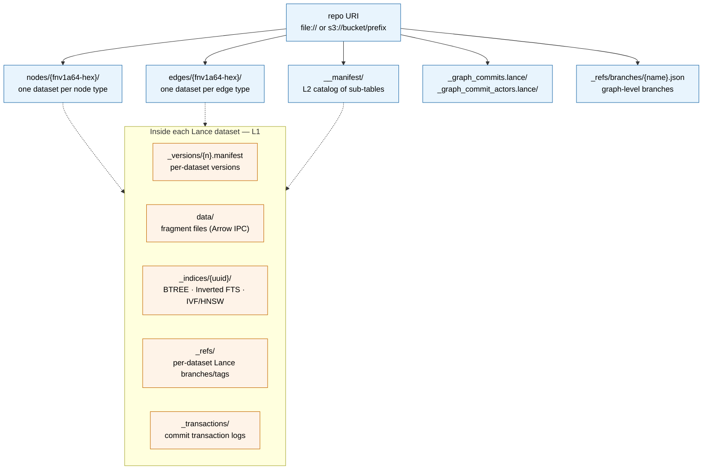

# Storage

## L1 — Lance dataset (per node/edge type)

Every node type and every edge type is its own Lance dataset:

- **Columnar Arrow storage**: each property is a column; nullable per Arrow schema.
- **Fragments**: data is partitioned into fragments; new writes create new fragments.
- **Manifest versioning**: every commit produces a new dataset version; old versions remain readable.
- **Stable row IDs**: enabled by OmniGraph for the commit-graph and run-registry datasets so durable references survive compaction.
- **Append / delete / `merge_insert`**: native Lance write modes.
- **Per-dataset branches** (Lance native): copy-on-write at the dataset level.
- **Object-store agnostic**: file://, s3://, gs://, az://, http (read-only via Lance) — OmniGraph wires file:// and s3:// (`storage.rs`).

## L2 — Multi-dataset coordination via `__manifest`

OmniGraph is **not** a single Lance dataset; it is a *graph* of datasets coordinated through one append-only manifest table.

- **Manifest table**: `__manifest/` Lance dataset.
- **Layout** (`db/manifest/layout.rs`, `db/manifest/state.rs`):
  - `nodes/{fnv1a64-hex(type_name)}` — one Lance dataset per node type
  - `edges/{fnv1a64-hex(edge_type_name)}` — one Lance dataset per edge type
  - `__manifest/` — the catalog of all sub-tables and their published versions
  - `_graph_commits.lance` / `_graph_commit_actors.lance` — the commit graph and its actor map
  - (legacy `_graph_runs.lance` / `_graph_run_actors.lance` from pre-v0.4.0 repos are inert; the run state machine was removed in MR-771 and these files are cleaned up via MR-770's production sweep)
- **Manifest row schema** (`object_id, object_type, location, metadata, base_objects, table_key, table_version, table_branch, row_count`):
  - `object_type` ∈ `table | table_version | table_tombstone`
  - `table_key` ∈ `node:<TypeName> | edge:<EdgeName>`
  - `table_branch` is `null` for the main lineage and the branch name otherwise
- **Snapshot reconstruction**: latest visible `table_version` per `(table_key, table_branch)` minus tombstones — rows where `object_type = table_tombstone`, whose own `table_version` (acting as the tombstone version) is `>= the entry's table_version`.
- **Atomic publish**: multi-dataset commits publish via a `ManifestBatchPublisher` so a single write to `__manifest` flips all the new sub-table versions visible at once.
- **Row-level CAS on the merge-insert join key**: `object_id` carries `lance-schema:unenforced-primary-key=true` so Lance's bloom-filter conflict resolver rejects two concurrent commits that land the same `object_id` row. Without this annotation, Lance's transparent rebase would admit silent duplicates of `version:T@v=N` from racing publishers (see `.context/merge-insert-cas-granularity.md`).
- **Optimistic concurrency control on publish**: `ManifestBatchPublisher::publish` accepts a `expected_table_versions: HashMap<table_key, u64>` map. Each entry asserts the manifest's current latest non-tombstoned version for that table is exactly what the caller observed; mismatches surface as `OmniError::Manifest` with `ManifestConflictDetails::ExpectedVersionMismatch { table_key, expected, actual }`. Empty map preserves the legacy "best-effort publish" semantics. The publisher uses `conflict_retries(0)` against Lance and owns retry itself (`PUBLISHER_RETRY_BUDGET = 5`), re-running the pre-check on each iteration so concurrent advances surface as `ExpectedVersionMismatch` rather than being silently rebased through.

### Internal schema versioning (`db/manifest/migrations.rs`)

The on-disk shape of `__manifest` is reconciled with the binary via a single stamp + dispatcher. `INTERNAL_MANIFEST_SCHEMA_VERSION` declares the shape this binary writes; the on-disk stamp `omnigraph:internal_schema_version` lives in the manifest dataset's schema-level metadata (Lance `update_schema_metadata`).

- **`init_manifest_repo`** stamps the current version at creation, so newly initialized repos never need migration.
- **Publisher open-for-write path** (`load_publish_state`) calls `migrate_internal_schema(&mut dataset)` before reading state. When the on-disk stamp matches the binary, this is a single metadata read with no writes; otherwise the dispatcher walks `match`-arm steps forward (1→2, 2→3, …) until the stamp matches, then proceeds with the publish. Reads stay side-effect-free.
- **Forward-version protection**: a stamp *higher* than the binary's known version triggers a clear "upgrade omnigraph first" error. An old binary cannot clobber a newer schema by silently treating "unknown stamp" as "missing stamp".
- **Idempotency**: each migration step is safe to re-run. A crash between two metadata updates inside a single step leaves the partial state; the next open re-runs the step and the second update lands. The dispatcher itself is a cheap stamp-read on the steady-state path.

Adding a new on-disk shape change is one constant bump (`INTERNAL_MANIFEST_SCHEMA_VERSION`), one match arm in `migrate_internal_schema`, and one test. No code outside this module branches on the stamp.

| Stamp | Shape change |
|---|---|
| v1 (implicit, pre-stamp) | `__manifest.object_id` had no PK annotation; publisher had no row-level CAS protection. |
| v2 | `__manifest.object_id` carries `lance-schema:unenforced-primary-key=true`; row-level CAS engaged. Stamped as `omnigraph:internal_schema_version=2`. |

## On-disk layout

A repo on disk is a directory tree of Lance datasets. Each dataset follows the standard Lance layout (`_versions/`, `data/`, `_indices/`, `_refs/`); OmniGraph adds the multi-dataset coordination by keeping `__manifest/` alongside the per-type datasets.

**What's where:**

- **Repo root** is one directory (or S3 prefix). Everything below is part of one OmniGraph repo.
- **`__manifest/`** is a Lance dataset whose rows describe which sub-table version is published at which graph-branch. Reading a snapshot starts here.
- **`nodes/`** and **`edges/`** are sibling directories holding one Lance dataset per declared type. Names are `fnv1a64-hex` of the type name to keep paths fixed-length and case-safe.
- **`_graph_commits.lance`** is an L2 dataset that records the graph-level commit DAG, with a paired `_graph_commit_actors.lance` for the actor map. (Pre-v0.4.0 repos also have inert `_graph_runs.lance` / `_graph_run_actors.lance` from the removed Run state machine; MR-770 sweeps these in production.)
- **`_refs/branches/{name}.json`** is graph-level branch metadata — pointers from a branch name to the manifest version it heads.
- **Inside each Lance dataset** (orange): the standard Lance directory layout. `_versions/{n}.manifest` records every commit; `data/` holds the actual Arrow fragments; `_indices/{uuid}/` holds index segments with their own `fragment_bitmap` for partial coverage; `_refs/` holds Lance-native per-dataset branches and tags.

The split — L2 owns the cross-dataset catalog; L1 owns the per-dataset internals — means that schema work (which adds or removes datasets) updates `__manifest`, while data work (which adds fragments) updates `_versions/` inside the affected dataset and then bumps `__manifest`.

## URI scheme support (`storage.rs`)

| Scheme | Backend | Notes |
|---|---|---|
| local path / `file://` | `LocalStorageAdapter` (tokio) | Normalized to absolute paths |
| `s3://bucket/prefix` | `S3StorageAdapter` (object_store) | Honors `AWS_ENDPOINT_URL_S3`, `AWS_ALLOW_HTTP`, `AWS_S3_FORCE_PATH_STYLE` |
| `http(s)://host:port` | HTTP client to `omnigraph-server` | Used by CLI as a target, not a storage backend |

## Object-store env vars (S3-compatible)

- `AWS_REGION`, `AWS_ACCESS_KEY_ID`, `AWS_SECRET_ACCESS_KEY`, `AWS_SESSION_TOKEN`
- `AWS_ENDPOINT_URL`, `AWS_ENDPOINT_URL_S3` — for MinIO / RustFS / GCS-via-XML
- `AWS_S3_FORCE_PATH_STYLE=true` — path-style URLs
- `AWS_ALLOW_HTTP=true` — allow plain HTTP (local dev)
